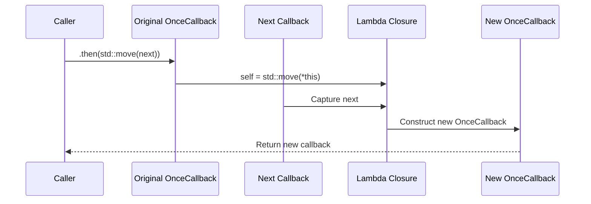

# OnceCallback in Practice (Part 5): Chaining with `then`

## Introduction

`then` allows us to connect two callbacks into a pipeline—where the output of the first callback becomes the input of the second. This sounds simple, but it features the most sophisticated ownership design among the four `OnceCallback` features. Since `OnceCallback` is move-only, `then` must transfer the full ownership of the original callback into the new one, without any sharing or leaking.

Starting from pipeline thinking, we will break down the implementation of `then` line by line, focusing on the ownership chain and the handling of void/non-void branches.

> **Learning Objectives**
>
> - Understand the pipeline semantics and ownership chain design of `then`.
> - Understand the complete implementation of `then` line by line.
> - Understand the special handling for void prefix callbacks.
> - Compare the choice of using `&&` ref-qualifier for `then` versus using deducing this.

---

## Pipeline Thinking: The Semantics of `then()`

If you have used Unix pipes, the semantics of `then` are quite intuitive:

```bash
# Unix pipeline: output of cmd1 is input to cmd2
cmd1 | cmd2
```

`then` does the same thing—the output of callback A is the input to callback B. Expressed in code:

```cpp
// A returns int, B takes int
auto A = []() { return 1; };
auto B = [](int x) { return x + 1; };

// Chained: returns 2
auto chained = OnceCallback(A).then(B);
chained();
```

`then` connects two independent callbacks into a new one. When we call the new callback, it automatically executes the entire A → B flow.

---

## Ownership is the Core Challenge of `then()`

The new chained callback needs to hold the **ownership** of both the original and the subsequent callback—otherwise, the original callback might be consumed externally beforehand, breaking the pipeline. Since `OnceCallback` is move-only, `then` must consume `*this` (the original callback) and `next` (the subsequent callback), transferring both ownerships into a new lambda closure.

The entire ownership chain looks like this:



Every layer passes ownership via move semantics, without any sharing or copying. This is the complete embodiment of move-only semantics in `then`.

---

## Line-by-Line Breakdown of the Complete `then()` Implementation

```cpp
template <typename Next>
auto then(Next&& next) && {
    // ...
}
```

### Function Signature: Rvalue Qualifier

```cpp
auto then(Next&& next) &&
```

The `&&` at the end makes this an rvalue-qualified member function—it can only be called on `std::move(obj)` or a temporary object `create_cb().then(...)`. If the caller writes `cb.then(...)` (lvalue call), the compiler will directly report "no matching overload". This is another way to express consume semantics—unlike `operator()` which uses deducing this to distinguish lvalue and rvalue for different error messages, `then` uses the ref-qualifier for simplicity.

### `std::decay_t<Next>`: Decay to Remove References

```cpp
using NextType = std::decay_t<Next>;
```

`Next` might be `Next&&` (rvalue reference) or `Next&` (lvalue reference). `std::decay_t` removes the reference to get the naked lambda type. We use `NextType` for type queries later.

### Two Branches of `if constexpr`

The core distinction in `then` lies in whether the original callback's return type is `void`.

**Non-void branch**: The original callback returns a value, which needs to be passed to the subsequent callback.

```cpp
if constexpr (!std::is_void_v<RetType>) {
    using NewRetType = std::invoke_result_t<NextType, ArgType>;
    return OnceCallback<NewRetType()>(
        [self = std::move(*this), next = std::forward<Next>(next)]() mutable -> NewRetType {
            ArgType result = std::move(self).invoke();
            return std::invoke(next, std::move(result));
        }
    );
}
```

`std::invoke_result_t<NextType, ArgType>` deduces at compile time: "what type is returned when passing a value of type `ArgType` to a callable of type `NextType`". This is the return type of the new callback.

The execution flow inside the lambda: first invoke the original callback to get the intermediate result `result`, then pass `result` to the subsequent callback.

```cpp
ArgType result = std::move(self).invoke();
return std::invoke(next, std::move(result));
```

**Void branch**: The original callback has no return value, and the subsequent callback takes no arguments.

```cpp
else {
    using NewRetType = std::invoke_result_t<NextType>;
    return OnceCallback<NewRetType()>(
        [self = std::move(*this), next = std::forward<Next>(next)]() mutable -> NewRetType {
            std::move(self).invoke();
            return std::invoke(next);
        }
    );
}
```

`std::invoke_result_t<NextType>` deduces "what type is returned when calling `NextType` with no arguments".

The execution flow inside the lambda: execute the original callback (ignoring the return value), then execute the subsequent callback (passing no arguments).

```cpp
std::move(self).invoke();
return std::invoke(next);
```

### Lambda Capture: The Core of Ownership

```cpp
[self = std::move(*this), next = std::forward<Next>(next)]
```

`self = std::move(*this)` is the key to the entire ownership chain—it moves **all contents** of the current `OnceCallback` object (`storage_`, `invoke_`, `status_`) into the lambda's closure object. After the move, the current object enters a "moved-from" state—`storage_` and `invoke_` have been moved away.

`next = std::forward<Next>(next)` also moves the subsequent callback into the lambda closure. `std::forward` preserves the value category of `next`—rvalue moves, lvalue copies.

This lambda is then passed to a new `OnceCallback` constructor and stored in the new callback's `storage_`. `OnceCallback`'s type erasure capability ensures that regardless of the lambda's actual type, it can be stored uniformly.

---

## Multi-stage Pipelines

`then` can be chained to form multi-stage pipelines:

```cpp
auto task1 = []() { return 1; };
auto task2 = [](int x) { return x * 2; };
auto task3 = [](int x) { return x + 10; };

auto pipeline = OnceCallback(task1)
    .then(task2)
    .then(task3);

pipeline(); // Returns 12: ((1 * 2) + 10)
```

Every call to `then` creates a new `OnceCallback`, internally capturing the previous step's callback. When the outermost callback is invoked, the execution process unfolds recursively: the outermost callback is invoked → its lambda executes → the lambda calls `invoke` on the previous layer → calls the next layer → until the bottom.

Performance-wise, each layer of `then` adds one level of `std::invoke` indirection. This is perfectly acceptable for pipelines of 2-3 levels. If the pipeline exceeds 10 levels, you might need to consider a flattened pipeline structure to avoid excessive nesting—but this is beyond our current scope.

---

## Common Pitfalls

### `mutable` Cannot Be Omitted

The lambda needs to call `self.invoke()`—this operation modifies the state of `self` (changing status from `kValid` to `kConsumed`). If the lambda is const (without `mutable`), `self` is a const reference inside the lambda, and we cannot call state-modifying operations on a const object, causing compilation to fail.

### State After `self = std::move(*this)`

After the move, the current `OnceCallback` object's `storage_` and `invoke_` have been moved away—they are in a "moved-from" state. `status_` is not explicitly set to `kEmpty`, but keeps its original value. However, since `storage_` has been moved, the current object is effectively unusable—any operation on it is undefined behavior. The `&&` qualifier on `then` ensures the caller cannot continue using the original object after calling `then`.

### Why Use `std::invoke` Instead of Direct Call

`next` is a generic callable object (usually a lambda), so direct `next(...)` syntax would also work. However, `std::invoke` is defensive programming—if someone passes a member function pointer as the subsequent callback, direct call syntax fails, but `std::invoke` handles it. Uniformly using `std::invoke` guarantees correct behavior regardless of the callable type passed.

---

## Summary

In this post, we broke down the complete implementation of `then`. Its core challenge is ownership management—by using `self = std::move(*this)`, we move the entire original callback into the lambda closure, establishing a complete ownership chain. `if constexpr` handles the different semantics of void and non-void return types—void callbacks pass no arguments to the subsequent callback, while non-void callbacks pass the intermediate result. `then` uses the `&&` qualifier to express consume semantics (more concise than deducing this in `operator()`, as it doesn't require custom error messages), and the `mutable` keyword is essential (because the internal state of `self` needs to be modified).

The next post is the final one in this series—we will use systematic test cases to verify the entire implementation and compare performance differences with the Chromium version.

## Reference Resources

- [Chromium callback.h source](https://chromium.googlesource.com/chromium/src/+/HEAD/base/functional/callback.h)
- [cppreference: std::invoke](https://en.cppreference.com/w/cpp/utility/functional/invoke)
- [cppreference: if constexpr](https://en.cppreference.com/w/cpp/language/if)
