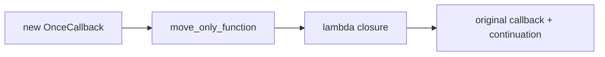

# OnceCallback hands-on (V): chaining with then

`then()` threads two callbacks into a single pipeline, feeding the previous one's output into the next. It's the same old Unix pipe trick, and you've surely seen it before:

```bash
# Unix pipe: cmd1's output is cmd2's input
echo "hello" | tr 'h' 'H' | wc -c
```

Carried over to callbacks, it's the very same story — callback A's output goes to callback B:

```cpp
auto pipeline = OnceCallback<int(int, int)>([](int a, int b) {
    return a + b;          // step one: 3 + 4 = 7
}).then([](int sum) {
    return sum * 2;        // step two: 7 * 2 = 14
});

int result = std::move(pipeline).run(3, 4);  // result == 14
```

At first we figured it would be easy: `then()` just stitches two callbacks together, right? But OnceCallback is move-only, so the original callback's ownership has to move, wholesale, into the new callback — missing the `func_`, missing the `token_`, missing the `status_`, none of that will do. In this piece we'll take `then()` apart line by line, keeping our eyes on two things in particular: how the ownership chain gets welded together link by link, and how the void and non-void return types split into two branches.

## Ownership: then()'s real problem

If you've ever used Unix pipes, the semantics of `then()` are pure intuition:

```bash
# Unix pipe: cmd1's output is cmd2's input
echo "hello" | tr 'h' 'H' | wc -c
```

`then()` does exactly the same thing — callback A's output is callback B's input. In code:

```cpp
auto pipeline = OnceCallback<int(int, int)>([](int a, int b) {
    return a + b;          // step one: 3 + 4 = 7
}).then([](int sum) {
    return sum * 2;        // step two: 7 * 2 = 14
});

int result = std::move(pipeline).run(3, 4);  // result == 14
```

`then()` chains two independent callbacks into one new callback. Invoking the new callback automatically walks through the whole A → B flow.

---

The chained new callback has to clutch both the original callback and the continuation in its own hands. With a plain `std::function` this is no great feat — take a copy and be done — but OnceCallback insists on being move-only: `func_`, `status_`, `token_`, not one of them may be copied. All `then()` can do is consume `*this` and `next`, moving both households bodily into a fresh lambda closure.

Drawn out, the ownership chain is a single line:


```mermaid
graph LR
    A["new OnceCallback"] --> B["move_only_function"] --> C["lambda closure"] --> D["original callback + continuation"]
```

Every link in that line is move semantics passing the baton — no copies, no sharing. This line is precisely what the whole set of move-only constraints looks like inside `then()`.

---

## then()'s complete implementation, line by line

```cpp
template<typename ReturnType, typename... FuncArgs>
template<typename Next>
auto OnceCallback<ReturnType(FuncArgs...)>::then(Next&& next) && {
    using NextType = std::decay_t<Next>;

    if constexpr (std::is_void_v<ReturnType>) {
        using NextRet = std::invoke_result_t<NextType>;
        return OnceCallback<NextRet(FuncArgs...)>(
            [self = std::move(*this),
             cont = std::forward<Next>(next)]
            (FuncArgs... args) mutable -> NextRet {
                std::move(self).run(std::forward<FuncArgs>(args)...);
                return std::invoke(std::move(cont));
            });
    } else {
        using NextRet = std::invoke_result_t<NextType, ReturnType>;
        return OnceCallback<NextRet(FuncArgs...)>(
            [self = std::move(*this),
             cont = std::forward<Next>(next)]
            (FuncArgs... args) mutable -> NextRet {
                auto mid = std::move(self).run(std::forward<FuncArgs>(args)...);
                return std::invoke(std::move(cont), std::move(mid));
            });
    }
}
```

### The function signature: rvalue qualification

```cpp
auto then(Next&& next) &&
```

That trailing `&&` makes it an rvalue-qualified member function, meaning `then()` only accepts `std::move(cb).then(next)` or a `.then(next)` on a temporary. Anyone who carelessly writes an lvalue call like `cb.then(next)` gets an on-the-spot "no matching overloaded function" from the compiler — an error that is refreshingly blunt. This is a different route from the deducing this approach `run()` takes — `run()` has to give different error messages on lvalues and rvalues, which is more trouble; `then()` needs no such distinction. One ref-qualifier is enough. Clean.

### std::decay_t\<Next\>: decay strips the reference

```cpp
using NextType = std::decay_t<Next>;
```

When `Next` arrives it may be `SomeLambda&&` or `SomeLambda&`; with a reference clinging to it, the downstream type deductions get awkward. `std::decay_t` peels the reference off and leaves the bare lambda type, which `std::invoke_result_t` then takes — as `NextType` — to look up the return.

### The two branches of if constexpr

What actually forks `then()` is whether the original callback's return type is void. Once that cut is made, the two sides look very different.

When the original callback returns a value — the non-void branch — that value must be fed onward to the continuation:

```cpp
using NextRet = std::invoke_result_t<NextType, ReturnType>;
```

`std::invoke_result_t<NextType, ReturnType>` asks, on our behalf at compile time: hand a value of type `ReturnType` to a callable of type `NextType` — what type does it give back? That is the new pipeline's outward return type. The work inside the lambda body is easy to narrate too: first run the original callback to obtain the intermediate result `mid`, then pass it along, as is, to the continuation:

```cpp
auto mid = std::move(self).run(std::forward<FuncArgs>(args)...);
return std::invoke(std::move(cont), std::move(mid));
```

The void branch wears a different face. The original callback returns nothing, so naturally the continuation takes no parameter either:

```cpp
using NextRet = std::invoke_result_t<NextType>;
```

Here `std::invoke_result_t<NextType>` deduces "call `NextType` with an empty parameter list, and see what comes back". The lambda body is just two steps: first run the original callback and toss the result away; then fish out the continuation and run it, also with no arguments:

```cpp
std::move(self).run(std::forward<FuncArgs>(args)...);
return std::invoke(std::move(cont));
```

### The lambda capture: the heart of ownership

```cpp
[self = std::move(*this), cont = std::forward<Next>(next)]
```

`self = std::move(*this)` is the vital organ of the whole ownership chain. It moves the current OnceCallback's entire estate — `func_`, `status_`, `token_`, not one left behind — into the lambda's closure. Once the move is done, the current object is a hollowed-out shell: `func_` and `token_` no longer belong to it. `cont = std::forward<Next>(next)` takes the continuation in as well, with `std::forward` standing guard over `next`'s original value category: an rvalue gets moved, an lvalue gets copied.

This lambda is finally handed to a fresh `OnceCallback<NextRet(FuncArgs...)>` constructor and tucked into its `std::move_only_function`. The type-erasure machinery means that whatever shape the lambda happens to take, it can be folded into the same shell.

---

## Multi-stage pipelines

`then()` can naturally keep linking on, section by section, into a multi-stage pipeline:

```cpp
using namespace tamcpp::chrome;
auto pipeline = OnceCallback<int(int)>([](int x) {
    return x * 2;
}).then([](int x) {
    return x + 10;
}).then([](int x) {
    return std::to_string(x);
});

std::string result = std::move(pipeline).run(5);
// 5 * 2 = 10, 10 + 10 = 20, to_string(20) = "20"
```

Every call to `then()` casts a new OnceCallback with a closure nested inside it that captured the previous step's callback. The moment the outermost `run()` fires, execution unfolds layer by layer like a nesting doll: the outermost one is `run()` → its own lambda executes → inside that lambda, `std::move(self).run()` is called on the next layer in → and the layer beyond that → drilling all the way down.

There is a price, though. Every extra stage of `then()` adds one more indirection through `std::move_only_function`. For a two- or three-stage pipeline that overhead is entirely negligible; if you really stack up ten-plus stages, the nesting grows deep enough that a flattened pipeline structure is probably called for — but that is far afield from our present topic, so we'll set it aside for now.

## A few easy places to trip up

### mutable is not optional

Inside the lambda we call `std::move(self).run()`, and that genuinely mutates `self`'s state — flipping the status from kValid over to kConsumed. Without `mutable` on the lambda, `self` is a const reference inside, and messing with a const object is something the compiler catches every single time — a hard error on the spot.

### The state of self = std::move(*this)

After the move, the original OnceCallback's `func_` and `token_` have already run away from home, leaving it in a "moved-from" state. Nobody explicitly dials `status_` back to kEmpty, so the old value still hangs there. But with `func_` empty, the shell is effectively dead, and anyone who touches it again is in undefined-behavior territory. Thankfully, that `&&` qualifier on `then()` guards the gate: the caller never gets a chance to keep using the original object after `then()`.

### Why std::invoke instead of calling directly

`cont` is usually just a lambda, and writing `cont(mid)` directly would run fine. But if someday someone passes in a member function pointer as the continuation, the direct-call syntax dies on the spot — `std::invoke` does not. Routing everything through `std::invoke` buys exactly that: whatever tool the other side brings, our machinery can catch it.

## References

- [Chromium callback.h source code](https://chromium.googlesource.com/chromium/src/+/HEAD/base/functional/callback.h)
- [cppreference: std::invoke](https://en.cppreference.com/w/cpp/utility/functional/invoke)
- [cppreference: if constexpr](https://en.cppreference.com/w/cpp/language/if)
