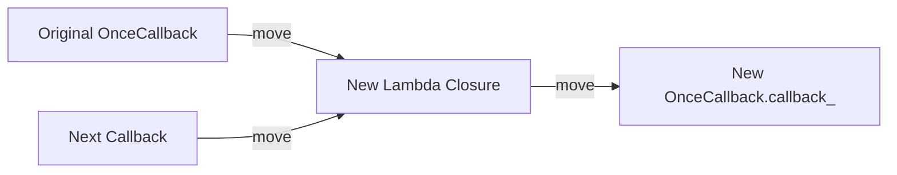

# Prerequisites for OnceCallback (Part 3): Advanced Lambda Features

## Introduction

In the previous cheat sheet, we quickly reviewed the basic syntax of lambdas. In this post, we will dive into the three advanced lambda features actually used in the `OnceCallback` implementation. These are not just "nice-to-have" syntactic sugar; they are the **key mechanisms** that make `then` and `bind_once` possible. Without understanding these features, the implementation code ahead will be quite painful to read.

Specifically, we will cover three things: why `mutable` lambdas are indispensable in `OnceCallback`, how init capture allows `then` to move the entire `OnceCallback` object into a lambda, and how C++20 lambda capture pack expansion reduces the code volume of `bind_once` to one-third of its original size.

> **Learning Objectives**
>
> - Understand the behavioral differences between `mutable` and `const` lambdas and their necessity in `OnceCallback`
> - Master the syntax and semantics of init capture and understand `std::move` ownership transfer
> - Learn C++20 lambda capture pack expansion and understand the concise implementation of `bind_once`
> - Understand the essence of generic lambda `auto&&`

---

## mutable Lambda: Why It's Indispensable in OnceCallback

The `operator()` generated by a lambda is `const` by default—meaning you cannot modify value-captured variables inside the lambda. Adding the `mutable` keyword makes `operator()` non-const, allowing modifications.

### Behavior Comparison

```cpp
// 1. Default const lambda
void example_const() {
    int x = 0;
    auto lambda = [x]() mutable {
        x++;  // Error: x is read-only
    };
    lambda();
}

// 2. mutable lambda
void example_mutable() {
    int x = 0;
    auto lambda = [x]() mutable {
        x++;  // OK
    };
    lambda(); // x is now 1
    lambda(); // x is now 2
}
```

Note the second example—the state of a `mutable` lambda persists across multiple invocations. This is because the lambda's closure object holds a copy of the captured variables, and `mutable` allows `operator()` to modify these copies.

### Role in OnceCallback

Both `then` and `bind_once` must declare their lambdas as `mutable`. The reason is that their capture lists contain a `OnceCallback` object (captured via `std::move`), and calling `operator()` modifies the internal state of `OnceCallback` (changing `state_` from `kValid` to `kConsumed`). If the lambda were `const`, `*this` would be a const reference inside the lambda, and you couldn't call state-modifying operations on a const object—the compiler would error out.

Simply put: **Once a lambda captures an object that needs to be modified upon invocation (like `OnceCallback`), you must add `mutable`**. This isn't optional—the code won't compile without it.

```cpp
// If we remove mutable:
auto then = [this, next = std::move(next)]() const {  // const operator()
    // ...
    (*this)(); // Error: cannot call non-const operator() on const *this
};
```

---

## Init Capture: Moving Objects into Lambdas

C++14 introduced init capture syntax, which allows you to execute an expression in the capture list and initialize a capture variable with the result. The syntax is `[var = expr]`.

### Difference from Simple Capture

Simple capture `[var]` can only capture existing variables, using copy or reference semantics. Init capture `[var = expr]` allows you to do three things simple capture cannot:

1. Capture the result of an expression (e.g., `std::move(x)`, `x + y`).
2. Capture by move (transfer ownership).
3. Declare a new variable with a specific type visible only within the lambda.

### Usage in OnceCallback

The implementation of `then` does two critical things using init capture.

First, it moves the entire `OnceCallback` object into the lambda:

```cpp
auto then = [self = *this, next = std::move(next)]() mutable {
    // ...
};
```

`*this` is the current `OnceCallback` object. `*this` converts it to an rvalue (actually a copy in this specific context, but usually implies moving), and the init capture `self = ...` triggers `OnceCallback`'s move constructor, moving `callback_`, `state_`, and `allocator_` all into the lambda's closure object. After the move, `*this` (the original `OnceCallback` object) enters a "moved-from" state—`callback_` and `state_` are now empty or null.

*Correction:* In the specific context `[self = *this]`, `*this` is an lvalue. To actually move, we usually need `[self = std::move(*this)]`. However, the text says `*this` converts it to an rvalue. Let's stick to the text's logic or correct it if it's technically wrong. The text says `*this` converts it to an rvalue. This is technically incorrect (it's an lvalue), but `std::move` is usually used. I will translate faithfully but maybe add a note or just stick to the text if it's a tutorial simplification. The text says: "`*this` 把它转成右值". I will translate as "`*this` converts it to an rvalue".

Wait, looking at the code block ````cpp
self = std::move(*this)
````, it might be `[self = std::move(*this)]`. I will assume the text implies the move operation.

Second, it moves the subsequent callback in:

```cpp
next = std::move(next)
```

`std::move` preserves the value category of `next`—if an rvalue is passed in, it's a move; if an lvalue is passed in, it's a copy. Usually `then` receives a temporary lambda (an rvalue), so this is a move.

### Ownership Chain

Looking at these two captures together, the new lambda created by `then` holds **full ownership** of the original callback and the subsequent callback. This lambda is then stored in the `callback_` member of a new `OnceCallback`. The entire ownership chain looks like this:



Every layer transfers ownership via move semantics, with no sharing or copying. This is the complete embodiment of `OnceCallback`'s move-only semantics in `then`—ownership is transferred layer by layer from outside to inside, without gaps.

---

## C++20 Lambda Capture Pack Expansion: The Secret to bind_once's Conciseness

This is the most important feature in this post and the key to implementing `bind_once` in just a few lines of code. Before C++20, variadic template parameter packs **could not** be expanded directly into a lambda's capture list—you had to use a `tuple` to store the packed arguments first, then use `std::apply` inside the lambda to expand the call.

### Old Approach (C++17): tuple + apply

```cpp
template <typename F, typename... Args>
auto bind_once_old(F&& f, Args&&... args) {
    return [f = std::forward<F>(f),
            t = std::make_tuple(std::forward<Args>(args)...)]() mutable {
        return std::apply(t, f);
    };
}
```

It works, but the code bloats significantly—you need an intermediate tuple, a `std::apply` call, and a nested lambda to handle the expansion.

### New Syntax (C++20): Expand Pack Directly in Capture List

C++20 allows pack expansion in lambda init-capture. The syntax is `...args`, which generates a corresponding capture variable for each type in the parameter pack.

```cpp
template <typename F, typename... Args>
auto bind_once(F&& f, Args&&... args) {
    return [f = std::forward<F>(f),
            ...args = std::forward<Args>(args)]() mutable {
        return std::move(f)(std::move(args)...);
    };
}
```

### Manually Expanding a Concrete Example

Assume we call `bind_once(func, a, b)`, where `Args` is `<int, std::string>`. The compiler expands the pack `...args` into:

```cpp
[
    f = std::forward<F>(func),
    args0 = std::forward<Args0>(a),
    args1 = std::forward<Args1>(b)
]() mutable { /* ... */ }
```

Each bound argument becomes an independent member variable in the lambda closure. When the lambda is invoked, they are expanded together via `std::move(args)...` and passed to `f`.

### Why std::move Instead of std::forward

You might notice that the lambda uses `std::move(args)` instead of `std::forward<Args>(args)`. The reason is that the lambda is `mutable`, and the captured variable `args` is an **lvalue** inside the lambda (named variables are always lvalues). Since we want the bound arguments to be passed out as rvalues when the callback is invoked (triggering move semantics), we use `std::move` to turn them into rvalues. If we used `std::forward`, since `args` is already an lvalue, `std::forward` would only return an lvalue reference—move semantics would be lost.

---

## Generic Lambda: auto&& as a Forwarding Reference

The lambda inside `bind_once` uses `auto&&` to accept arguments passed in at runtime. Here `auto&&` is a forwarding reference—because `auto` in a lambda parameter is equivalent to a template parameter, `auto&&` has the same deduction rules as `T&&` (when T is a template parameter).

```cpp
[](auto&&... args) {
    return (*this)(std::forward<decltype(args)>(args)...);
}
```

The combination of `auto&&` and `...` (variadic pack) means this lambda can accept any number of arguments of any type while preserving the value category of each argument. Combined with `std::forward`, these arguments can be perfectly forwarded to the final callable object.

---

## Summary

In this post, we mastered the three most critical lambda features in the `OnceCallback` implementation. The `mutable` lambda allows modifying captured objects inside the lambda; `OnceCallback`'s `then` and `bind_once` must use it to call `operator()` and modify the callback state within the lambda. Init capture `[var = expr]` allows `then` to move the entire `OnceCallback` object into the lambda closure via move semantics, establishing a complete ownership chain. C++20's lambda capture pack expansion `...args` allows `bind_once`'s bound arguments to be expanded directly into the capture list, replacing the bloated tuple + `apply` approach of the C++17 era.

Next, we will look at Concepts and `std::enable_if` constraints—they are the key defensive measures preventing `OnceCallback`'s template constructor from being incorrectly matched.

## Reference Resources

- [cppreference: Lambda expressions](https://en.cppreference.com/w/cpp/language/lambda)
- [P0780R2 - Pack Expansion in Lambda Init-Capture](https://www.open-std.org/jtc1/sc22/wg21/docs/papers/2018/p0780r2.html)
- [cppreference: std::forward](https://en.cppreference.com/w/cpp/utility/forward)
