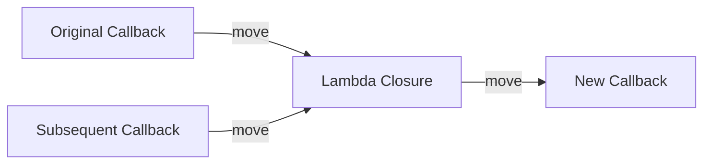

# Design Guide for `once_callback` (Part 2): Step-by-Step Implementation

## Introduction

In the previous post, we completed the analysis of motivation and interface design, establishing the target API and internal architecture for `once_callback`. In this post, we will start writing the actual code. But first, a heads-up—this post will not focus on "serving up the complete implementation," but rather on guiding you through the design rationale and key technical choices for each step. We will examine the skeletal structure of the code, but we will not post a complete, directly compilable header file—we will leave those details for post-class exercises and the testing verification in the third post.

The implementation is divided into four steps, each building upon the previous one: first, nail the core `operator()` semantics, then add argument binding, followed by cancellation checks, and finally, `then` chain composition. In each step, we will focus only on "what this component looks like" and "what the key template techniques are," rather than interpreting the implementation line by line.

> **Learning Objectives**
>
> - Understand the template partial specialization pattern and internal storage design of `once_callback`
> - Master the application of advanced template techniques such as deducing this, `requires` constraints, and lambda capture pack expansion in practical components
> - Understand the argument binding mechanism of `Bind` and the ownership chain design of `then`

---

## Step 1: Core Skeleton — Starting with Template Partial Specialization

### Why use this syntax for `once_callback<R(Args...)`

You may have noticed that our declaration of `once_callback` is a bit special—it's not `template <typename R, typename... Args>`, but `template <typename Signature>`. This is called "signature-style template parameter," and `std::move_only_function` and `std::function` do the same.

The technique behind this is **template partial specialization**. We first declare a primary template with only a declaration and no definition:

```cpp
template <typename Signature>
class once_callback;
```

Then we provide a partial specialization for the case where `Signature` happens to be a function type:

```cpp
template <typename R, typename... Args>
class once_callback<R(Args...)> {
    // ...
};
```

When the user writes `once_callback<int(int, int)>`, the compiler treats `int(int, int)` as a whole type matching the `Signature` of the primary template, then discovers that the partial specialization can unpack this whole into a return type `R` and a parameter pack `Args...`, so it selects the partial specialization. The benefit of this pattern is that users can use a very natural "function signature" syntax to specify the callback type, without needing to pass the return value and argument list separately.

There is a confusing point here: `R(Args...)` looks like a function declaration, but in the context of template parameters, it is a **function type**. `int(int, int)` is a legal C++ type—it describes "a function that takes two int parameters and returns an int." Template partial specialization utilizes this type, unpacking it via pattern matching to extract the return type and parameter pack.

### Internal Storage: What does the class skeleton look like

In the previous post, we established the three-state architecture. Now let's look at the class skeleton—ignoring method implementations for now, focusing only on data members and interface signatures:

```cpp
template <typename R, typename... Args>
class once_callback<R(Args...)> {
public:
    // Constructor, destructor, move operations
    once_callback();
    once_callback(std::nullptr_t);
    once_callback(once_callback&& other) noexcept;
    once_callback& operator=(once_callback&& other) noexcept;

    // Disallow copy
    once_callback(const once_callback&) = delete;
    once_callback& operator=(const once_callback&) = delete;

    // Core execution interface
    template <typename Self>
    R operator()(this Self&& self, Args... args)
        requires (!std::is_lvalue_reference_v<Self>);

    // Cancellation interface
    [[nodiscard]] bool is_cancelled() const;
    void set_cancellation_token(cancellation_token token);

private:
    enum class State { kEmpty, kValid, kConsumed };

    struct VTable {
        void (*move)(void* src, void* dest) noexcept;
        void (*destroy)(void* target) noexcept;
        R (*invoke)(void* target, Args... args);
    };

    static const VTable& get_vtable_for();

    State state_ = State::kEmpty;
    std::optional<cancellation_token> cancel_token_;
    alignas(void*) char storage_[sizeof(void*) * 2];
};
```

Every member in the skeleton has a clear responsibility. `VTable` is responsible for type erasure—unifying various forms of callable objects into a known-signature call interface. `State` is a three-state enum, distinguishing "never assigned" (kEmpty), "ready to call" (kValid), and "already called" (kConsumed). `cancel_token_` is an optional cancellation token used to check whether execution should be skipped before the callback runs. Move operations perform pointer-level transfers, leaving the source object in the kEmpty state.

Next, let's focus on the two most ingenious parts of the skeleton: the deducing this technique of `operator()` and the `requires` constraint of the constructor. These are the most template-intensive parts of the entire component and deserve to be explained thoroughly.

### deducing this: Letting the compiler help us intercept erroneous calls

`operator()` is the soul of the entire component and the method with the densest C++23 features. Let's look at its declaration first:

```cpp
template <typename Self>
R operator()(this Self&& self, Args... args)
    requires (!std::is_lvalue_reference_v<Self>);
```

If you haven't seen `this Self&& self` syntax before, don't panic, we'll go through it step by step.

#### What is deducing this

deducing this is a feature introduced in C++23, officially called "explicit object parameter." In traditional member functions, `this` is an implicit parameter—the compiler automatically passes the address of the current object, invisible and untouchable. deducing this allows us to explicitly write `this` as the first parameter of the function and use a template parameter to deduce its type and value category.

```cpp
template <typename Self>
void func(this Self&& self);
```

The key lies in `Self&&`—it looks like an rvalue reference, but it's actually a **forwarding reference** because `Self` is a template parameter. The special thing about a forwarding reference is that it can be deduced as different types based on the value category of the passed argument:

- `obj.func()` — `obj` is an lvalue, `Self` deduces to `Self&` (lvalue reference)
- `std::move(obj).func()` — `obj` is an rvalue, `Self` deduces to `Self` (prvalue)
- `const_obj.func()` — const lvalue, `Self` deduces to `const Self&`

#### How we utilize it

Knowing the deduction rules of `Self&&`, intercepting lvalue calls is simple:

```cpp
requires (!std::is_lvalue_reference_v<Self>)
```

`std::is_lvalue_reference_v<Self>` is a compile-time constant checking if `Self` is an lvalue reference type. When the caller writes `callback(args...)`, `Self` is deduced as `once_callback&`, which is an lvalue reference, the condition is `true`, negating it makes the `requires` clause fail, and the compiler reports an error immediately—the error message is exactly what we wrote. When the caller writes `std::move(callback)(args...)`, `Self` is deduced as `once_callback`, which is not a reference, `requires` passes, and it enters the body to execute the real logic. Note that we use `std::forward<Self>(self)` instead of `self`—this ensures `operator()` is correctly invoked on the rvalue.

There is a detail worth pondering: the condition of `requires` depends on the template parameter `Self`, so it is only evaluated when the template is instantiated. This means if `operator()` is never called, `requires` won't trigger—regardless of whether an lvalue or rvalue is passed. Only when the compiler needs to instantiate this template at a certain call point will the specific type of `Self` be determined, and `requires` evaluated. This is called "lazy instantiation," a very common pattern in template metaprogramming.

#### Comparison with Chromium's approach

Chromium doesn't enjoy the benefits of C++23; it uses two overloads: `R operator()(Args...)&&` is the real execution version, and `R operator()(Args...)& = delete` contains a `sizeof` to produce a compile error. That `sizeof` hack exploits a property of C++: `sizeof` must be evaluated on a complete type, so when evaluated, it must be inside the class definition (the type of `*this` is complete), the expression value is definitely `false`. Before C++23, writing `requires` directly would trigger on all code paths (even if the overload was never called), so Chromium had to use the `sizeof` trick. C++23 relaxed this restriction, but Chromium's codebase hasn't fully migrated to C++23 yet, so it retains the old style.

Our deducing this solution requires only one function template, naturally distinguishing lvalues and rvalues through the deduction of `Self&&`, which is much cleaner than Chromium's two overloads + `sizeof` hack.

### The constructor's requires constraint

There is a seemingly redundant constraint on the constructor template:

```cpp
template <typename F>
    requires (!std::same_as<std::decay_t<F>, once_callback>)
once_callback(F&& f);
```

Why not just `template <typename F> once_callback(F&& f)` and be done with it? The problem lies in the competition between the template constructor and the move constructor.

When we write `once_callback cb = std::move(other_cb)`, the compiler has two paths: call the implicitly declared move constructor `once_callback(once_callback&&)`, or instantiate the template constructor as `once_callback(once_callback&)` (letting `F` be `once_callback&`). Intuitively, we feel the move constructor is a "more specific" match and should be prioritized. But C++ overload resolution rules don't work that way—in some cases, a function signature instantiated from a template is a "more exact" match than implicitly declared special member functions, and the compiler will unhesitatingly choose the template version. This can lead to unexpected behavior, such as the template constructor failing to correctly set the source object's state to kEmpty.

Our implementation uses a custom concept `not_same_as_once_callback` to solve this: `!std::same_as<std::decay_t<F>, once_callback>` means "exclude this template when the decayed type of `F` happens to be `once_callback` itself." Decay here serves to remove reference and cv qualifiers from `F`—because `F` could be `once_callback&` or `const once_callback`, after decay they both become `once_callback`. With the constraint, when passing `once_callback` itself, the template is excluded, and the compiler correctly matches the move constructor.

This technique is very common when implementing move-only type erasure wrappers—`std::move_only_function`'s implementation has similar constraints. If you write similar components in the future, remember this pattern: **template constructor + requires excluding self type = protecting the correct matching of move semantics**.

### Internal implementation ideas for consumption semantics

The implementation logic of `operator()` is straightforward—check state, handle cancellation, call the callable object, update state. There are a few details worth mentioning.

The first is that cancellation checks happen before execution. `operator()` first checks if the token is valid—if cancelled, it consumes the callback without executing, returning directly for void cases, or throwing `bad_callback_call` for non-void cases. This exception-throwing behavior might seem aggressive, but it has good reason: the caller expects a return value, but we cannot provide a meaningful one, so throwing an exception is safer than returning an undefined value.

The second is the `if constexpr` branch. When the return type is `void`, we cannot write `return result(...)`—void is not a type that can be assigned. `if constexpr` selects the branch at compile time; the void case takes the "call but don't assign" path, while the non-void case takes the "call and assign to result" path. This is the standard pattern for handling void return types with `std::optional`.

The third is nulling after consumption. `operator()` first moves the callable object out as a local variable, then sets `state_` to `kConsumed` and `cancel_token_` to empty, and finally executes the callable object in the local variable. This order is important—move the callable object out, mark the state, then execute. This way, even if the callable object throws an exception internally, `state_` is already kConsumed, and the callback won't be in an inconsistent state. Nulling isn't just about marking state—it triggers the `VTable::destroy` to destruct the internally held callable object, releasing resources captured by the lambda (like `std::unique_ptr`).

### Verifying the core skeleton

After writing the skeleton, quickly verifying a few scenarios is enough: basic type return, void return, move-only capture, and move semantics. If these four scenarios pass—constructing a callback gets the correct return value, void callbacks execute normally, resources are released after callbacks capturing `unique_ptr` are used, the source object becomes empty after moving, and the target object is valid—the skeleton is fine. We will organize complete test cases in the third post.

---

## Step 2: Argument Binding — `Bind`

### What problem are we solving

The scenario for `Bind` is very intuitive: you have a three-parameter function `int add(int a, int b, int c)`, but the first two parameters can be determined at binding time (e.g., 10 and 20), and only the third parameter is passed at call time. You want to get a `once_callback<int(int)>` that only takes one argument, and when called, it automatically feeds 10, 20, and your passed argument to the original function.

This is argument binding—stuffing "known parameters" into the callback in advance, so the caller only needs to care about "unknown parameters." Chromium's `base::BindOnce` does a lot of work in this area to handle parameter lifetimes (`Unretained`, `RetainedRef`, `Owned`, `WeakPtr`, etc.), our simplified version only focuses on the core argument binding logic.

### Implementation skeleton of `Bind`

```cpp
template <typename BoundSig, typename F, typename... BoundArgs>
auto Bind(F&& f, BoundArgs&&... bound_args) {
    return [f = std::forward<F>(f),
           ...bound_args = std::forward<BoundArgs>(bound_args)]<typename... CallArgs>
           (CallArgs&&... call_args) mutable
        -> decltype(auto)
    {
        return std::invoke(f, bound_args..., std::forward<CallArgs>(call_args)...);
    };
}
```

This code isn't long, but it contains several template techniques worth expanding on. Let's break them down one by one.

### Lambda Capture Pack Expansion

The line `...bound_args = std::forward<BoundArgs>(bound_args)` is the **lambda init-capture pack expansion** syntax introduced in C++20. It is the key to the concise implementation of `Bind`.

Before C++20, parameter packs of variadic templates could not be directly expanded into a lambda's capture list—you couldn't write code to "capture every element of `bound_args` into the lambda separately." The workaround was to pack all bound arguments into a `std::tuple`, then use `std::apply` inside the lambda to expand them into separate arguments for the call. This solution works, but the code bloats significantly—you need an extra tuple, an `std::apply` call, and template helper code to handle the move semantics of tuple elements.

C++20 finally allows pack expansion into lambda captures. Specifically, `...bound_args = ...` generates a corresponding capture variable for each type in `BoundArgs`, each initialized with perfect forwarding `std::forward<BoundArgs>`. To give a concrete example, if `BoundArgs` is `int&&, double&`, then expansion is equivalent to:

```cpp
[
    f = std::forward<F>(f),
    bound_args_0 = std::forward<int&&>(bound_arg_0), // int&&
    bound_args_1 = std::forward<double&>(bound_arg_1)  // double&
]
```

Each capture variable can be used independently inside the lambda, and in our `Bind`, they are passed together to `f` via `bound_args...` when the lambda is called. Note we use `bound_args...` not `std::move(bound_args)...`—because the lambda owns the captures, the captured variables are lvalues inside the lambda, and we want to pass them as rvalues to trigger move semantics.

### Unified invocation capability of `std::invoke`

The lambda uses `std::invoke` instead of directly calling `f(...)` because `std::invoke` can uniformly handle various callable objects. Calling a normal function pointer directly is fine, but member function pointers are different—you can't write `ptr(obj, args)`, you must use `(obj.*ptr)(args)` syntax. `std::invoke` encapsulates all these differences: `std::invoke(ptr, obj, args...)` is equivalent to `(obj.*ptr)(args...)`.

This means `Bind` natively supports member function binding without extra code:

```cpp
struct Calculator {
    int add(int a, int b) { return a + b; }
};

Calculator calc;
auto cb = Bind<int(int)>(&Calculator::add, &calc, 10);
// cb(20) calls calc.add(10, 20)
```

However, there is a **lifetime trap** to note here: `&calc` is a raw pointer, and `Bind` won't manage its lifetime. If `calc` is destroyed before the callback is invoked, `std::invoke` will access freed memory through a dangling pointer. Chromium uses `Unretained` to explicitly mark "I know this raw pointer's lifetime is safe," `Owned` to take over ownership, and `WeakPtr` to automatically cancel the callback when the object is destructed. In our simplified version, this safety responsibility is temporarily handed to the caller.

### Signature deduction: Why explicit specification of `BoundSig` is needed

You may have noticed that the first template parameter `BoundSig` (e.g., `int(int)`) of `Bind` needs to be explicitly specified by the caller. Ideally, the compiler should be able to automatically deduce the "remaining signature after removing bound parameters" from the callable signature of `F`. But this task is much more complex in C++ than imagined.

For a function pointer `int(*)(int, int, int)`, you can extract the parameter list via template partial specialization and then use a compile-time "type list slicing" operation to remove the first N types. For functors with a definite signature, you can also extract the signature via `decltype(operator())`. But for **generic lambdas** (`[](auto x){...}`), its `operator()` is itself a template, and there is no uniquely determined signature—the compiler cannot obtain information on "what parameters this lambda accepts" at the type level at all.

Chromium wrote a whole set of type manipulation tools (`BindTraits`, `CallbackParamTraits`, etc.), about a few hundred lines of template metaprogramming code to handle various edge cases. For our teaching purposes, having the caller write one more template parameter `BoundSig` is a more pragmatic choice—it saves a huge amount of complex template metaprogramming and improves code clarity.

---

## Step 3: Cancellation Check — `cancellation_token` and `is_cancelled`

### The concept of cancellation token

A callback can be associated with a "cancellation token" when created. The token represents the lifetime of some external object—when that object is destroyed, the token becomes invalid, and all callbacks associated with the token become "cancelled."

You can think of it as a "pass": when creating the callback, issue a pass to it that says "valid." At some moment, an external object says "the pass is voided" (calling `invalidate`), after which all callbacks holding this pass will find "the pass is already invalid" when checked before execution, and skip execution. In Chromium, this pass is the control block inside `base::WeakPtr`—when the object `WeakPtr` points to is destroyed, the flag in the control block is cleared, and all callbacks bound to this `WeakPtr` are automatically cancelled.

### Design ideas for `cancellation_token`

Our simplified cancellation token only needs three core operations: create (generate a valid token), invalidate (mark as void), and check (query if still valid). Internally, use `std::shared_ptr` to manage a `struct` containing `std::atomic<bool>`:

```cpp
class cancellation_token {
public:
    cancellation_token() : state_(std::make_shared<State>()) {}

    void invalidate() { state_->cancelled.store(true, std::memory_order_relaxed); }
    bool is_cancelled() const { return state_->cancelled.load(std::memory_order_relaxed); }

private:
    struct State {
        std::atomic<bool> cancelled{false};
    };

    std::shared_ptr<State> state_;
};
```

Using `std::shared_ptr` instead of a raw pointer allows the token to be copied and moved while all copies share the same `State`. `std::atomic<bool>` ensures the safety of multi-threaded access—one thread might be executing `is_cancelled` while another calls `invalidate`, and `memory_order_relaxed` semantics guarantee the former read sees the latter's write.

### Integration into `once_callback`

Integrating the cancellation token into `once_callback` is straightforward: add an optional `cancellation_token` to the data members, set it via the `set_cancellation_token` method, and then check it in two places—when `is_cancelled` is queried and before `operator()` executes.

`is_cancelled` logic: if the state is not kValid, return true (empty and consumed callbacks count as "cancelled"), and if there is a token and it is invalid, also return true. In `operator()`, before actually executing the callable object, check the token status—if cancelled, consume the callback without executing, return directly (void case) or throw `bad_callback_call` (case requiring a return value).

`set_cancellation_token` is currently just a simple wrapper for `std::optional::emplace`. In Chromium's full implementation, the difference lies in the strength of thread safety guarantees—`is_cancelled` can only be called on the sequence where the callback is bound (i.e., the thread that created the callback), guaranteeing a deterministic result; `MayBeCancelled` can be called from any thread, but the result may be stale. Our simplified version doesn't distinguish this semantics for now, but retains both method names for future expansion in `std::execution` or cross-thread scenarios.

---

## Step 4: Chain Composition — `then`

### Semantics of `then`

`then` allows us to串联 two callbacks into a pipeline. The semantics are intuitive: when the pipeline is called, execute the first callback with the original arguments, then pass the return value to the second callback. For example, callback A calculates `x + 1`, callback B calculates `y * 2`,串联 with `then`, you get a new callback that automatically runs the entire A → B process when called.

Sounds simple, but `then` is the one with the most ingenious ownership design among the four features.

### Ownership is key

The new callback after串联 needs to hold the **ownership** of the original and subsequent callbacks—otherwise, the original callback might be consumed externally in advance, breaking the pipeline. And `once_callback` is move-only, which means `then` must consume the original callback (`this`) and the subsequent callback (`next`), transferring ownership of both to a new lambda closure. The entire ownership chain looks like this:



The skeleton of the implementation idea looks like this:

```cpp
template <typename NextSig>
auto then(once_callback<NextSig>&& next) && {
    using Result = typename next_signature_traits<NextSig>::result_type;

    return once_callback<Result(Args...)>(
        [self = std::move(*this), next = std::move(next)](Args... args) mutable {
            if constexpr (std::is_same_v<Result, void>) {
                self(args...); // Execute original, discard return
                next();       // Execute subsequent
            } else {
                return next(self(args...)); // Pass result to next
            }
        }
    );
}
```

Note an important difference from the Chromium original here: we use `std::move(next)` for the subsequent callback instead of `std::move(next)`. This is because `then`'s `next` parameter is a normal callable object (like a lambda), not a `once_callback`—the caller doesn't need to explicitly write `std::move(next)`, `then` calls it directly. Only the original callback (`this`) needs `std::move` to express consumption semantics.

### Several easy-to-fall traps

**First, `&&` ref-qualifier.** The `&&` at the end of the function declaration makes it an rvalue-qualified member function, callable only via `std::move(obj)` or a temporary object `obj.then(...)`. This is another way to express "consumption semantics"—unlike `operator()` using deducing this, `then` directly uses the traditional ref-qualifier. Why not deducing this? Because `then` doesn't need to distinguish lvalues and rvalues to give different error messages—it just accepts rvalues, no middle ground.

**Second, `self = std::move(*this)`.** This line moves **all contents** of the current `once_callback` object into the lambda's closure object. After moving, the current object enters a consumed state (because we didn't set it to kEmpty, but let it naturally remain a "moved-from" state). The closure object is then stored in the `storage_` of the returned new `once_callback`—`once_callback`'s type erasure capability guarantees that no matter the lambda's actual type, it can be stored uniformly.

**Third, the `mutable` keyword cannot be omitted.** The default `operator()` generated by a lambda is `const`—meaning the lambda cannot modify captured variables internally. But we need to call `operator()` on `self` inside the lambda, an operation that modifies the object state (changing status from kValid to kConsumed). So the lambda must be declared `mutable`, making `self` non-const.

**Fourth, `if constexpr`.** Just like the situation in `operator()`—when the original callback returns `void`, the semantics of `then` are "execute original, then execute subsequent (no parameter passing)." `if constexpr` selects branches at compile time, generating completely different code paths for the two cases.

### Multi-level pipelines

`then` can be called in a chain, forming multi-level pipelines:

```cpp
auto pipeline = callback_a
    .then(callback_b)
    .then(callback_c);
```

Each `then` call creates a new `once_callback`, internally capturing the previous step's callback in a nested manner. The call order from outside to inside is recursively expanded: the outermost callback is invoked → execute its lambda → lambda calls `operator()` on the upper layer → then calls the upper layer → until the bottom. Performance-wise, each level of `then` adds one indirect call through `std::invoke`, which is completely acceptable for 2-3 level pipelines. If the pipeline is very deep (more than 10 levels), consider using `std::execution`'s `let_value` or similar to create a flattened pipeline structure to avoid nested closure overhead—but this is beyond our current discussion scope.

---

## Summary

In this post, we completed a design walkthrough of the four core functions of `once_callback`. Unlike the interface design of the first post, the focus here is on understanding "why write it this way" and "what the key template techniques are." Let's review a few core knowledge points:

- **Template partial specialization** `once_callback<R(Args...)>` lets users specify callback types with natural function signature syntax, and the compiler unpacks the function type into return values and parameter packs via pattern matching
- **Deducing this** lets `operator()` implement compile-time lvalue/rvalue interception through a single function template, cleaner than Chromium's double overload + `sizeof` hack
- **`requires` constraint** (via `not_same_as_once_callback` concept) resolves the matching conflict between template constructors and move constructors, a standard defensive measure for move-only type erasure wrappers
- **Lambda capture pack expansion** is the key to the concise implementation of `Bind`, requiring tuple + `apply` workarounds before C++20
- **Core challenge of `then`** is ownership management—it guarantees the integrity of the ownership chain of each callback in the pipeline through rvalue qualifiers + lambda capture move, using `std::invoke` to uniformly call subsequent callbacks

The next post will use systematic test cases to verify these designs and compare our performance trade-offs with the Chromium original.

## Reference Resources

- [Chromium callback.h source](https://chromium.googlesource.com/chromium/src/+/HEAD/base/functional/callback.h)
- [Chromium bind_internal.h source](https://chromium.googlesource.com/chromium/src/+/HEAD/base/functional/bind_internal.h)
- [cppreference: std::move_only_function](https://en.cppreference.com/w/cpp/utility/functional/move_only_function)
- [cppreference: std::invoke](https://en.cppreference.com/w/cpp/utility/functional/invoke)
- [P0847R7 - Deducing this proposal](https://www.open-std.org/jtc1/sc22/wg21/docs/papers/2021/p0847r7.html)
- [P0780R2 - Pack Expansion in Lambda Capture](https://www.open-std.org/jtc1/sc22/wg21/docs/papers/2018/p0780r2.html)
