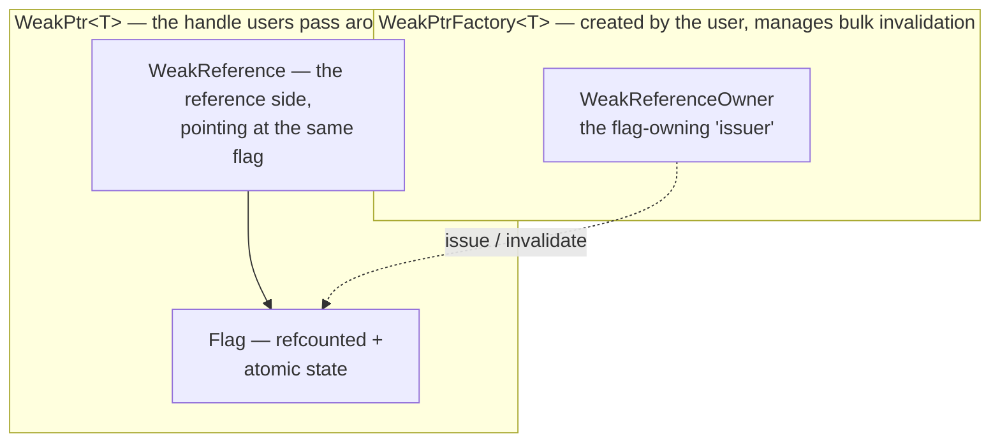

# WeakPtr hands-on (I): motivation and API design

Back in 01-4, when we hand-rolled the cancellation token, we took the lazy way out and hung an atomic flag off the callback — 0 while the object is alive, flipped to 1 before destruction, and an `if` check before the callback runs. The dangling problem was papered over for the moment. But there was a loose end that never sat right with us: who exactly owns that flag? And how does the callback get hold of it?

Mull over how awkward this arrangement is. The flag is created by object A, while the callback runs somewhere else entirely. For the callback to see the flag, you have to hand it a pointer to the flag. Pass a raw pointer, and the moment A is destroyed the flag goes with it — the pointer in the callback's hand dangles again, and we've come full circle back to the start. Pass a `shared_ptr` instead? Then the flag never gets destroyed — but that only manages the flag, not A itself; the problem isn't solved at all, the hole has merely been moved to a different spot.

This awkwardness is in fact the concrete embodiment of that classic old C++ problem: weak references. Chromium gives it a rather hard-core answer in `base`, called `WeakPtr`. In this piece we'll sort out the motivation and the hole that needs patching, and pin down the target API while we're at it. Interface before implementation; the code is left to the following pieces.

---

## It starts with a bug

### The scenario: posting an asynchronous task

Suppose we have a `Controller` that posts tasks to a thread pool; when a task finishes, it comes back and updates the controller's own state.

```cpp
class Controller {
public:
    void start_work(ThreadPool& pool) {
        // Post a task to the thread pool; on completion it calls back on_work_done
        pool.post([this] { this->on_work_done(); });
    }
    void on_work_done() { /* update state */ ++work_count_; }
private:
    int work_count_ = 0;
};
```

Test this code ten times and about nine and a half of those runs look fine. But the moment `Controller` gets destroyed before the task's turn comes up — the user switches pages, the hosting window closes — the copy of the callback sitting in the task system is still clutching `this` for dear life. When the task finally runs, `on_work_done` dereferences an object that has already been destroyed. Segfault.

### This is the problem we already met in 01-4

It's the same story as the hand-rolled cancellation token back then: hang a flag on the Controller, flip it to 1 before destruction, and have the callback check the flag before executing. The idea is exactly the same.

But back then we cut a corner: the flag's lifetime was crudely patched together by "the callback holds a `shared_ptr<Flag>` while the Controller holds the raw flag," because the teaching version only wanted to make the "check" step clear. This time we have to get serious. The real approach is to fuse the "flag" and the "weak reference to the object" into one thing. What the callback receives is not a lonely little flag, but a `WeakPtr<Controller>` — one that can both tell the callback whether the Controller is dead, and, if it isn't, call the Controller's methods directly.

That is the job `WeakPtr` exists to do.

---

## Why none of the three existing solutions suffices

Before building our own wheel, let's first block off the three ready-made roads — only then will you understand why Chromium insisted on building its own.

The raw-pointer `this` is exactly the code above: after the object is destroyed the callback dangles, UAF, nothing more to say.

`shared_ptr<Controller>` doesn't work either. It forces you to convert the Controller to shared ownership — originally one clean, crisp owner, and now "theoretically anyone can hold it." Worse, as long as the callback keeps clutching its `shared_ptr`, the Controller **never gets destroyed** — the task is still queuing and the Controller refuses to leave: a resource leak plus lifetime out of control. That isn't fixing the bug, that's swapping it for a different bug.

And `std::weak_ptr<Controller>`? It requires a `shared_ptr` to exist before it can be used, so we loop right back to the previous road. On top of that, every access has to `lock()` a temporary `shared_ptr`, which on a hot path like a callback is both wordy and an extra lump of atomic overhead. Its limitations at the abstraction level were systematically covered in [WeakPtr prerequisite (0)](./pre-00-weak-ptr-weak-reference-and-lifetime.md); here, letting the code speak is enough.

Three roads: either unsafe, or polluting ownership, or tied to the cost of non-intrusiveness. Chromium's demand is plain: let the Controller keep its original single-owner model, and give the callback a weak reference that "doesn't extend lifetime, can test for aliveness, and can be invalidated in bulk."

---

## Chromium's answer: the design philosophy of WeakPtr

Chromium's `WeakPtr` is not one isolated little class; it is a four-layer structure. Let's look at it from the bottom up. This layering is the same playbook as the `BindState` covered in [OnceCallback hands-on (I)](../../01_once_callback/full/01-1-once-callback-motivation-and-api-design.md) — the bottom layer does type erasure plus reference counting, and the top layer tosses the user a lightweight handle. Learn one, and the other comes almost for free.

### The four-layer architecture



At the very bottom sits `Flag`, an internal class users never get to touch. It is exactly that "is the object dead yet" state; it hangs off `RefCountedThreadSafe`, is shared by the issuer and all reference holders, and carries a single atomic flag bit inside. One layer up is `WeakReference`, a reference wrapper around `Flag` that holds a `scoped_refptr<const Flag>` — it is the entity of that "weak reference" inside WeakPtr. Above that is `WeakPtr<T>`, the handle users operate, holding a `WeakReference` plus a `T*`, two pointers in size, tagged `TRIVIAL_ABI` so it can travel in registers. At the very top, `WeakPtrFactory<T>` hangs on the observed object as the "mint": call `GetWeakPtr()` to mint a new WeakPtr, call `InvalidateWeakPtrs()` to void all minted ones in one stroke.

There's one design in here we find genuinely elegant: **all WeakPtrs minted from the same factory share one and the same Flag**. So "call `InvalidateWeakPtrs()` once when the object is destroyed, and every WeakPtr collectively goes invalid" comes almost for free. This is precisely the "invalidate a whole batch at once" that `std::weak_ptr` cannot do.

### Why this shape

Look back at that knot from 01-4: how does the flag get passed along? Chromium's answer is precisely this structure. The Flag manages its own life with reference counting — as long as some WeakPtr still holds it, the Flag stays alive; meanwhile the object the Flag points to gets destroyed exactly when it should, and the Flag doesn't stand in the way. The two lifetimes are kept completely separate.

The Controller object's life is decided by its owner and has nothing whatsoever to do with WeakPtr. The Flag's life is managed by reference counting, running from the first WeakPtr minted to the last WeakPtr destroyed. And the "is the Controller dead yet" state lives in the Flag: before the Controller is destroyed, the factory calls `Invalidate` once to flip the flag bit over.

This is what "staying out of ownership + being able to test for aliveness" looks like when it lands. The four requirements we listed in [WeakPtr prerequisite (0)](./pre-00-weak-ptr-weak-reference-and-lifetime.md) get digested by this four-layer structure, one by one.

---

## Designing the target API

Next, let's pin down the target API. This is how engineers work — first get "what do I want" straight, then come back and interrogate each decision. Naming follows the project's `tamcpp::chrome` namespace, snake_case style, consistent with the OnceCallback series.

### The weak pointer: WeakPtr\<T\>

```cpp
#include "weak_ptr/weak_ptr.hpp"
using namespace tamcpp::chrome;

// Minted from the factory (see below)
WeakPtr<Controller> wp = factory.get_weak_ptr();

// Liveness check + dereference
if (wp) {
    wp->on_work_done();      // operator-> : normal call while the object is alive
}

// After invalidation
wp->on_work_done();          // operator-> : object dead → CHECK failure, program aborts
wp.get();                    // get()      : object dead → returns nullptr, no crash

// Reset
wp.reset();                  // actively let go; afterwards wp == nullptr
```

### The factory: WeakPtrFactory\<T\>

```cpp
class Controller {
public:
    void start_work(ThreadPool& pool);
    void on_work_done();
    // Expose the minting interface to the outside (the factory itself stays private)
    WeakPtr<Controller> get_weak() { return weak_factory_.get_weak_ptr(); }
    ~Controller() = default;
private:
    int work_count_ = 0;
    // Key point: the factory is the last member and stays private (02-3 explains why)
    WeakPtrFactory<Controller> weak_factory_{this};
};

// Mint elsewhere (through the public interface, without touching the private factory)
WeakPtr<Controller> wp = controller.get_weak();
```

> Active invalidation (`invalidate_weak_ptrs()`) and queries (`has_weak_ptrs()`) are the factory's own methods, and they too are usually forwarded through the Controller's public methods — the object itself decides when to void all its observers, rather than letting outsiders poke `weak_factory_` directly. Otherwise one slip of external code invoking the invalidation blinds every observer at once. 02-3 unpacks this encapsulation.

### Integrating with callbacks (a preview of 02-5)

This step is the "eye" of the whole series — the pivotal move. The real Chromium idiom is not `if (wp) wp->...`, but binding the WeakPtr directly into the callback, so that after the object dies the callback **automatically** becomes a no-op:

```cpp
// After the controller dies, this task is silently dropped automatically — no dangling dereference
pool.post(bind_once(&Controller::on_work_done, controller.weak_factory_.get_weak_ptr()));
```

Only at this point does that hand-rolled cancellation token from 01-4 genuinely plug into a systematic callback machinery. In 02-5 we'll take the mechanism here apart down to the assembly level.

---

## Analyzing the interface design decisions

The API is settled, yet decisions hide inside every signature. Let's spell out the "why" one item at a time; every conclusion in this section can be matched against a comment or a line of implementation in the Chromium source, and the hands-on pieces later will cash each one in.

### Why get() returns a raw pointer while operator*/operator-> use CHECK

`WeakPtr` deliberately keeps the two flavors of dereference — "checked" and "unchecked" — far apart.

`get()` returns a `T*`: the real address while the object lives, `nullptr` once it's dead, and **no crash** — the judgment call is handed to you. `operator*` and `operator->` are the fierce ones: with a dead object they go straight to `CHECK` failure and abort the program, crashing in release builds too — not the DCHECK kind that only crashes in debug.

Why so harsh? Because dereferencing an invalidated WeakPtr is a **definite logic error**. You could perfectly well have checked liveness first with `if (wp)` or `get()`; skipping the check and dereferencing anyway can only mean the code is written wrong. A bug like this should blow up immediately in release too, instead of carrying a dangling pointer onward and spraying all manner of weird behavior. Chromium's source comments write this rule out as a contract outright (`weak_ptr.h:240-252`).

As for `get()`, it is the escape hatch reserved for "I'll do the liveness check myself," returning a raw pointer without checking on your behalf. The scenarios where you need to feed an already-checked pointer into legacy code that doesn't accept WeakPtr — that's what it's for.

### Why operator== and operator<=> are not provided

It may strike you as odd: smart pointers can generally compare addresses, so why won't WeakPtr even offer `==`? Chromium wrote a dedicated comment in the source explaining (`weak_ptr.h:196-201`):

> WeakPtr deliberately does not implement `operator==` and `operator<=>`, because comparison of weak references is inherently unstable.

Two layers of reasons. If the comparison took validity into account, two WeakPtrs could be equal this instant, and a second later one is invalidated while the other isn't — the result keeps shifting, useless for sorting or as a key. And if the comparison only looked at the underlying pointer value? Worse: after an object is destroyed, that address may get reused by some brand-new object, and two completely unrelated WeakPtrs become "equal" through an address collision — a sneakier bug.

So WeakPtr permits comparison with `nullptr` only — the `if (wp)` style of liveness check. Every other comparison is withheld outright, plugging misuse at the type level.

### Why WeakPtrFactory is composition, not inheritance

There are actually two ways to obtain a WeakPtr in Chromium.

The mainstream one is composition: the object keeps `WeakPtrFactory<T> weak_factory_{this}` as a member — controllable, flexible, and usable even with non-class types such as `WeakPtrFactory<bool>`. Historically there was also an inheritance flavor: Chromium once provided `SupportsWeakPtr<T>`, and a T inheriting from it automatically gained `GetWeakPtr()`. That style **has been removed from Chromium** because it encouraged unsafe usage; the current `//base` keeps only the composition style. We mention this only so you don't get confused reading old code — never use it in new code.

Our series implements only the composition style, because it is the mainstream form Chromium recommends, and it is the carrier of that famous "last member" idiom — 02-3 expands on it. The inheritance flavor is, plainly, its syntactic sugar; once you understand composition, it comes naturally.

### Why the factory must be the last member

02-3 will argue this carefully using destruction order; here just remember the conclusion: `WeakPtrFactory<T> weak_factory_{this}` must be declared after all other members. The reason is that C++ destroys members in the reverse order of declaration — placed last, the factory is destroyed first, so all WeakPtrs are already invalid before any other member begins destructing. Flip it around: were the factory placed earlier, some member could already be destructed while the WeakPtrs remain valid, and anyone dereferencing gets a half-destroyed object. This idiom is the watershed between using WeakPtr right and using it wrong; we'll devote 02-3 to it.

---

## Our implementation versus Chromium's trade-offs

Just like the OnceCallback series, our teaching edition keeps the core machinery — the four layers of Flag, WeakReference, WeakPtr, and WeakPtrFactory — but makes some simplifications. A preview of the trade-offs here; 02-6 closes things out with measured comparisons.

| Dimension | Chromium's implementation | Our teaching edition |
|---|---|---|
| Flag's reference counting | `RefCountedThreadSafe` (atomic, cross-sequence) | Same (this is the core; it cannot be cut) |
| Atomic flag | `base::AtomicFlag` (a release/acquire wrapper) | `std::atomic` used directly with memory_order |
| Sequence checking | `SEQUENCE_CHECKER` (a no-op in release) | Simplified to an optional debug assertion |
| `SafeRef` | Complete (non-null, crashes on dangle) | Not implemented (left as an extension) |
| `BindOnce` integration | The full `InvokeHelper<true>` dispatch | A simplified trampoline + hookup with 01's OnceCallback |
| `TRIVIAL_ABI` | Annotated | Annotated (clang) |

We replace Chromium's `base::AtomicFlag` with `std::atomic` plus explicit memory_order because the latter is standard library — everyone can compile it. But one thing must be made clear: the two are equivalent in release/acquire semantics; pre-02 covers that in detail.

---

## Setting up the environment

WeakPtr's toolchain demands are a notch lower than OnceCallback's. It uses C++20's concepts and requires (converting construction, const overloads), but has no need for C++23's `move_only_function` or deducing this.

### Compiler requirements

GCC 11+ or Clang 12+ will do; compile with `-std=c++20`. Where `TRIVIAL_ABI` is needed we'll use `[[clang::trivial_abi]]` — a **Clang-only attribute that neither GCC nor MSVC supports** (in our testing, GCC 16 still treats it as an ignored scoped attribute: no error, but no register-passing effect either). Our `TAMCPP_TRIVIAL_ABI` macro expands to nothing on non-Clang compilers, so the code compiles as usual and behaves correctly — it just doesn't enjoy the trivial_abi ABI optimization.

### Verification code

```cpp
#include <atomic>
#include <concepts>

// Verify that concepts are available
template <typename U, typename T>
    requires std::convertible_to<U*, T*>
constexpr bool check_convertible() { return true; }

// Verify that atomic + memory_order are available (each order's value is implementation-defined;
// the standard only guarantees they are pairwise distinct, so we only assert distinctness, which holds across compilers)
static_assert(std::memory_order::acquire != std::memory_order::release);

int main() { return 0; }
```

If this compiles, the environment is ready. The accompanying project scaffolding reuses the `code/volumn_codes/vol9/full_tutorial_codes/chrome_design/` directory; from 02-2 on, we'll add the batch of examples `12_` through `18_` into it.

---

## References

- [Chromium `base/memory/weak_ptr.h` source and design comments](https://source.chromium.org/chromium/chromium/src/+/main:base/memory/weak_ptr.h)
- [Chromium `base/memory/weak_ptr.cc` implementation](https://source.chromium.org/chromium/chromium/src/+/main:base/memory/weak_ptr.cc)
- [OnceCallback hands-on (IV): designing the cancellation token](../../01_once_callback/full/01-4-once-callback-cancellation-token.md)
- [WeakPtr prerequisite (0): weak references and the lifetime puzzle](./pre-00-weak-ptr-weak-reference-and-lifetime.md)
