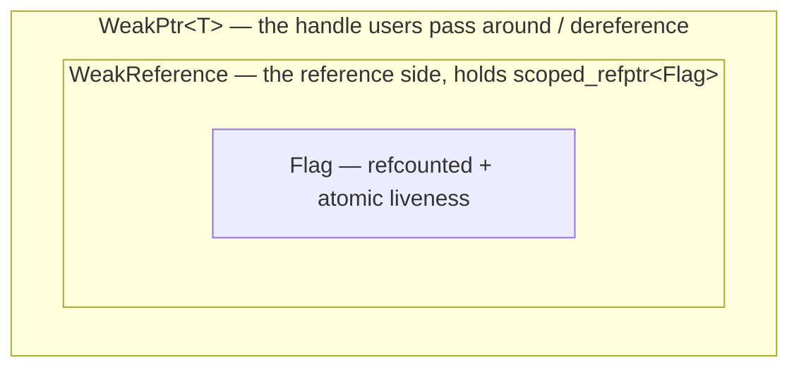

# WeakPtr hands-on (II): the core skeleton and control block

## Recap of the three-layer structure

WeakPtr is a three-layer structure: `Flag` (the control block), `WeakReference` (the reference side), and `WeakPtr<T>` (the user-facing handle). The seven prerequisite pieces have gathered all the parts — intrusive reference counting, acquire/release, CHECK/DCHECK — and in this piece we weld them together and watch how they mesh into real code. We will build bottom-up, starting with the lowest layer and the one carrying the most weight, `Flag`. It is the carrier of the "is the object dead yet?" state from [prerequisite (0)](./pre-00-weak-ptr-weak-reference-and-lifetime.md), and the industrial-grade true form of the hand-rolled flag in [01-4's cancellation token](../../01_once_callback/full/01-4-once-callback-cancellation-token.md).

Following the diagram from [02-1](./02-1-weak-ptr-motivation-and-api-design.md), let's fill in the code — here is that diagram one more time:



Each layer's job is not complicated. `Flag` owns the "is the object dead yet?" state — one atomic flag bit plus a reference count; `WeakReference` is a lightweight reference to the Flag — plainly a thin wrapper around `scoped_refptr<const Flag>`; `WeakPtr<T>` adds a `T*` on top of the `WeakReference`, assembling the handle the user holds.

---

## Layer one: Flag — a refcounted atomic state

Before designing `Flag`, let's straighten out its situation first. The factory side has to hold it, and every WeakPtr side has to hold it too — a whole crowd sharing one thing — which destines it to carry a reference count. The state it keeps in hand is a single boolean bit, "invalidated or not", and that bit has to be read and written from different sequences, so atomic it must be. On top of that, it is governed by reference counting, so whichever sequence lets go last may at any moment be the one responsible for deleting it — which in turn forces the count itself to be safe across threads.

Stack those three requirements together and you get exactly [prerequisite (I)](./pre-01-weak-ptr-intrusive-refcount-and-scoped-refptr.md)'s `RefCountedThreadSafe` colliding with [prerequisite (II)](./pre-02-weak-ptr-atomic-and-memory-order.md)'s acquire/release. We will reuse the minimal `RefCounted` from pre-01, upgrade it with `RefCountedThreadSafe`'s atomic-counting semantics, and build the Flag on top.

```cpp
// Platform: host | C++ Standard: C++17
#pragma once
#include <atomic>
#include <cassert>
#include <cstddef>

namespace tamcpp::chrome::internal {

// Cross-sequence-safe intrusive reference-counting base class (a simplified RefCountedThreadSafe)
class RefCountedThreadSafe {
public:
    void add_ref() const noexcept {
        ref_count_.fetch_add(1, std::memory_order_relaxed);
    }
    bool release() const noexcept {
        if (ref_count_.fetch_sub(1, std::memory_order_acq_rel) == 1) {
            return true;    // the caller is responsible for delete this
        }
        return false;
    }
    bool has_one_ref() const noexcept {
        return ref_count_.load(std::memory_order_acquire) == 1;
    }
protected:
    RefCountedThreadSafe() = default;
    ~RefCountedThreadSafe() = default;
private:
    mutable std::atomic<int> ref_count_{0};
};

// Mirrors Chromium's base::AtomicFlag: a one-shot, release/acquire boolean flag
class AtomicFlag {
public:
    void Set() noexcept {
        flag_.store(1, std::memory_order_release);
    }
    bool IsSet() const noexcept {
        return flag_.load(std::memory_order_acquire) != 0;
    }
private:
    std::atomic<uint_fast8_t> flag_{0};
};

}  // namespace tamcpp::chrome::internal
```

With those two parts in place, `Flag` itself turns out very thin:

```cpp
// Platform: host | C++ Standard: C++17
namespace tamcpp::chrome::internal {

class Flag : public RefCountedThreadSafe {
public:
    Flag() = default;

    // Invalidation: the release-store publishes the "object has entered the invalidated state" message together with all prior writes
    void Invalidate() noexcept {
        // The teaching version omits the sequence check; Chromium DCHECKs (seq || HasOneRef()) here
        invalidated_.Set();
    }

    // Liveness check (same-sequence contract): an acquire-load
    bool IsValid() const noexcept {
        return !invalidated_.IsSet();
    }

    // Liveness check (cross-sequence hint): also an acquire-load, but the caller owns the risk that a positive answer may not be trustworthy
    bool MaybeValid() const noexcept {
        return !invalidated_.IsSet();
    }

private:
    template <typename> friend class scoped_refptr;   // allows delete once the count hits zero
    ~Flag() = default;                   // private: outsiders cannot delete directly
    AtomicFlag invalidated_;
};

}  // namespace tamcpp::chrome::internal
```

A few spots in this code deserve their own callout. `Flag` inherits `RefCountedThreadSafe`, so the atomic reference count comes for free; the destructor is deliberately `private`, tightening the delete opening down to the `release` path and friends — exactly the "block outsiders from deleting directly" trick from the end of [prerequisite (I)](./pre-01-weak-ptr-intrusive-refcount-and-scoped-refptr.md), keeping itchy fingers away.

`Invalidate` pairs with `IsValid`, one release-store against one acquire-load; we already derived this pair's happens-before in [prerequisite (II)](./pre-02-weak-ptr-atomic-and-memory-order.md): once you read "invalidated", none of the object's earlier writes can escape you. The teaching version cuts the sequence checks (Chromium hangs `DCHECK(seq.CalledOnValidSequence() || HasOneRef())` inside `Invalidate` and `DCHECK_CALLED_ON_VALID_SEQUENCE` inside `IsValid`), leaving them for 02-4's discussion of lazy binding; but on the core acquire/release semantics, not a single word is discounted here.

---

## Layer two: WeakReference — a reference wrapper around Flag

One layer up sits `WeakReference`. Frankly it is `scoped_refptr<const Flag>` wearing a shell, and it does not do much: it holds a reference-counted handle pointing at the Flag and forwards the three operations `IsValid`/`MaybeValid`/`Reset` straight through.

```cpp
// Platform: host | C++ Standard: C++17
namespace tamcpp::chrome::internal {

// Simplified scoped_refptr (see pre-01 for the full version)
template <typename T>
class scoped_refptr {
public:
    scoped_refptr() noexcept = default;
    explicit scoped_refptr(T* p) noexcept : ptr_(p) { if (ptr_) ptr_->add_ref(); }
    scoped_refptr(const scoped_refptr& o) noexcept : ptr_(o.ptr_) { if (ptr_) ptr_->add_ref(); }
    scoped_refptr(scoped_refptr&& o) noexcept : ptr_(o.ptr_) { o.ptr_ = nullptr; }
    ~scoped_refptr() { if (ptr_ && ptr_->release()) delete ptr_; }
    scoped_refptr& operator=(scoped_refptr r) noexcept { T* t = ptr_; ptr_ = r.ptr_; r.ptr_ = t; return *this; }
    T* get() const noexcept { return ptr_; }
    explicit operator bool() const noexcept { return ptr_ != nullptr; }
private:
    T* ptr_ = nullptr;
};

class WeakReference {
public:
    WeakReference() = default;
    explicit WeakReference(const scoped_refptr<Flag>& flag) : flag_(flag) {}

    bool IsValid() const noexcept { return flag_ && flag_->IsValid(); }
    bool MaybeValid() const noexcept { return flag_ && flag_->MaybeValid(); }
    void Reset() noexcept { flag_ = nullptr; }

private:
    scoped_refptr<Flag> flag_;
};

}  // namespace tamcpp::chrome::internal
```

`flag_` holds a reference-counted handle, so several WeakReferences can share the same Flag without fighting over it. Once a Flag is constructed, its identity — which Flag `flag_` actually points to — never moves again; the only thing that can change is the `AtomicFlag invalidated_` bit, and `Set()` / `IsSet()` are thread-safe atomic operations to begin with, so cross-sequence reads and writes need no extra locking at all. (The real Chromium uses `scoped_refptr<const Flag>` here, at `weak_ptr.h:153`, wanting "Flag identity is immutable" shouted from the type level; our teaching version skips that const, and the companion `weak_ptr.hpp` stays consistent with the text.)

`Reset()` nulls `flag_` out, and `IsValid()` and `MaybeValid()` both flip to false immediately — an active letting-go.

---

## Layer three: WeakPtr\<T\> — the user-facing handle

At the top layer, `WeakPtr<T>` adds one more piece on top of `WeakReference`: a `T*`. This pointer's semantics are a bit counterintuitive: while the object lives it points at the object; once the object destructs, dangling is allowed — hanging there in broad daylight, but off-limits to the touch. [Prerequisite (V)](./pre-05-weak-ptr-template-friend-and-uintptr-t.md) explained why `raw_ptr` is deliberately not used here: permitting the dangle is itself part of the design, and gatekeeping is left to the `WeakReference`.

```cpp
// Platform: host | C++ Standard: C++20
#include <concepts>

namespace tamcpp::chrome {

template <typename T> class WeakPtrFactory;   // forward declaration

template <typename T>
class [[clang::trivial_abi]] WeakPtr {
public:
    WeakPtr() = default;
    WeakPtr(std::nullptr_t) noexcept {}    // NOLINT(google-explicit-constructor)

    // Upcast converting constructor (see pre-04)
    template <typename U>
        requires(std::convertible_to<U*, T*>)
    WeakPtr(const WeakPtr<U>& other) noexcept
        : ref_(other.ref_), ptr_(other.ptr_) {}

    template <typename U>
        requires(std::convertible_to<U*, T*>)
    WeakPtr(WeakPtr<U>&& other) noexcept
        : ref_(std::move(other.ref_)), ptr_(other.ptr_) {}

    // Liveness check + dereference, in two postures
    T* get() const noexcept { return ref_.IsValid() ? ptr_ : nullptr; }

    T& operator*() const { assert(ref_.IsValid()); return *ptr_; }   // the teaching version uses assert; Chromium uses CHECK
    T* operator->() const { assert(ref_.IsValid()); return ptr_; }

    explicit operator bool() const noexcept { return get() != nullptr; }

    void reset() noexcept {
        ref_.Reset();
        ptr_ = nullptr;
    }

    bool maybe_valid() const noexcept { return ref_.MaybeValid(); }
    bool was_invalidated() const noexcept { return ptr_ && !ref_.IsValid(); }

private:
    template <typename U> friend class WeakPtr;
    friend class WeakPtrFactory<T>;

    // Only the factory can call this: used at minting time
    WeakPtr(internal::WeakReference&& ref, T* ptr) noexcept
        : ref_(std::move(ref)), ptr_(ptr) {
        assert(ptr);
    }

    internal::WeakReference ref_;
    T* ptr_ = nullptr;     // RAW_PTR_EXCLUSION: dangling is allowed; ref_ gates the deref
};

}  // namespace tamcpp::chrome
```

Nothing in this code was written offhand — every piece maps back to one of the earlier prerequisites. Let's walk them one by one.

The `[[clang::trivial_abi]]` at the top of the class comes from pre-06; its job is to let this type — which clearly has a non-trivial destructor — pass in registers the way a trivial type would. pre-06 already argued the safety preconditions: `ptr_` is a raw pointer, trivial to begin with; the `scoped_refptr` inside `ref_` is trivial and still relocatable; both conditions hold, so the annotation will not tip over.

The `requires` clauses hanging on the converting constructors (pre-04's product) police the direction of conversion: `WeakPtr<Derived>` can convert toward `WeakPtr<Base>`, while the reverse direction and unrelated types get blocked at compile time. The `template <typename U> friend class WeakPtr` right after them (pre-05) is not decoration: the converting constructors need to read `other.ref_` / `other.ptr_`, and without that friend declaration they simply cannot reach them.

The teaching version uses `assert` in `operator*` and `operator->` — a debug-time catch; the real Chromium uses `CHECK`, which crashes just the same in release. Dereferencing something already invalidated is a flat-out logic error, and in production it must blow up on the spot; in 02-6 we will use a macro to switch the release behavior — file that away for now.

Finally, that private constructor paired with `friend WeakPtrFactory<T>` is the minting slot reserved for the factory. Through it the factory can write values straight into `ref_` and `ptr_`, where nobody outside can reach — securing the contract that "only the factory can mint a WeakPtr".

### The gatekeeping chain inside get()

The most critical line is `get()`:

```cpp
T* get() const noexcept { return ref_.IsValid() ? ptr_ : nullptr; }
```

Unrolled, the whole gatekeeping chain is:

```text
get() → ref_.IsValid() → (flag_ && flag_->IsValid()) → !invalidated_.IsSet()
                                                          ↑ acquire-load
```

Beneath a single `get()` call there is exactly one atomic acquire-load. If it reads "not invalidated", return `ptr_`, and the caller can deref with a clear conscience; if it reads "invalidated", hand back `nullptr` obediently. All of WeakPtr's safety is tied to this gate: every dereference must, and can only, pass through `get()`. `operator*` / `operator->` look like they lay hands on `ptr_` directly, but both `CHECK` `ref_.IsValid()` before going in — equivalent to having confirmed that `get()` would not return null.

---

## Wiring it together: a minimal working example

The factory is not written yet (that is the next piece's job), but we can hand-assemble a Flag + WeakReference and first verify the three layers run through. The snippet below is pseudocode for exposition — it calls `WeakPtr`'s private constructor directly, which normally only `WeakPtrFactory` can reach through friendship; the real, compilable version lives in the companion `code/.../chrome_design/16_weak_ptr_skeleton.cpp`, which takes the proper road of factory minting.

```cpp
// Platform: host | C++ Standard: C++20
#include <iostream>

struct Foo { int x = 42; };

int main() {
    using namespace tamcpp::chrome;
    using namespace tamcpp::chrome::internal;

    Foo foo;

    // Hand-assemble a Flag + WeakReference (simulating the factory's minting; 02-3 will wrap it up)
    auto* flag = new Flag();
    scoped_refptr<Flag> flag_ref(flag);                 // ref_count = 1
    WeakReference ref(flag_ref);                        // ref_count = 2
    WeakPtr<Foo> wp(std::move(ref), &foo);              // holds ref + &foo

    std::cout << (wp ? "alive" : "dead") << '\n';       // alive
    std::cout << wp->x << '\n';                         // 42

    flag->Invalidate();                                 // simulate the invalidation before the object destructs
    std::cout << (wp ? "alive" : "dead") << '\n';       // dead
    std::cout << wp.get() << '\n';                      // 0(nullptr)

    return 0;
}
```

Run it, and the terminal spits out `alive` / `42` / `dead` / `0`. The moment `Invalidate` is called, `wp`'s `operator bool` (backed by `get()`) flips to false, and `get()` honestly hands back `nullptr`. The promise made back in [02-1](./02-1-weak-ptr-motivation-and-api-design.md) — when the object dies, the callback receives a nullptr rather than a dangling pointer — is honored in code right here.

Still, our Flag at this point is hand-assembled. Who does the minting, and who is responsible for shouting `Invalidate` at the very moment the object destructs? That is where `WeakPtrFactory` enters the stage. Implementing the factory, plus that famous "last member" idiom, is what we take apart in the next piece.

## References

- [Chromium `base/memory/weak_ptr.h`](https://source.chromium.org/chromium/chromium/src/+/main:base/memory/weak_ptr.h)
- [Chromium `base/memory/weak_ptr.cc`](https://source.chromium.org/chromium/chromium/src/+/main:base/memory/weak_ptr.cc)
- [WeakPtr prerequisite (I): intrusive reference counting and scoped_refptr](./pre-01-weak-ptr-intrusive-refcount-and-scoped-refptr.md)
- [WeakPtr prerequisite (II): std::atomic and memory_order](./pre-02-weak-ptr-atomic-and-memory-order.md)
