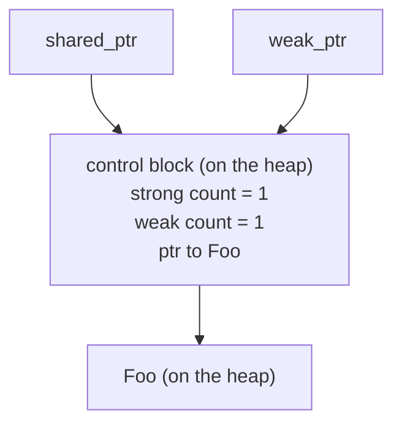

# WeakPtr prerequisite (0): weak references and the lifetime puzzle

In [OnceCallback hands-on (IV): designing the cancellation token](../../01_once_callback/full/01-4-once-callback-cancellation-token.md) we hand-rolled an atomic flag: 0 while the object was alive, flipped to 1 right before destruction, glanced at before the callback ran, and a well-behaved no-op once set. The dangling problem was gone, but the more we turned it over afterwards, the less it sat right: who exactly owns that flag? How long does it live? And how does the callback get a firm grip on it? The tail we waved off in one sentence back then is precisely the most stubborn class of problems in C++ — lifetime and ownership.

Object A wants to reference object B without extending B's life, and still wants to know at any moment whether B is alive. This piece takes that apart: how the standard library's `std::weak_ptr` copes, why it comes up short in async callbacks, and why Chromium saw fit to roll its own `WeakPtr` from scratch.

---

## Lifetime: the two ends of the ownership spectrum

Let's pull the camera all the way back first. In C++, "A references B" sits at two extremes on the ownership spectrum, with a wide empty stretch in between — what we're hunting for is some foothold in the middle.

### Strong references: holding one extends the life

`std::shared_ptr<T>` is the canonical strong reference. It expresses shared ownership: as long as one `shared_ptr` still points at B, B is not allowed to die; only when the last one leaves is B destroyed.

```cpp
auto sp = std::make_shared<Foo>();  // reference count = 1
{
    std::shared_ptr<Foo> sp2 = sp;  // reference count = 2
}   // sp2 leaves, the count drops back to 1, Foo lives on
// sp is still here, Foo is still alive
```

The rules are safe, but the price is honest: whoever takes a `shared_ptr` gets a hand in B's lifespan. Picture A as a timer and B as a business object, with A holding a reference to B so it can call B's method when the timer fires. What happens if A holds a `shared_ptr<B>`? As long as the timer stays scheduled, B can never be destroyed — even when business semantics say B should have left long ago. A only meant to "borrow it for a bit", and ended up "co-owning" it. The ownership graph is muddied, and everyone who later has to reason about lifetimes pays for it with a frown.

### Raw pointers: no ownership, and no warning when the target dies

On the other end sits the raw pointer `T*`. It stays entirely out of ownership: whether B lives or dies is none of A's business — use it whenever you like. Feather-light, and just as hair-raising:

```cpp
Foo* p = obj;
obj = nullptr;       // someone elsewhere destroyed the object
p->do_something();   // dangling pointer, undefined behavior, most likely a segfault
```

Note that the raw pointer's sin is not "doesn't extend the lifetime" — that is exactly what we asked for. The sin is that it has no way whatsoever to express "but I'd still like to confirm the other side is alive". A pointer is just an address, and an address doesn't turn null because the object was destroyed. `p` is still the same `p`, while the memory it aims at may long since have been taken over by some other object — one touch and it's a use-after-free.

### What we actually want

Put the two extremes on the table, and what we want comes into focus — somewhere in the middle of the spectrum:

> No ownership, so no extended lifetime; but the slip in hand can still tell whether the other side has left.

That is a weak reference: it only observes liveness and takes no part in the ownership count. The standard library ships `std::weak_ptr`, but it carries no small amount of baggage; Chromium wrote a separate `WeakPtr` in `//base`. This series takes both apart until they make sense, and then we hand-roll a teaching version of our own.

---

## std::weak_ptr: the standard library's weak reference

`std::weak_ptr` entered the standard library with C++11. It has one hard rule: it can only be constructed from a `shared_ptr`; you cannot conjure a `weak_ptr` out of thin air pointing at a stack object or a bare object from `new`.

The rule grows out of its mechanism. Inside a `shared_ptr` there is more than a bare pointer: it also points at a piece of heap memory called the control block, where the reference counts live. A `weak_ptr` shares that same control block, but travels on its own separate counter, the weak count.



Here is the crux: a `weak_ptr` doesn't increase the strong count, so it has no hand in when Foo is destroyed; but it does increase the weak count, and that keeps the control block itself lingering alive. This earns the weak reference one trick nobody else has: after the object is destroyed, it can still answer "is the object gone yet?"

### The three core operations

```cpp
auto sp = std::make_shared<Foo>();
std::weak_ptr<Foo> wp = sp;   // constructed from the shared_ptr, does not increase the strong count

wp.use_count();   // how many strong references are left
wp.expired();     // equivalent to use_count() == 0, has the object been destroyed
auto locked = wp.lock();  // try to upgrade back to a shared_ptr
```

`expired()` tells you whether the object is dead; `lock()` nudges the weak reference toward a strong one — if the object is alive it hands you a valid `shared_ptr`, and if it's already gone you get an empty one.

### Why you must use lock(), not expired() plus construction

The most natural way for a newcomer to write it is this — and it is also the easiest way to end up in a ditch:

```cpp
std::weak_ptr<Foo> wp = sp;
// ... someone else may have released sp ...

if (!wp.expired()) {
    // wp hasn't expired here?
    sp->do_something();   // wrong! sp may have been released after expired() but before this line
}
```

The instant `expired()` returns `false`, the object really is alive; but between your getting that `false` and actually dereferencing, another thread may drop the last `shared_ptr` and trigger the destructor. This is the textbook TOCTOU (time-of-check-to-time-of-use) race: a window stands open between the moment you check and the moment you use.

The correct fix is `lock()`: it packs "check liveness" and "upgrade to a strong reference" into a single atomic operation. Either you get a `shared_ptr` that guarantees the object is alive, or you get an empty one — no seam in between:

```cpp
if (auto locked = wp.lock()) {
    locked->do_something();   // locked now holds a strong count, the object is guaranteed alive
}
```

This step is the lifeblood of using `weak_ptr` safely, so digest it well: `lock()` squeezes the liveness check and the lifetime extension into the same atomic operation. Chromium's `WeakPtr` takes another road: it never extends lifetime at all, it only checks liveness, so it doesn't count on lock()'s "check-and-extend atomically" trick to plug TOCTOU. Instead it throws down a sequence contract — deref and invalidate must land on the same sequence, tasks within a sequence run serially, and the window is gone at the root. We'll unfold that contract in 02-4 (sequence affinity); for now, just carry the impression.

---

## make_shared and the control block: a counterintuitive memory detail

At this point one detail deserves a pause, because it leads straight into "intrusive vs non-intrusive reference counting" — the core motivation of the next piece — so let's plant the seed here.

`std::shared_ptr`'s control block is non-intrusive: a separate block of heap memory living apart from the object. So behind the single statement `std::shared_ptr<Foo>(new Foo)` there are actually two heap allocations — one for Foo, one for the control block.

```cpp
std::shared_ptr<Foo> sp1(new Foo);   // two heap allocations: Foo + control block
auto sp2 = std::make_shared<Foo>();   // one heap allocation: Foo and the control block packed together
```

`std::make_shared` squeezes the object and the control block into the same heap allocation, done in one shot — the main reason it beats `shared_ptr(new)` on speed. But this optimization drags out a counterintuitive side effect: as long as one `weak_ptr` still points at it, the whole block of memory (the part the object occupied included) is never returned, even long after the object has been destroyed.

```cpp
std::weak_ptr<Foo> wp;
{
    auto sp = std::make_shared<Foo>();   // one allocation: control block + Foo
    wp = sp;
}   // sp leaves, Foo is destroyed, but the control block stays because wp is still around
// Foo's destruction has already run, yet the memory it occupied still hangs there, because the control block is packed with it
auto sp2 = wp.lock();   // returns an empty shared_ptr — the object is truly gone
// but the make_shared allocation is only truly returned once wp is destroyed too
```

Why? The control block has to outlive every `weak_ptr` (otherwise a `weak_ptr` couldn't safely query `expired()`), and `make_shared` insists on tying the control block and the object into one household. Object destroyed does not mean memory returned; in scenarios where the `weak_ptr` lives long, you end up dragging around a chunk of memory that is dead through and through yet still squatting there.

This isn't a `weak_ptr` bug — it is what you get when the non-intrusive control block and make_shared's merged allocation stack on top of each other. But it is a real cost, and Chromium's `WeakPtr` sidesteps it with intrusive reference counting; we unfold that in the next piece.

---

## Four limits of std::weak_ptr in async/callback scenarios

Zoom back in now, to the scenario this series truly cares about: async callbacks and task posting. `std::weak_ptr` is a general-purpose, correct design — that needs no whitewashing. But stuffed into a system of "task posting + no ownership entanglement + sequenced execution", it pushes back at you in four places, and each one is a reason for Chromium to roll its own.

### Limit 1: it must pair with shared_ptr, forcing ownership into the picture

This one is the killer. A `weak_ptr` can only come from a `shared_ptr`, which means: to use weak references at all, first convert the object into `shared_ptr` management. But for many objects the natural ownership is not shared at all — the object belongs to some owner, and when the owner goes it should go; it needs none of the reference-counting sprawl.

Forcing a `shared_ptr` onto an object that was never meant to be shared warps the ownership graph on the spot: a clean-cut "single owner" becomes, in theory, a share anyone could grab. Every maintainer who later glances at that `shared_ptr` has to go on alert — is this genuinely shared ownership, or just pasted on to get a `weak_ptr`? The cost of that hesitation is invisible, but it is real.

### Limit 2: the non-intrusive control block costs an allocation

The previous section already laid this out: `shared_ptr` either costs two allocations, or one with `make_shared` at the price of tying the memory down. For a weakly referenced object created at high frequency (callback targets are often exactly this kind), the overhead is far from friendly. Chromium takes the intrusive route — the reference count is made a member of the object itself, one allocation and done; details in the next piece.

### Limit 3: no way to invalidate a whole batch at once

Picture an object referenced by a dozen-plus callbacks or timers, each clutching its own `weak_ptr`. When the object is destroyed, those `weak_ptr`s should expire as a group — yet `weak_ptr` has no "actively invalidate a batch" move. They do expire, but only because the object's last `shared_ptr` dissolved. In other words, invalidation is a side effect driven by the reference count, not an action you can explicitly call off.

For pure lifetime management there is nothing wrong here. But the moment you want to express "the object is still alive, but it has entered a state where it must not be called back anymore", `weak_ptr` is out of words. In Chromium this need is everyday routine, and `WeakPtr` can do it (`InvalidateWeakPtrs()`, covered in 02-3).

### Limit 4: no sequence affinity

`std::weak_ptr`'s threading model is "the atomic operations themselves are safe; whether the dereference needs synchronization is your call". In general-purpose code that is a sensible default. But dropped into an engineering system like Chromium's — tasks run on sequences, and the overwhelming majority of objects answer to exactly one sequence — that freedom turns into a pit: nothing reminds you "this object may only be deref'd on a certain sequence", and sooner or later you will forget which dereference needed a lock.

Chromium wants it the other way around: weak references may flow between sequences, but dereference and invalidation must land on the bound sequence, and offenders get caught — at least in debug builds. That is precisely the job of `WeakPtr`'s `SEQUENCE_CHECKER`, expanded in 02-4.

---

## Chromium's trade-offs: what kind of weak reference it wants

Stack the four limits together, and Chromium's requirements could not be clearer:

| `std::weak_ptr` limit | What Chromium's `WeakPtr` wants |
|---|---|
| Must pair with `shared_ptr` | **No ownership entanglement** — the object is managed however it was; WeakPtr is only an observer |
| Non-intrusive control block | **Intrusive reference counting** — the count is an object member, one allocation |
| No batch invalidation | **Shared flag** — one factory invalidate and every WeakPtr expires together |
| No sequence affinity | **Sequence binding** — deref/invalidation must happen on the bound sequence, DCHECK'd in debug |

That table is the roadmap for the six hands-on pieces that follow. What we'll do is land those four things in code, row by row: a `RefCountedThreadSafe` flag (intrusive + safe across sequences), a release/acquire pair of atomic operations (safe visibility between sequences), a `WeakPtrFactory` shouldering batch invalidation, and a set of `SEQUENCE_CHECKER` macros standing guard over the sequence contract.

But before that, several blocks of prerequisite knowledge must be filled in first: what intrusive reference counting really is (`scoped_refptr` / `RefCountedThreadSafe`, next piece), atomic operations and memory order (pre-02), sequences and thread affinity (pre-03), plus the concepts and `TRIVIAL_ABI` that WeakPtr uses (pre-04 through 06). This piece covers the "why": absorb the requirements thoroughly, and in every implementation step that follows you will know which hole it is patching.

## References

- [cppreference: std::weak_ptr](https://en.cppreference.com/w/cpp/memory/weak_ptr)
- [cppreference: std::shared_ptr and the control block](https://en.cppreference.com/w/cpp/memory/shared_ptr)
- [cppreference: std::make_shared](https://en.cppreference.com/w/cpp/memory/shared_ptr/make_shared)
- [Chromium `base/memory/weak_ptr.h` design notes](https://source.chromium.org/chromium/chromium/src/+/main:base/memory/weak_ptr.h)
