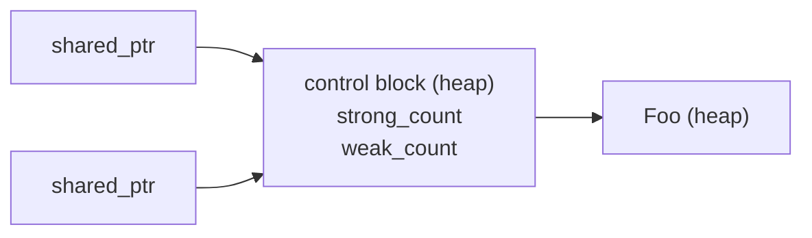
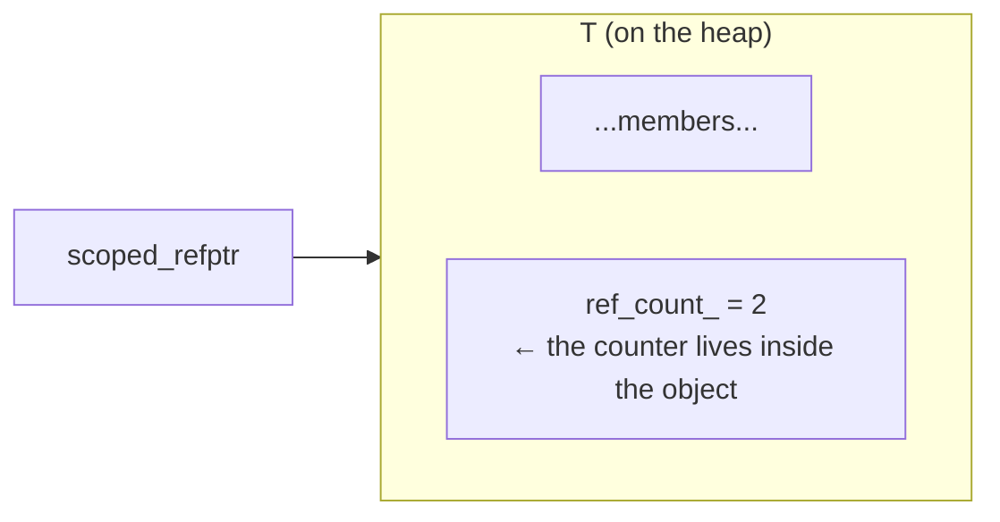

# WeakPtr prerequisite (I): intrusive reference counting and scoped_refptr

In the previous piece we planted a seed: Chromium's `WeakPtr` parks the "is the object dead yet?" state inside a small object called `Flag`, and that Flag gets shared by the object's owner and by every callback holding a WeakPtr — parties that may well run on different sequences. A small object shared by several parties that still has to be freed safely: that is exactly the job reference counting was built for.

And yet Chromium deliberately does not use `std::shared_ptr`. It rolled its own intrusive reference counting, with a shell called `scoped_refptr` and a base class `RefCountedThreadSafe`. The first time I hit this spot in the source I was genuinely puzzled: the standard library ships a ready-made solution, so why reinvent the wheel? This piece takes that puzzle apart. Three things, laid out thoroughly: how `std::shared_ptr`'s non-intrusive control block really differs from an intrusive count, what the `scoped_refptr` shell looks like, and why WeakPtr's Flag has to use the cross-sequence-safe version.

---

## Refcounting: letting several owners share one object

Set the smart-pointer syntax aside for a moment and look at the essence. Reference counting solves exactly one problem: an object is shared by several holders — how do we guarantee it only gets destructed when the last holder leaves? The mechanism is two steps, no more: pick up a new reference, and the counter goes up by one; drop a reference, and it goes down by one — if it hits zero, you were the last one out, so switch off the lights on your way, which is to say, destruct the object.

The mechanism itself does not care where the counter is stored. But it is precisely that "where does it live" question that splits `std::shared_ptr` and Chromium's `scoped_refptr` onto two different roads — one called non-intrusive, the other intrusive.

---

## Non-intrusive: how std::shared_ptr does it

`std::shared_ptr` puts the counter outside the object — a separate chunk of heap memory, called the control block. The smart pointer internally stores two pointers: one to the object, one to the control block.



The most direct benefit of doing it this way: the object itself has no idea it is being reference counted. Take any type `T`, drop it into a `shared_ptr<T>`, and not a single line of `T` needs to change. That is non-intrusive's biggest advantage — universality; anything fits.

The cost lands on allocation. You write `std::shared_ptr<Foo>(new Foo)`, and under the hood two heap allocations actually happen: one for the Foo, one for the control block. `std::make_shared<Foo>()` merges the two into one and saves you that extra cut, but we talked about its side effect in [prerequisite (0)](./pre-00-weak-ptr-weak-reference-and-lifetime.md): hang a long-lived `weak_ptr` off it, and the entire object's memory lingers around, unreleased.

There is a sneakier cost: the control block is only attached at runtime, so when all you hold is a `T*`, there is no way to go back and find its reference count. That sounds harmless, but the moment you face a judgment like "am I the sole holder right now?", it forces you to take the long way around.

---

## Intrusive: the counter is a member of the object

Intrusive reference counting flips it around — the counter directly becomes part of the object. The most common approach is to have `T` inherit from a base class that carries its own counter:



With that, the pros and cons swap places compared to non-intrusive. The benefit is one allocation — object and counter form a single body, one `new` handles everything, no extra control block. More valuable still: any code holding a `T*` can trace its way straight to the count, because the count is a member in the first place; `shared_ptr` is powerless given a raw pointer. The cost, of course, is the "intrusion" itself — `T` must inherit a base class, a line of code has to change, and not just any type can be dropped in.

### Comparison table

| Axis | Non-intrusive (`shared_ptr`) | Intrusive (`scoped_refptr`) |
|---|---|---|
| Counter location | Standalone control block (heap) | Member of the object itself |
| Heap allocations | 2 (or 1 with `make_shared`, but the memory is fused together) | **1** |
| Does the object need modifying | No | Must inherit a base class |
| Can a `T*` query the count | No | Yes (`HasOneRef()` etc.) |
| Weak reference | Built-in `weak_ptr` | Must be built separately (that is exactly what WeakPtr is for) |

Chromium chose intrusive, at the root, to squeeze out overhead and to standardize on one convention. `//base` has a flood of small objects all going through reference counting; saving one allocation and one pointer indirection at each spot adds up to real money at browser scale. And standardizing on one intrusive convention makes operations like "query the count straight from a raw pointer" feasible — which is exactly the capability that the cross-thread destruction exemption in `WeakPtr::Flag::Invalidate` needs.

---

## Hand-rolling a minimal intrusive reference count

Theory alone is not satisfying enough, so let's hand-roll one ourselves and squeeze Chromium's design decisions out step by step. First, write the counting base class:

```cpp
// Platform: host | C++ Standard: C++17
#include <atomic>
#include <cstddef>

// Atomic intrusive refcount base class (corresponds to Chromium's
// RefCountedThreadSafe, not the non-atomic RefCounted — the latter is for
// single-sequence objects; here we go cross-sequence, so atomics it is)
class RefCountedThreadSafe {
public:
    void add_ref() const noexcept {
        ref_count_.fetch_add(1, std::memory_order_relaxed);
    }

    bool release() const noexcept {
        // release semantics: writes before destruction are visible to the
        // thread that subsequently observes count == 0
        if (ref_count_.fetch_sub(1, std::memory_order_acq_rel) == 1) {
            return true;   // the caller is responsible for delete this
        }
        return false;
    }

    bool has_one_ref() const noexcept {
        return ref_count_.load(std::memory_order_acquire) == 1;
    }

protected:
    RefCountedThreadSafe() = default;
    ~RefCountedThreadSafe() = default;

private:
    mutable std::atomic<int> ref_count_{0};
};
```

A few points deserve calling out. The counter is `mutable` — `add_ref` / `release` do not, logically, change the object's observable state, so they must be callable on a `const` object. The `acq_rel` on `release` is deliberate: the acquire side lets it synchronize correctly with other threads' `add_ref` / `release` (establishing happens-before — not "reading the freshest value"; that would take `seq_cst`), and the release side, when the count drops to zero, publishes every write made on this object to whichever thread takes over the `delete`.

Next, have the target type inherit from it:

```cpp
class Flag : public RefCountedThreadSafe {
public:
    Flag() = default;
    // ... business interface ...
};
```

At this point `Flag` carries its own counter. But a counter alone is not enough — we still need a smart pointer that automatically calls `add_ref` / `release` on copy, move, and destruction. That thing is `scoped_refptr`.

---

## scoped_refptr: the smart-pointer shell for intrusive reference counting

`scoped_refptr<T>` does the same job as `std::shared_ptr<T>` cut from the same mold — copy bumps the count, destruction decrements it, and hitting zero deletes the object. The difference is that it does not keep a separate control block; it directly calls the `add_ref` / `release` that `T` inherited. A minimal implementation looks like this:

```cpp
// Platform: host | C++ Standard: C++17
template <typename T>
class scoped_refptr {
public:
    scoped_refptr() noexcept = default;

    explicit scoped_refptr(T* p) noexcept : ptr_(p) {
        if (ptr_) ptr_->add_ref();
    }

    // copy: +1
    scoped_refptr(const scoped_refptr& other) noexcept : ptr_(other.ptr_) {
        if (ptr_) ptr_->add_ref();
    }

    // move: no bump, no drop — just empty the source
    scoped_refptr(scoped_refptr&& other) noexcept : ptr_(other.ptr_) {
        other.ptr_ = nullptr;
    }

    ~scoped_refptr() { release(); }

    scoped_refptr& operator=(scoped_refptr r) noexcept {  // copy-and-swap
        swap(r);
        return *this;
    }

    void swap(scoped_refptr& other) noexcept {
        T* tmp = ptr_; ptr_ = other.ptr_; other.ptr_ = tmp;
    }

    T* get() const noexcept { return ptr_; }
    T& operator*() const noexcept { return *ptr_; }
    T* operator->() const noexcept { return ptr_; }
    explicit operator bool() const noexcept { return ptr_ != nullptr; }

private:
    void release() noexcept {
        if (ptr_ && ptr_->release()) {
            delete ptr_;   // last reference, destruct
            ptr_ = nullptr;
        }
    }

    T* ptr_ = nullptr;
};
```

The `operator=` here has a trick to it: it uses copy-and-swap. The by-value parameter `r` already performs one copy and bumps the count; inside the body it swaps with `this`, and when `r` is destroyed it releases the old reference `this` was holding. This one stroke handles self-assignment and exception safety. Chromium's `scoped_refptr` is roughly this shape, with more details (inter-type conversions, `raw_ptr` integration, that kind of thing), but the core skeleton matches ours.

Usage is nearly identical to `shared_ptr`:

```cpp
auto p = scoped_refptr<Flag>(new Flag);   // ref_count = 1
{
    auto p2 = p;                           // ref_count = 2
}                                          // p2 destructs, ref_count = 1
// p is still around; Flag stays alive
```

But in memory it only allocated once — the `Flag` object itself, with the counter embedded inside it.

---

## RefCounted vs RefCountedThreadSafe

Chromium actually keeps two versions of the refcount base class, and the difference comes down to one question: atomics or not.

One is `RefCounted<T>`, the non-atomic version. Counting goes through plain integer add/sub, so it can only be used on a single sequence. It carries a `SequenceChecker` internally that, in debug builds, exists specifically to catch violations like "refcount touched from another sequence." If the count stays at 1 and is never copied, the object can in fact be moved to another sequence; but the moment `add_ref` / `release` get called concurrently, that is a genuine data race. The benefit is minimal overhead.

The other is `RefCountedThreadSafe<T>`, the atomic version. Counting uses atomic instructions (`fetch_add` / `fetch_sub` with `acq_rel`), so multiple sequences and threads can bump and drop concurrently and safely. The cost is of course higher than the non-atomic version — one atomic operation is not the same thing as one plain add/sub — but for an object shared across sequences, it is a hard requirement.

The tradeoff logic is actually simple: stay single-sequence when you can, and bank the atomic overhead; only reach for the atomic version when going cross-sequence is unavoidable. Chromium does not blindly use `ThreadSafe` everywhere — inside a browser the vast majority of objects are single-sequence by nature, and atomics piled onto hot paths accumulate a cost that is not to be underestimated.

### HasOneRef(): the privilege of querying the count from a raw pointer

Intrusive has one capability non-intrusive cannot pull off — with nothing but the object's `T*` in hand, you can directly ask "am I the only one holding a reference right now":

```cpp
bool has_one_ref() const noexcept {
    return ref_count_.load(std::memory_order_acquire) == 1;
}
```

`shared_ptr` cannot do this, because you need a `shared_ptr` first before you can reach the control block; hand it a bare `T*`, and it has no idea where the control block is. But an intrusive counter grows right on the object, so a `T*` alone is enough.

WeakPtr uses this capability cleverly — as we will see in [02-2, the hands-on series], `Flag::Invalidate` contains this line:

```cpp
DCHECK(sequence_checker_.CalledOnValidSequence() || HasOneRef());
```

Translated into words: Invalidate must be called on the bound sequence; but if `HasOneRef()` — meaning no WeakPtr is holding this Flag anymore — then it does not matter which sequence destructs it, so let it through. This opening for cross-thread destruction can only be written when two things come together: "intrusive" plus "the count is queryable from `this`". It is the most concrete, and most valuable, payoff of intrusive reference counting inside WeakPtr.

---

## A pit that must be plugged: never let users new/delete directly

Intrusive reference counting has one iron invariant — the object may only be `delete`d by `release()` at the exact moment the count reaches zero, never directly by outside code. Think it through: a user grabs a `scoped_refptr`, turns around, and calls `delete p.get()`; the counter is still being referenced inside other `scoped_refptr`s, yet the object is already destroyed. Instant dangling.

`std::shared_ptr` does not have to worry about this, because the control block keeps the object firmly in its grip. Intrusive cannot lean on that; it needs the object's own cooperation: hide the destructor as `private` or `protected`, and leave only the refcount `release` path as the way in. That is exactly what Chromium's `RefCountedThreadSafe` does — through a `friend`-protected `Destroy()` it actually performs `delete this`, outside code can never touch the destructor, and mistaken deletes are plugged at the source.

```cpp
// Teaching version: non-template base (matches RefCountedThreadSafe at line 123 above)
// Real Chromium is the template form RefCountedThreadSafe<Flag>; see the note below
class Flag : public RefCountedThreadSafe {
public:
    Flag() = default;

private:
    template <typename> friend class scoped_refptr;   // teaching version: scoped_refptr does the delete
    ~Flag() = default;          // private: outside code cannot delete directly
    // ...
};
```

When we hand-roll the teaching version we follow the same principle — a private destructor plus a controlled release path — but one detail must be spelled out: in real Chromium, `release()` calls a `Destroy()` static method that `RefCountedThreadSafe<T>` befriends, and that performs `delete this`; in our simplified version, `delete ptr_` is written directly inside `scoped_refptr<T>::~scoped_refptr()`. So in the teaching version, Flag's friend is `scoped_refptr`, not `RefCountedThreadSafe` — the companion code `12_intrusive_refcount.cpp` and `weak_ptr.hpp` is written exactly this way and compiles directly. This approach and RAII are twin siblings: resource acquisition is initialization, and release may only travel the one controlled road.

---

The two forms of refcounting are now fully taken apart. Non-intrusive `std::shared_ptr` puts the count in a standalone control block — universal, at the price of one extra allocation; intrusive `scoped_refptr` embeds the counter in the object — one allocation, and as a bonus it hands you the ability to query the count straight from a `T*`, at the price of the object having to inherit a base class. To squeeze overhead and standardize on one convention, Chromium bets on intrusive across `//base`. The tradeoff between the two base classes, `RefCounted` (non-atomic, single-sequence) and `RefCountedThreadSafe` (atomic, cross-sequence), comes down at the end of the day to: save wherever you can.

For WeakPtr specifically, the Flag is shared by WeakPtrs living on several sequences, so it absolutely must use `RefCountedThreadSafe`; and the "query the count from `this`" capability of `HasOneRef()` is precisely the premise that lets `Flag::Invalidate` write its cross-thread destruction exemption. The next building block is atomic operations and memory order — we are going to truly understand that `acq_rel` sitting inside `RefCountedThreadSafe`.

## References

- [Chromium `base/memory/ref_counted.h`](https://source.chromium.org/chromium/chromium/src/+/main:base/memory/ref_counted.h)
- [Chromium `base/memory/scoped_refptr.h`](https://source.chromium.org/chromium/chromium/src/+/main:base/memory/scoped_refptr.h)
- [cppreference: std::shared_ptr](https://en.cppreference.com/w/cpp/memory/shared_ptr)
- [cppreference: std::atomic and memory_order](https://en.cppreference.com/w/cpp/atomic/memory_order)
