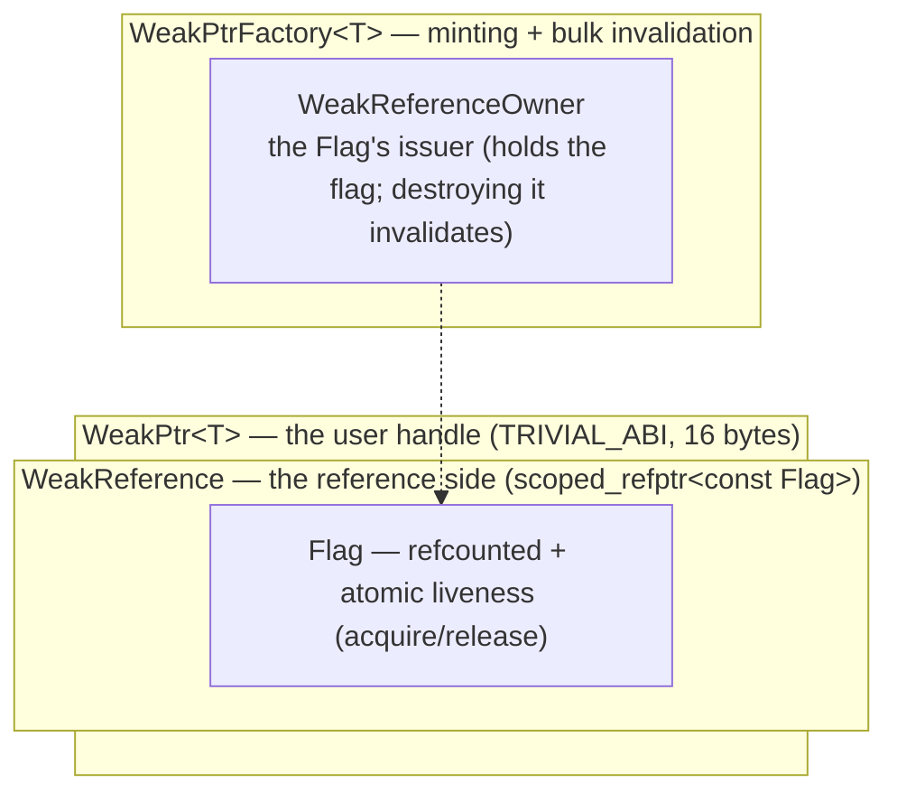

# weak_ptr Design Guide (I): motivation, API, and the control block

> This is the hands-on track: we assume you are already comfortable with acquire/release, concepts, and intrusive reference counting; if not, work through [the full/ prerequisites](../full/pre-00-weak-ptr-weak-reference-and-lifetime.md) first.

Last time, when we hand-rolled the OnceCallback cancellation token, we took the lazy route and slapped an atomic flag on it — set it on object destruction, run one `if` before the callback fires, and the dangling was indeed gone. But the thing had a loose end we didn't pay much mind to at first: who exactly owns that flag? And how does the callback get hold of it? We honestly hadn't thought that through ourselves at the time. Chromium works this question all the way through in `//base`, and the answer is `WeakPtr`. In this piece we take apart the motivation, the API, and the control-block architecture; implementation and tests are left to the following two pieces. We won't touch code details here — the goal is simply to get "why it was designed this way" straight in our heads.

## The problem: `std::weak_ptr`'s four limitations in async callbacks

`std::weak_ptr` itself is a general-purpose, correct design — nothing to argue there. But stuff it into a system built on "task posting + staying out of ownership + serialized execution", and it pushes back in four places:

First, it is hard-welded to `shared_ptr`. To hold a weak reference, you must first put the object under `shared_ptr` management — one clean owner to begin with, and now you have bent the ownership model out of shape with your own hands.

Second, its control block is non-intrusive. Two roads: either two heap allocations, or `make_shared` merging the object and the control block into a single allocation. The latter looks like the easy win, but hang one long-lived `weak_ptr` off it and the entire object's memory overstays its welcome instead of being released — which gets loud in embedded systems or long-lived processes.

The third is sneakier — we only ran into it once we genuinely wanted to "invalidate a whole batch at once": `std::weak_ptr` has no "fail an entire batch in one stroke". Its invalidation is a side effect driven by the reference count — the last `shared_ptr` goes away, and the weak references lapse on their own. But what if you want to say "the object is still alive, yet it has entered a state where it must not be called back anymore"? There is no such API; you end up taking a detour through some outer flag of your own.

Fourth, it has no sequence affinity. The atomic operations themselves are safe, but "does this dereference need synchronization" is a question it refuses to answer — it drops that decision in your lap. In a system where "tasks run on sequences", that freedom is actually a pit — sooner or later you will forget whether some particular dereference needed a lock.

## The design philosophy of Chromium's WeakPtr

WeakPtr pushes back on all four of those, one by one. The trade-offs are laid out in the table below; one glance should map them for you:

| Limitation | WeakPtr's goal |
|---|---|
| Must pair with shared_ptr | **Stays out of ownership** — an observer, not an owner |
| Non-intrusive control block | **Intrusive reference counting** — the Flag uses `RefCountedThreadSafe`, one allocation |
| Cannot invalidate in bulk | **A shared Flag** — one factory invalidate, and every WeakPtr lapses together |
| No sequence affinity | **Sequence binding** — deref/invalidation must happen on the bound sequence, DCHECK catches violations in debug builds |

The step we find most abstract sits right here: Chromium simply peels "is the object dead yet" off the object itself and makes it a separate, reference-counted little object — it calls the thing a Flag. The factory and every WeakPtr share one and the same Flag. Once you split it this way, "one invalidate, every observer lapses together" comes almost for free — just flip the Flag over, and every WeakPtr holding it reads false on its next liveness test. Even better: when the object gets destroyed now has nothing whatsoever to do with WeakPtr — the object is deleted by its owner as usual, the Flag is looked after by its own reference count, and the two affairs are thoroughly decoupled.

## API design

The externally visible API is just this much — we were honestly a bit surprised on our first read: such a powerful mechanism, such a plain storefront:

```cpp
// Weak-pointer handle: no lifetime extension, can test for aliveness
template <typename T> class [[clang::trivial_abi]] WeakPtr {
public:
    WeakPtr() = default;
    WeakPtr(std::nullptr_t);

    template <typename U> requires(std::convertible_to<U*, T*>)   // upcast
    WeakPtr(const WeakPtr<U>&);

    T* get() const;                 // returns nullptr when invalid, no crash
    T& operator*() const;           // invalid → CHECK/assert
    T* operator->() const;
    explicit operator bool() const;
    void reset();

    bool maybe_valid() const;       // cross-sequence hint: negative is trustworthy / positive is not
    bool was_invalidated() const;   // distinguishes "invalidated" from "deliberately reset"
};

// The mint: hangs on the observed object, invalidates in bulk
template <typename T> class WeakPtrFactory {
public:
    explicit WeakPtrFactory(T* ptr);
    WeakPtr<T> get_weak_ptr();                  // non-const overload requires(!is_const_v<T>)
    WeakPtr<const T> get_weak_ptr() const;
    void invalidate_weak_ptrs();                // invalidate + mint a fresh Flag
    void invalidate_weak_ptrs_and_doom();       // invalidate + never mint again (cheaper)
    bool has_weak_ptrs() const;
};
```

A few small signature-level trade-offs are worth a quick word here (for the full treatment, see [full/02-1](../full/02-1-weak-ptr-motivation-and-api-design.md)). `operator*` and `operator->` use `CHECK` rather than `DCHECK` — dereferencing after invalidation is a confirmed bug, and release builds owe you that crash too; `get()` just honestly returns the raw pointer, serving as the escape hatch. There's one more spot that stumped us at first: why no `operator==` and `<=>`? It clicked later — comparisons over weak references are inherently flighty: two WeakPtrs equal this instant, and the next instant one has lapsed while the other hasn't; semantics like that are pointless to compare. Also, `WeakPtrFactory` goes with composition rather than inheritance — and it must be the last member (that's a destruction-order matter; more on it later).

## Internals: the control block's two-layer architecture

The mechanism looks involved, but it really stacks into four layers. We'll find it came out of the same mold as OnceCallback's `BindState` — the bottom layer does type erasure plus reference counting, and the top layer tosses out a lightweight handle. Learn one, and the other comes almost free:



Only one thing does the real work: the Flag. It rides on `RefCountedThreadSafe` (it has to be shared across sequences), and inside there is just one `AtomicFlag invalidated_` serving as the liveness bit. `Invalidate` does a release-store, `IsValid` does an acquire-load — that pair sets up the happens-before, meaning "if you read the invalidation, you are guaranteed to see every write made before the object entered the invalid state", all without a single lock. The Flag also casually hangs a `SEQUENCE_CHECKER` off itself; it is lazily bound, costs 0 bytes and is a pure no-op under release compilation, and only truly does its job in debug.

One more distinction to keep straight: the Flag's reference count looks after the Flag alone — as long as some WeakPtr still holds it, it stays; the object it points to gets destroyed exactly when it should, and the Flag does not stand in the way. That is precisely where the "decoupling" we mentioned earlier lands.

## Key design decisions

| Decision | Choice | Reason |
|---|---|---|
| Assertion level for dereferencing an invalid pointer | `CHECK` (crashes in release too) | The precursor of a UAF; must blow up immediately |
| Assertion level for sequence violations | `DCHECK` (debug only) | A contract breach, not an immediate memory-safety hazard; debug-time catching is enough |
| `ptr_` as a raw pointer + `RAW_PTR_EXCLUSION` | Dangling allowed | `IsValid` guards the gate before deref; the raw_ptr quarantine drags on memory |
| Storing the pointer as `uintptr_t` (in the factory base) | Sinking into a non-template base | Tamps down template bloat (only a thin derived layer is generated per T) |
| `WeakPtrFactory` composition vs inheritance | Composition | Flexible, works for any type, doesn't pollute the inheritance chain |
| `[[clang::trivial_abi]]` | The annotation | `ptr_` is bare and trivial + scoped_refptr is trivially relocatable; parameters travel in registers |

At this point the architecture and the signatures are as clear as they need to be. But explaining is one thing; actually typing it out line by line, we will run into plenty of pits that don't show on paper — how to keep `trivial_abi` from breaking the invariant, why `WeakPtrFactory` absolutely must be the last member, and where exactly that `uintptr_t` template-slimming trick saves. In the next piece we turn these promises into code.

## References

- [Chromium `base/memory/weak_ptr.h`](https://source.chromium.org/chromium/chromium/src/+/main:base/memory/weak_ptr.h)
- [weak_ptr Design Guide (II): step-by-step implementation](./02-weak-ptr-implementation.md)
- [WeakPtr prerequisite (0): weak references and the lifetime puzzle](../full/pre-00-weak-ptr-weak-reference-and-lifetime.md)
- [once_callback Design Guide (I): motivation and API design](../../01_once_callback/hands_on/01-once-callback-design.md)
