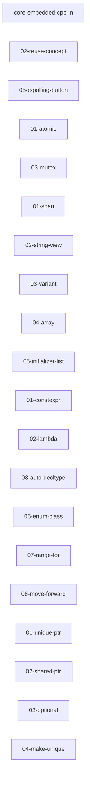

# 交叉引用表

> 自动生成于 2026-04-19

## 引用关系图

## 引用详情

| 文章 | 引用目标 |
|------|----------|
| 02-reuse-concept | `./compilation-linking-2-reuse-concept/dynamic_library.png`, `./compilation-linking-2-reuse-concept/static_library.png` |
| 01-atomic | `../vol5-concurrency/01-atomic.md` |
| 03-mutex | `../vol5-concurrency/04-mutex-and-raii-guards.md` |
| 01-span | `../../vol3-standard-library/02-span.md` |
| 02-string-view | `../../vol2-modern-features/cpp17-string-view.md` |
| 03-variant | `../../vol2-modern-features/03-variant.md` |
| 04-array | `../vol3-standard-library/01-array.md` |
| 05-initializer-list | `../vol3-standard-library/01-initializer-lists.md` |
| 01-constexpr | `../../vol2-modern-features/03-constexpr.md` |
| 02-lambda | `../../vol2-modern-features/01-lambda-basics.md` |
| 03-auto-decltype | `../../vol2-modern-features/01-auto-and-decltype.md` |
| 05-enum-class | `../vol2-modern-features/01-enum-class.md` |
| 07-range-for | `../vol2-modern-features/03-range-based-for-optimization.md` |
| 08-move-forward | `../vol2-modern-features/02-move-semantics.md` |
| 01-unique-ptr | `../../vol2-modern-features/02-unique-ptr.md` |
| 02-shared-ptr | `../../vol2-modern-features/03-shared-ptr.md` |
| 03-optional | `../../vol2-modern-features/04-optional.md` |
| 04-make-unique | `../vol2-modern-features/02-unique-ptr.md` |
| 05-c-polling-button | `./03-button-hardware-and-bounce.md`, `./04-hal-gpio-input.md` |
| core-embedded-cpp-index | `../../vol1-fundamentals/00-preface.md`, `../../vol1-fundamentals/02-c-language-crash-course.md`, `../../vol1-fundamentals/03A-cpp98-namespace-reference.md`, `../../vol1-fundamentals/03B-cpp98-function-overload-default-args.md`, `../../vol1-fundamentals/03C-cpp98-classes-and-objects.md` (+80 more) |
