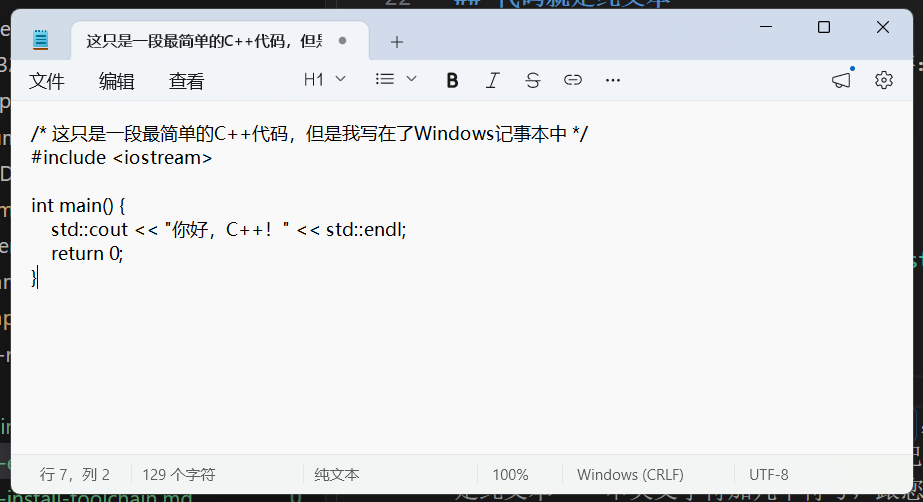
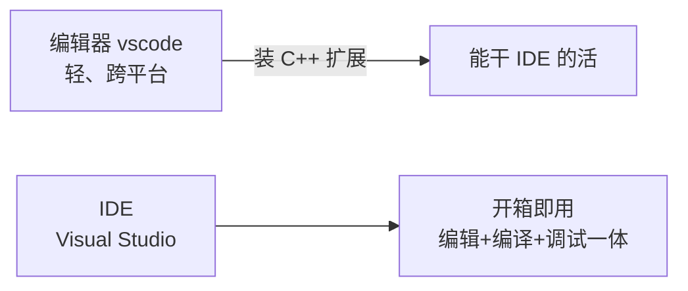
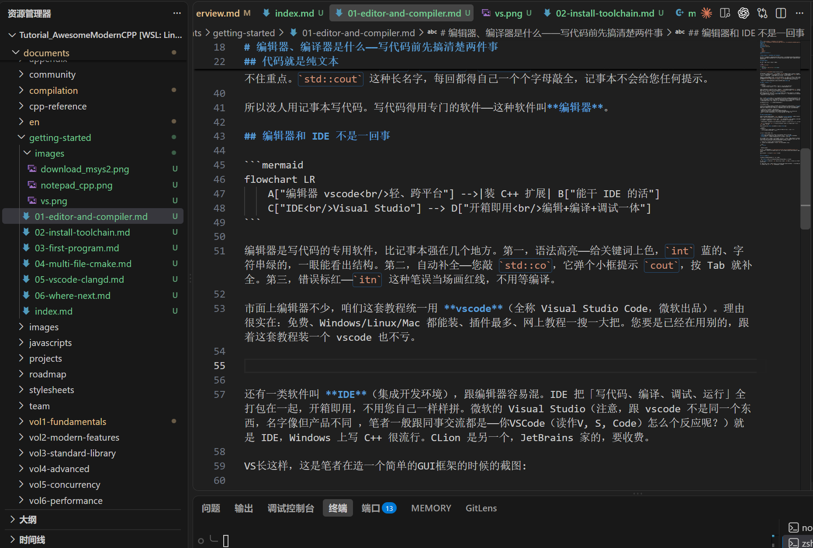
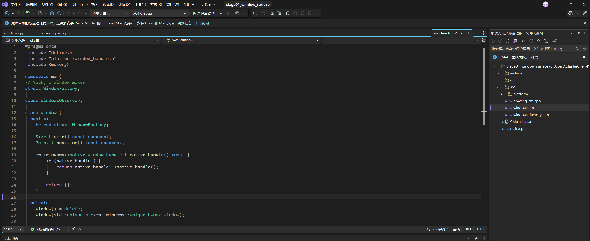

# 编辑器、编译器是什么——写代码前先搞清楚两件事

您打算学 C++，但先别急着敲代码。有两件事得先搞清楚——用什么软件写代码、写完的代码怎么变成能跑的程序。听起来像废话，可这两件事要是含糊，后面装软件、报错排查全跟着乱。这一篇就把这两个最基础的问题说透。

## 代码就是纯文本

咱们先看一段最简单的 C++ 代码长什么样：

```cpp
#include <iostream>

int main() {
    std::cout << "你好，C++！" << std::endl;
    return 0;
}
```



这段代码存成一个文件，扩展名是 `.cpp`，比如叫 `main.cpp`。您要是好奇，用 Windows 自带的记事本双击打开它（或者右键「打开方式」选记事本），能看到一模一样的内容。说白了，`.cpp` 文件本质就是纯文本——一串英文字符加几个符号，跟您在记事本里敲的几个字没本质区别。

但您要是真拿记事本写代码，会发现几个让人崩溃的事。您把 `int` 打成 `itn`，记事本一声不吭，等代码跑不起来才发现。关键词 `int`、`return`、`include` 全是黑色，跟普通文字一个样，眼睛扫半天抓不住重点。`std::cout` 这种长名字，每回都得自己一个个字母敲全，记事本不会给您任何提示。

所以没人用记事本写代码。写代码得用专门的软件——这种软件叫**编辑器**。

## 编辑器和 IDE 不是一回事



编辑器是写代码的专用软件，比记事本强在几个地方。第一，语法高亮——给关键词上色，`int` 蓝的、字符串绿的，一眼能看出结构。第二，自动补全——您敲 `std::co`，它弹个小框提示 `cout`，按 Tab 就补全。第三，错误标红——`itn` 这种笔误当场画红线，不用等编译。

市面上编辑器不少，咱们这套教程统一用 **vscode**（全称 Visual Studio Code，微软出品）。理由很实在：免费、Windows/Linux/Mac 都能装、插件最多、网上教程一搜一大把。您要是已经在用别的，跟着这套教程装一个 vscode 也不亏。

> 嘿嘿，笔者正在写这篇教程的Markdown文档截图


还有一类软件叫 **IDE**（集成开发环境），跟编辑器容易混。IDE 把「写代码、编译、调试、运行」全打包在一起，开箱即用，不用您自己一样样拼。微软的 Visual Studio（注意，跟 vscode 不是同一个东西，名字像但产品不同 ，笔者一般跟同事交流都是——你VSCode（读作V, S, Code）怎么个反应呢？）就是 IDE，Windows 上写 C++ 很流行。CLion 是另一个，JetBrains 家的，要收费。

VS长这样，这是笔者在造一个简单的GUI框架的时候的截图:



vscode 严格说是个编辑器，刚装好它只会高亮和补全，编译得自己想办法。但它的妙处在于「**扩展**」（extension，可以理解成插件）——装上 C++ 相关的扩展后，编辑器能干 IDE 大部分活。咱们后面就是这么用它。所以您别被「vscode 是编辑器不是 IDE」这句话吓到，实际用起来差别没字面那么大。

::: details 点开看：编辑器和 IDE 到底选哪个

- 编辑器（vscode 这类）：轻、灵活、跨平台，要装扩展才完整。
- IDE（Visual Studio 这类）：重、开箱即用、调试器强，但绑平台（VS 主力在 Windows）。
- 新手实在拿不准就 vscode——这套教程也是按 vscode 走的，跟着装一遍最省事。
:::

## 编译器：把代码翻译成程序

到这里有个关键的事得点破：您写的 `.cpp` 是给人看的，**计算机其实跑不了。**, 就这个事情我要多强调好几次！计算机从来只认识0和1，他真的看不懂你写的一大堆给人看的东西！

计算机只会跑它自己认识的程序，Windows 上就是 `.exe` 文件——您平时双击就开起来的那些软件，比如浏览器、QQ，腾讯视频等等全是 `.exe`，也就是二进制的程序，这些计算机才认识。

> 我知道有人要准备雄起了——我是Linux用户！不吃你们exe这套，好吧，那ELF多少本质也算二进制程序的

`.cpp` 是一堆英文字符，`.exe` 是计算机的母语，两边语言不通。所以中间得有个翻译过程，把 `.cpp` 翻译成 `.exe`。

干这个翻译活的，叫**编译器**。翻译这个动作，叫「**编译**」。


常见的 C++ 编译器有这么几家：

- **MSVC**：微软自家的，Visual Studio 里自带，Windows 上写 C++ 很顺手。
- **GCC**：GNU 项目开源的，Linux 用得多，Windows 上常通过一个叫 **MinGW** 的包来装。
- **Clang**：另一款开源编译器，报错信息比 GCC 友好，新手看着不头疼。

这仨都能编译标准的 C++ 代码，差别主要在报错风格、性能和一些边缘行为。咱们这套教程在 Windows 上走 MinGW（也就是 GCC）这条线，因为它免费、轻量、跟 vscode 配合顺手。MSVC 那条线要装一整个 Visual Studio，体积大，对纯小白来说门槛偏高。等您用熟了，想换随时换。

::: details 点开看：命令行怎么看自己电脑有没有编译器
打开 Windows 的「命令提示符」（开始菜单搜 `cmd`），敲下面这行回车：

```bash
g++ --version
```

什么叫没有安装呢?

要是蹦出一行版本号（比如 `g++ (x86_64-posix-seh-rev0, Built by MinGW-W64 project) XX.Y.Z`），说明装过 MinGW 的 GCC 了。要是提示「'g++' 不是内部或外部命令（或者是它的英文版本）」，那就是没装——下一篇咱们就装。

MSVC 的命令叫 `cl`，Clang 叫 `clang++`，同理。
:::

## 写 C++ 要两样东西

把上面两段拼起来就清楚了。写 C++ 离不开两样：

一样是**编辑器**，您在它里头敲代码、改代码、看错误提示。咱们用 vscode。

另一样是**编译器**，您敲完的 `.cpp` 喂给它，它吐出能跑的 `.exe`。咱们在 Windows 上用 MinGW 提供的 GCC。

下一篇咱们就把 vscode 和编译器都装上，顺手再装个叫 CMake 的构建工具——代码一多，光有编译器不够使，CMake 帮咱们把一堆 `.cpp` 文件组织起来一起编译。
