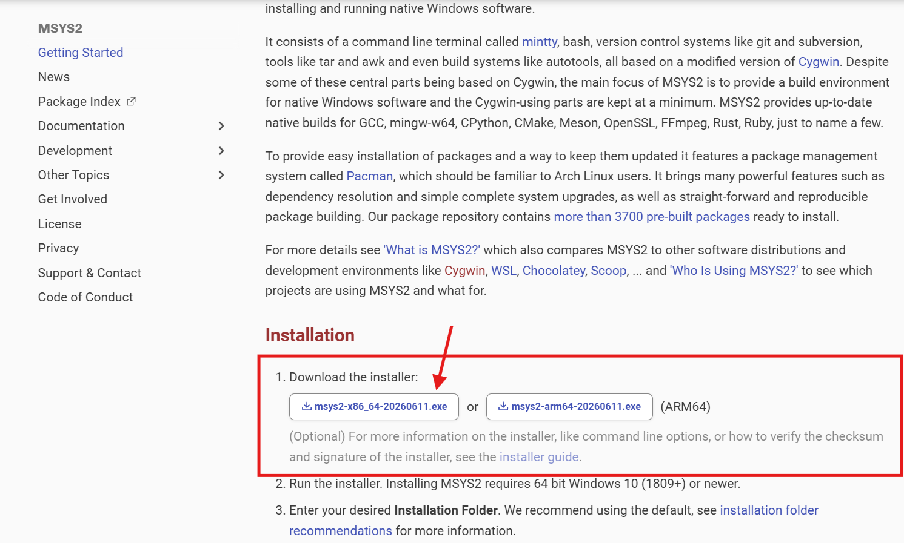
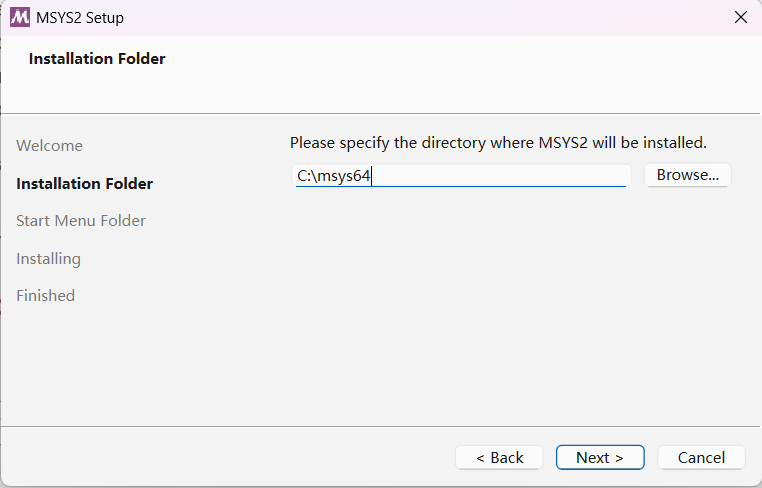
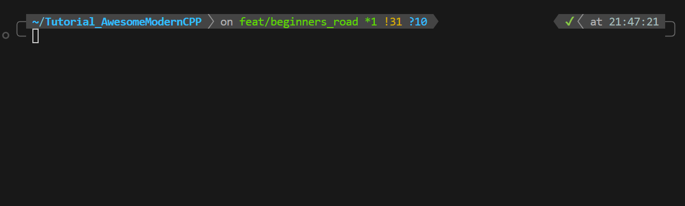
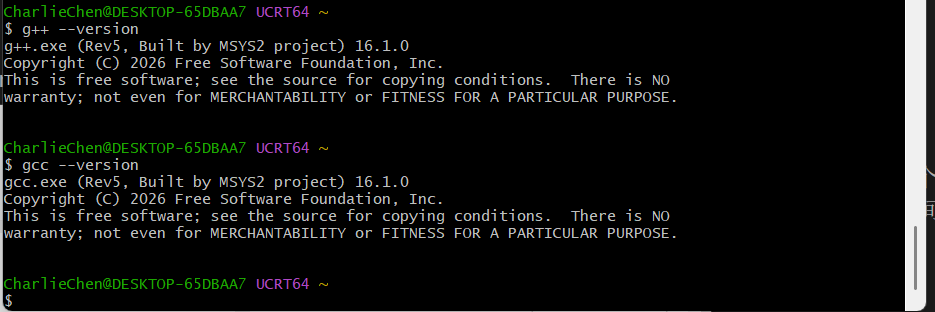

# 装好写 C++ 要用的三样东西

## 开场

上一篇咱们明确了要装两样东西：编辑器（vscode）和编译器。其实还得再来一样——构建工具，名字叫 CMake。

先说清楚 CMake 是干嘛的。咱们以后写 C++，一个项目不会只有一个 .cpp 文件，可能五六个、十几个，还得分文件夹放。这时候手动敲命令一个个编译会疯掉。CMake 就是帮咱们管这些事的，您写一份配置文件告诉它「项目里有哪几个文件、要生成什么程序」，剩下的事它来。具体怎么用，下一篇咱们就上手，现在先把它装上。

这一篇全是手把手，每一步都有截图位。装完三样东西，咱们下一篇就能写出第一个能跑的程序。

## Windows 路线（推荐）

如果您的系统是 Windows 10 或 Windows 11，跟着这一节走就行。三步，按顺序来。

### 步骤 1·装 vscode

vscode 是微软做的一个免费的编辑器，咱们以后写代码就在它里面敲。

打开浏览器，访问 <https://code.visualstudio.com>。

页面正中有个蓝色的大按钮，写着「Download for Windows」，点它。如果您的浏览器没有自动开始下载，它会跳到一个下载选择页，选「Windows」那一项，下到一个 `.exe` 安装包。

下载完，双击运行 `VSCodeUserSetup-x64-x.x.x.exe`。安装器长得跟普通软件差不多，一路下一步。这里要留意的是这一屏：

请把这几项都勾上（尤其是「Add to PATH」，这个一定要勾，不勾后面会麻烦）：

- 在「Select Additional Tasks」这一屏里，勾选「Add "Open with Code" action to Windows Explorer file context menu」
- 勾选「Add "Open with Code" action to Windows Explorer directory context menu」
- 勾选「Register Code as an editor for supported file types」
- 勾选「Add to PATH」（**最重要**）

剩下几项（要不要在桌面建快捷方式、要不要加右键菜单的某些项）随您喜欢。我反正是加了，因为偶尔干活懒得开CMD或者是Powershell。

::: details 点开看：装的时候忘了勾「Add to PATH」怎么办
别慌。最省事的办法是把 vscode 自己的安装路径手动加到系统 PATH 里，但更省事的办法是：卸载重装一遍，这次记得勾。重新装一遍两分钟的事，比折腾 PATH 快。但是温馨提醒一下您，之后您从事计算机的工作，改PATH那是同事都懒得说的基本功。学习计算机最好现在就学会折腾。
:::

装完之后，按一下键盘上的 Win 键（就是带 Windows 图标那个键），开始菜单里应该能看到 vscode 的图标。

点开它，看到一个欢迎页面，就算装好了。

### 步骤 2·装编译器（走 MinGW-w64 这条路）

编译器就是把您写的 .cpp 翻译成 .exe 的那个程序。Windows 下能用的 C++ 编译器有好几种，咱们这里走 MinGW-w64 这条路——它本质是 Linux 上那个著名的 GCC 编译器移植到 Windows 的版本。

为什么选它？两个原因。第一，跟咱们这套教程后面会用到的 Linux 环境是一套东西，命令行操作习惯完全一致，学一遍到处能用。第二，后面如果您想往嵌入式方向走（这套教程也覆盖），GCC 是主流，提前熟悉没坏处。

微软自家也有个编译器叫 MSVC（Visual Studio 那一套），也很好用。两种的区别咱们放在折叠盒里，这里不展开，先把 MinGW 装上。

装 MinGW 最省心的办法是借助一个叫 MSYS2 的工具。MSYS2 本质是一个「包管理器」——您可以把它理解成一个软件商店，跟手机上的应用商店差不多，只不过它装的是给程序员用的命令行工具，而且是用命令行操作的。

打开浏览器，访问 <https://www.msys2.org>。



页面上有个下载链接，指向 `msys2-x86_64-xxxxxxxx.exe` 这样的安装包（文件名里带日期，您下的时候日期不一样是正常的）。下下来，双击运行。

先记得点击一下next，然后会让你选一个路径：



安装器会让您选安装路径。**强烈建议用默认路径 `C:\msys64`**，不要改。后面咱们要往系统 PATH 里加东西，路径写死了方便。如果您装到了别的地方，后面所有路径都得跟着改，容易出错。

一路下一步装完。装完之后，开始菜单里会多出几个 MSYS2 开头的图标。

::: warning 这里有个新手最容易踩的坑
开始菜单里有好几个 MSYS2 入口：「MSYS2 MINGW64」「MSYS2 UCRT64」「MSYS2 CLANG64」「MSYS2」等等。

**请打开「MSYS2 UCRT64」这一个**，别开成「MSYS2」（那个最朴素的）。咱们装的是 UCRT64 版本的 GCC，必须在 UCRT64 终端里才能正常用。开错了，后面装完会发现命令找不到。
:::

打开 UCRT64 终端后，会看到一个紫色字体的命令行窗口。在里面敲这一行命令（注意大小写、空格、连字符都要对），然后回车：

```bash
pacman -S mingw-w64-ucrt-x86_64-gcc
```

::: details 点开看：您可能的输出？

我还真遇到过有人问下面这个美刀符号啥意思的，我想了想，额，您就认为是计算机的shell给您的一个前导的提示符，看到这个加上后面一闪一闪的光标，计算机就是在静候您的输出。

但是并不是总是这样的，比如说我的配置过，就是这样的~



```bash
CharlieChen@DESKTOP-65DBAA7 UCRT64 ~
$ echo "Hello!" # 测试一下能不能用, 这个是bash命令，您学习Linux的话，这个是必须会的
Hello!

CharlieChen@DESKTOP-65DBAA7 UCRT64 ~
$ pacman  -S mingw-w64-uart-x86_64-gcc
error: target not found: mingw-w64-uart-x86_64-gcc
# 上面这行笔者手滑了:打成了 uart(串口),正确是 ucrt(Windows 10 的 C 运行时)。
# 看到 target not found 先怀疑包名拼错——pacman 找不到这个名字的包就会这么报

CharlieChen@DESKTOP-65DBAA7 UCRT64 ~
$ pacman -S mingw-w64-ucrt-x86_64-gcc
resolving dependencies...
looking for conflicting packages...

Packages (17) mingw-w64-ucrt-x86_64-binutils-2.46-4
              mingw-w64-ucrt-x86_64-crt-14.0.0.r92.g818fa6510-1
              mingw-w64-ucrt-x86_64-gcc-libs-16.1.0-5  mingw-w64-ucrt-x86_64-gettext-runtime-1.0-1
              mingw-w64-ucrt-x86_64-gmp-6.3.0-2
              mingw-w64-ucrt-x86_64-headers-14.0.0.r92.g818fa6510-1
              mingw-w64-ucrt-x86_64-isl-0.27-1  mingw-w64-ucrt-x86_64-libiconv-1.19-1
              mingw-w64-ucrt-x86_64-libwinpthread-14.0.0.r92.g818fa6510-1
              mingw-w64-ucrt-x86_64-mpc-1.4.1-1  mingw-w64-ucrt-x86_64-mpfr-4.2.2-3
              mingw-w64-ucrt-x86_64-tzdata-2026b-1
              mingw-w64-ucrt-x86_64-windows-default-manifest-6.4-4
              mingw-w64-ucrt-x86_64-winpthreads-14.0.0.r92.g818fa6510-1
              mingw-w64-ucrt-x86_64-zlib-1.3.2-2  mingw-w64-ucrt-x86_64-zstd-1.5.7-2
              mingw-w64-ucrt-x86_64-gcc-16.1.0-5

Total Download Size:    68.98 MiB
Total Installed Size:  490.23 MiB

:: Proceed with installation? [Y/n]
# 这里的意思是让你输入一个 y，问你要不要下载。实际上是要的
# 输入 y 回车，起来一会回来就会安装完毕
```

现在我们可以试一下了！



:::


`pacman` 就是 MSYS2 这个「软件商店」的操作命令，`-S` 是「安装（sync）」的意思，后面那一长串是要装的包的名字。

第一次装东西时，pacman 会问您要不要继续、下载的包对不对，输入 `Y` 回车确认就行。它会下载几十兆的东西，等一会儿。

装完之后，咱们得让 Windows 系统认识这个新装的编译器——也就是把它所在的位置告诉系统的 PATH 变量。PATH 是什么？您可以理解成系统的一个「常用地址本」，凡是写在里面的地址（文件夹路径），系统都能直接找到里面的程序，不用每次都写完整路径。

按 Win 键，搜索「环境变量」，点「编辑系统环境变量」。

弹出的窗口右下角有个「环境变量」按钮，点它。在下方的「系统变量」列表里找到名为 `Path` 的那一行（注意是 `Path` 不是 `PATHEXT`），双击它。

在弹出的列表里点「新建」，输入这一行（如果您装 MSYS2 时用了默认路径，就是这个）：

```text
C:\msys64\ucrt64\bin
```

一路「确定」把所有窗口关掉，保存。

现在验证一下装好了没有。**这一步要开一个全新的命令行窗口**——刚才改了 PATH，旧的窗口不会自动刷新，必须重开。

按 Win+R，输入 `cmd`，回车，打开一个命令提示符（黑色背景那个）。敲：

```bash
g++ --version
```

如果看到类似下面这样的输出（具体版本号可能更新），就成了：

```text
➜  g++ --version
g++.exe (Rev5, Built by MSYS2 project) 16.1.0
Copyright (C) 2026 Free Software Foundation, Inc.
This is free software; see the source for copying conditions.  There is NO
warranty; not even for MERCHANTABILITY or FITNESS FOR A PARTICULAR PURPOSE.
```

如果看到「'g++' 不是内部或外部命令」之类的报错，说明 PATH 没设对。回去检查三件事：路径是不是写成了 `C:\msys64\ucrt64\bin`（很多人漏掉中间的 `\ucrt64\`）、有没有拼错、是不是开了新的 cmd 窗口。

### 步骤 3·装 CMake

最后一样。打开浏览器，访问 <https://cmake.org/download>。

页面会列出多个平台的安装包。找到 Windows 一栏下的 `Windows x64 Installer`，下载那个 `.msi` 文件（文件名类似 `cmake-x.y.z-windows-x86_64.msi`）。

双击运行 `.msi`。安装器一路下一步，到了这一屏要特别留意：

会问您 CMake 要不要加进系统 PATH。**选第二项「Add CMake to the system PATH for all users」**（给所有用户加进系统 PATH）。第一项默认是不加，第三项只给当前用户加，咱们选中间这个最省事。

继续下一步装完。

验证一下。**同样要开一个全新的 cmd 窗口**（旧窗口的 PATH 没刷新）。敲：

```bash
cmake --version
```

看到版本号输出就成：

```text
➜  cmake --version
cmake version 4.4.1

CMake suite maintained and supported by Kitware (kitware.com/cmake).
```

::: details 点开看：命令行装 CMake 也不是不行
如果您更喜欢用命令行，也可以在 MSYS2 UCRT64 终端里 `pacman -S mingw-w64-ucrt-x86_64-cmake` 装。但这样装出来的 CMake 路径在 `C:\msys64\ucrt64\bin` 下，跟刚装的 GCC 一起，不用再单独改 PATH。两种装法二选一，别重复装。
:::

## 装 vscode 的 C++ 扩展

三样主体软件装好了，最后再给 vscode 装两个「扩展」（extension）。扩展可以理解成 vscode 的插件，给它加上额外功能。

打开 vscode。在窗口最左边那一列图标里，找一个由四个小方块组成的图标（鼠标放上去会显示「Extensions」），点它。或者直接按快捷键 `Ctrl+Shift+X`。

在顶部搜索框里分别搜这两个名字，找到对应的扩展，点「Install」安装：

第一个是 C/C++。这是微软官方做的扩展，提供代码补全、跳转定义、错误提示这些功能。咱们在篇 5 才会动它的设置，但先装上不亏。

第二个是 CMake Tools。也是微软官方的，专门让 vscode 配合 CMake 用。下一篇咱们写第一个程序就会用到它。

两个都装好之后，vscode 窗口最下方蓝色的状态栏里会多出一些跟 CMake 相关的按钮（比如显示当前构建类型、构建按钮之类的）。看到这些就说明扩展生效了。

::: details 点开看：用 Linux（Ubuntu/Debian 系）怎么装
Windows 主线讲完了。如果您手头是 Linux 机器，整套东西命令行一条命令就装完，比 Windows 省心得多。这也是为什么我喜欢干活在WSL或者是自己的Linux笔记本。一点不耽误事情！

打开终端，敲这一行（一次性把编译器、CMake、调试器都装齐）：

```bash
sudo apt update && sudo apt install -y build-essential cmake ninja-build gdb
```

`build-essential` 这个包里就含了 GCC 编译器，`cmake` 是构建工具，`ninja-build` 是个更快的构建后端（CMake 常配它），`gdb` 是调试器，后面排查问题用得上。`sudo` 是「以管理员权限运行」，会让您输密码。

vscode 去 <https://code.visualstudio.com> 下 `.deb` 安装包，双击装（或者命令行 `sudo apt install ./code_*.deb`）。

验证办法跟 Windows 一样：

```bash
g++ --version
cmake --version
```

能看到版本号就成了。C/C++ 和 CMake Tools 两个扩展同样要在 vscode 里装，跟系统无关。
:::

::: details 点开看：MSVC 和 MinGW 到底差在哪，怎么选
Windows 上的 C++ 编译器主要有两套：微软自家的 MSVC（Visual Studio 那一套），和咱们这里走的 MinGW（GCC 的 Windows 移植版）。

简单说：两套都能写、都能编译出 Windows 程序，日常学习差别不大。但有几个点值得留意。

调试器不同。MSVC 配的是微软自家的调试器，MinGW 配的是 GDB。咱们这套教程后面用 GDB 多，因为嵌入式那一套也用 GDB，习惯一致。

C++ 标准跟进度不同。MSVC 在某些新特性上跟进更快一点，GCC 在另一些上更快，互有领先。对入门阶段没影响。

体积不同。装整套 Visual Studio 要十几个 GB（笔者的工作吃了几十个GB，因为横跨了不同版本的VS），MinGW 加 MSYS2 一两个 GB 就够。咱们刚开始学，装个轻量的省事。

命令行习惯不同。MSVC 偏 Windows 原生那套（cl.exe 编译器、链接器配置跟 Linux 完全不一样），MinGW 跟 Linux/macOS 上的 GCC 一致。咱们这套教程后面的命令、CMake 配置都假设是 GCC，所以走 MinGW 最顺。

如果以后您做 Windows 桌面应用开发、要调 Windows 专属 API（比如 Direct3D），那时再上 Visual Studio 装 MSVC 也不迟。详细的对比和切换方法，咱们放在 vol1/ch00 那篇专门讲 Windows 环境搭建的文章里。
:::

三样东西装好了：编辑器 vscode、编译器 MinGW、构建工具 CMake，再加上 vscode 里两个 C++ 扩展。下一篇咱们就在 vscode 里写出第一个 C++ 程序，让它真正跑起来，看看那行 `Hello, World!` 是怎么从代码变成屏幕上的字的。


::: details 点开看：想参考更详细的环境搭建

- [超详细 VSCode 安装教程（Windows）](https://zhuanlan.zhihu.com/p/678737903) —— VSCode 下载安装每一步都配图，装 vscode 卡住的话对着这个看
- [MSYS2+VSCode：Windows 下接近 Linux 的 C/C++ 编程环境搭建](https://zhuanlan.zhihu.com/p/1982834714722194966) —— 比本篇更全的搭建（一路到 clangd、lldb 调试、zsh 美化），想一次配满的看这个
:::
