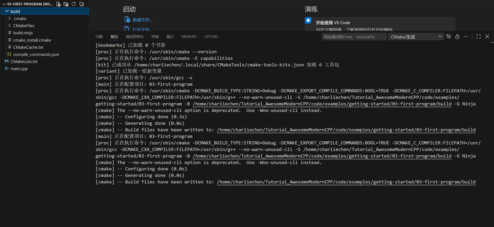
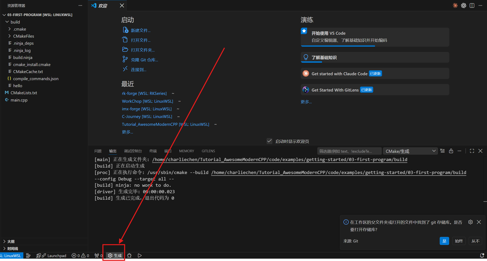

# 您的第一个 C++ 程序——在 vscode 里跑通 hello

## 开场

环境装好了吧？（没装请回篇 2，vscode、MinGW、CMake 还有那两个扩展都得装齐。）这一篇咱们干一件有仪式感的事——亲手写出第一个 C++ 程序，让它真跑起来，在屏幕上吐出 `Hello, C++!`。

全程在 vscode 里点按钮，一行命令都不用敲（命令行那一套放在文末折叠盒里，想看再点开）。中间会经历一个完整的小项目流程：建文件夹、写代码、写 CMake 配置、配置、生成、运行。听上去步骤不少，其实每一步就点一下按钮，跟着走一遍您就摸清套路了。

## 步骤 1·建个项目文件夹

先找个地方放您写的代码。别直接在桌面或者 C 盘根目录里堆文件，过两天就乱成一锅粥。咱们专门建个文件夹，每个项目一个。

在桌面（或者您顺手的位置，比如 `D:\code\` 这种）右键新建一个文件夹，起名叫 `hello`。名字短、全小写、不带空格——这三条以后写代码起名字都管用，先养成习惯。

文件夹建好之后，打开 vscode。点菜单「文件 → 打开文件夹」（英文界面是 `File → Open Folder`），在弹出的窗口里选中刚才那个 `hello` 文件夹，点「选择文件夹」。

打开之后，vscode 左侧会出现一个资源管理器面板，标题就是 `hello`，下面空空荡荡，啥也没有——因为这是个空文件夹。这就对了，咱们从零开始往里塞东西。

::: tip 「打开文件夹」这一步不是多此一举
vscode 跟记事本不一样，它认的是「项目」。您得告诉它「我接下来在 hello 这个文件夹里干活」，它才会把扩展、CMake、调试这些功能都接到这个文件夹上。直接拖一个 `.cpp` 进 vscode 也能编辑，但后面 CMake 那一套用不起来。所以每次开新项目，第一步都是「打开文件夹」。
:::

## 步骤 2·新建 main.cpp

左侧资源管理器面板的标题 `hello` 右边，有一排小图标。把鼠标放上去，第一个长得像一张白纸加个加号的，是「新建文件」（鼠标悬停会显示 `New File`）。点它。

点完之后，面板里会出现一个让您输文件名的小输入框。敲 `main.cpp`，回车。

为什么叫 `main`、为什么后缀是 `.cpp`？`main` 是约定俗成的名字，C++ 程序的入口（程序从这里开始跑）就放在这个文件里，大家都这么起，您跟人交流不会被绊。`.cpp` 是 C++ 源代码文件的标准后缀，编译器一看到 `.cpp` 就知道要按 C++ 来编译。

回车之后，主编辑区会打开 `main.cpp` 这个文件（当然是空的），左侧资源管理器里也多出了 `main.cpp` 这一项。

## 步骤 3·把代码粘进去

把下面这段代码完整复制，粘进 `main.cpp`：

```cpp
#include <iostream>

int main() {
    std::cout << "Hello, C++!\n";
    return 0;
}
```

粘好之后，编辑器里的代码会变成彩色的——`int` `return` `#include` 这种关键词一种颜色，`"Hello, C++!\n"` 这种字符串另一种颜色。这叫语法高亮，上一篇提过，编辑器干的就是这活。

简单说几句这段代码在干啥，您现在不用全记住，混个脸熟就行。

第一行 `#include <iostream>` 是把 C++ 自带的「输入输出」工具包拉进来用。`iostream` 这个名字拆开看就是 input output stream（输入输出流），管的就是「从键盘读东西」和「往屏幕写字」。

中间那个 `int main()` 是程序的入口。C++ 程序跑起来，都是从 `main` 这个函数的第一行开始执行的，没有例外。花括号 `{}` 里头就是程序实际要干的事。

`std::cout << "Hello, C++!\n";` 是往屏幕输出字。`std::cout` 您可以理解成「屏幕」这个对象的代号，`<<` 是「往里送」的箭头，把右边那串字送进屏幕显示出来。`\n` 是换行符，让输出完之后光标挪到下一行。

`return 0;` 是告诉操作系统「这个程序正常跑完了，没出错」。0 表示正常，非 0 表示有问题——这个约定以后会用到，现在知道 0 是好的就行。

## 步骤 4·还得配一个 CMakeLists.txt

代码写完了，您可能想：「现在点那个三角形运行按钮不就跑了？」

不行。这一步会把很多新手卡住，笔者先说清楚为什么。

vscode 自带的那个运行按钮（或者按 `F5`）不知道您要用哪个编译器、要编译哪个文件、要生成什么名字的程序——它什么都不知道。您光给它一个 `main.cpp`，它一脸懵。咱们得另外写一份「说明书」，把这些事全告诉它。这份说明书要写的文件，叫 `CMakeLists.txt`，CMake 就是读它的。

（有人会问：那篇 1 不是说编译器直接编译就行吗？对，命令行里直接调 `g++ main.cpp` 是能编出来。但 vscode 那套图形化按钮走的是 CMake 这条线，咱们既然要在 vscode 里点按钮，就照 CMake 的规矩来。CMake 还能管多文件项目，篇 4 咱们就知道了。）

在 `main.cpp` 旁边，用步骤 2 那个「新建文件」图标，再建一个文件，名字叫 `CMakeLists.txt`（注意大小写，`C` `M` `a` `k` `e` 都大写，`Lists` 的 `L` 大写，剩下小写，后缀 `.txt`）。这个名字是 CMake 规定死的，差一个字母它都不认。

把下面这段粘进去：

```cmake
cmake_minimum_required(VERSION 3.20)
project(hello LANGUAGES CXX)

set(CMAKE_CXX_STANDARD 17)
set(CMAKE_CXX_STANDARD_REQUIRED ON)

add_executable(hello main.cpp)
```

这五行是什么意思，逐行给您翻译：

第一行 `cmake_minimum_required(VERSION 3.20)` 是说「跑这个项目的 CMake 版本至少得是 3.20」。3.20 是个挺老的下限，绝大多数机器都满足。CMake 拿这句话去检查您装的 CMake 版本够不够。

第二行 `project(hello LANGUAGES CXX)` 说这个项目名字叫 `hello`，用的语言是 C++（`CXX` 是 CMake 里 C++ 的代号，C 是 `C`，C++ 是 `CXX`）。

第四行 `set(CMAKE_CXX_STANDARD 17)` 说「用 C++17 这个版本的标准」。C++ 这几年一直在演进，C++11、14、17、20、23 都有，越新加的特性越多。17 是个稳的版本，绝大多数项目都至少能用它，咱们起步就用 17。

第五行 `set(CMAKE_CXX_STANDARD_REQUIRED ON)` 说「上面那个标准不是建议，是硬要求」。如果编译器不支持 C++17，直接报错，不让它悄悄降级到老标准——降级了您还不知道，后面踩坑踩不明白。

最后一行 `add_executable(hello main.cpp)` 是最关键的一行。`add_executable` 是「生成一个可执行程序」的意思，括号里第一个 `hello` 是生成的程序名字，第二个 `main.cpp` 是要编译的源文件。这行整体的意思就是：把 `main.cpp` 编译成一个叫 `hello` 的可执行程序（Windows 上就是 `hello.exe`）。

## 步骤 5·选试剂盒（kit）

还记得篇 2 装完那两个扩展后，vscode 底部状态栏多出来的那一块吗？现在该用它了。

鼠标点状态栏那一块写着「No Kit Selected」或者「未选择试剂盒」的字样（英文界面是 `No Kit Selected`）。点它会弹出一个小列表。或者按 `Ctrl+Shift+P` 打开命令面板，输入 `CMake: Select a Kit` 回车，效果一样。

弹出的列表里，会列出 vscode 在您电脑上找到的所有编译器。您应该能看到一个类似 `GCC 16.1.0 x86_64-w64-mingw32` 或者 `GCC x.x.x ucrt64` 的条目（具体版本号取决于您装的那版 MinGW）。选这个 GCC 的。

选好之后，状态栏那块字会变成 `GCC 16.1.0` 之类，显示当前选中的是哪个编译器。

试剂盒是 CMake Tools 扩展的术语，您可以理解成「工具箱」——告诉 CMake Tools「以后编译就用这个编译器」。这一步只需选一次，以后再打开这个项目，它都记着。

::: warning 列表里看不到 GCC 怎么办
要是列表里压根没有 GCC，只有一些 `Visual Studio` 之类的条目，说明篇 2 那一步 MinGW 没装好，或者装好了但 PATH 没设对，CMake Tools 找不到它。回去检查篇 2 的步骤 2，重点看 `C:\msys64\ucrt64\bin` 这个路径有没有正确加进系统 PATH，还有是不是重启了 vscode（改完 PATH 要重启 vscode 才生效）。

列表最下面通常还有一行 `[Unspecified]`，这是「不指定」的意思。先别选这个，咱们要明确指定 GCC。
:::

选择好了，好消息就是现在的话Select A Kit完事了之后自动会开始丝滑的配置：



配置这一步在干什么？CMake 读您的 `CMakeLists.txt`，根据里头的说明，生成一堆「构建文件」（在 `hello` 文件夹下会多出来一个 `build` 子文件夹，东西都塞在那里面）。这一步**还没有编译您的代码**，只是 CMake 在做准备工作——把用哪个编译器、编译哪些文件、生成什么这些事都安排好。真正的编译在下一步。

::: tip 配置什么时候要重跑
以后您只要改了 `CMakeLists.txt`（比如加了一个新源文件），就得重跑一次配置，CMake 才会重新认。光改 `.cpp` 文件不用重跑配置，CMake 自动发现。
:::

## 步骤 6·生成（构建）

配置完了，点状态栏的「生成」按钮（英文 `Build`）。或者命令面板 `CMake: Build`。



这次输出窗又跑字，但内容不一样了——是编译器真的在干活。您能看到类似 `Building CXX object ... main.cpp.o`、`Linking CXX executable hello.exe` 这样的行。最后一行会显示「生成已完成」或者类似的成功提示。

到这一步，您的 `main.cpp` 真正被翻译成 `hello.exe` 了。它就躺在 `hello\build\` 文件夹下。下一步就是把它跑起来。

::: warning 万一报错了
最常见的报错是找不到编译器，或者编译器路径不对——回到步骤 5 重新选试剂盒。还有一种常见的是 `main.cpp` 文件名打错了（比如打成了 `mian.cpp`），CMake 找不到文件。报错信息一般会直接写出来哪一行出问题，对照看就行。改完之后重新点「生成」。
:::

## 步骤 8·运行

状态栏上有个三角形播放键，是「运行」按钮（英文 `Run`）。注意别点到旁边那个带小虫子图标的——那是「调试」按钮（Debug），会进调试模式，先不用它。

点运行按钮。vscode 下方的终端面板会弹出来（如果没弹，按 `` Ctrl+` `` 调出来），里头会打印一行字：

```text
Hello, C++!
```

到这儿，您的第一个 C++ 程序真跑起来了。这一行字从代码变成屏幕上的字符，走完了「写代码 → 配置 → 生成 → 运行」一整套流程，您以后写的每一个 C++ 程序，套路都是这一套。

## 步骤 9·改改再跑

光跑通一次不算熟。咱们改改代码再跑一遍，把循环走顺。

回到 `main.cpp`，把那行 `Hello, C++!` 改成您想说的别的，比如：

```cpp
#include <iostream>

int main() {
    std::cout << "我学会了写 C++！\n";
    return 0;
}
```

保存（`Ctrl+S`）。注意保存之后，状态栏的文件名旁边那个小白点会消失，说明改动已经落盘。

然后直接点状态栏的「运行」按钮。CMake Tools 会自动先重新生成（因为它发现 `.cpp` 变了），再跑。终端里这次会打印：

```text
我学会了写 C++！
```

以后改代码就是这套动作：改完保存、点运行。中间的配置、生成 CMake Tools 都替您自动接上了。

::: details 点开看：命令行怎么做
上面点的那些按钮，底层其实就是跑几条命令。咱们在 vscode 终端里手动跑一遍，您就知道按钮背后在干什么。

打开 vscode 终端（菜单「终端 → 新建终端」，或快捷键 `` Ctrl+` ``）。第一次构建，分三步：

```bash
cmake -B build
cmake --build build
.\build\hello.exe
```

第一条 `cmake -B build` 就是「配置」——在 `build` 文件夹下生成构建文件（`-B` 指定输出目录）。

第二条 `cmake --build build` 就是「生成」——真正调用编译器，把 `main.cpp` 编译成 `hello.exe`。

第三条 `.\build\hello.exe` 就是「运行」——直接执行那个 `.exe`。

以后改完代码，只需要重跑后两条（第二条会自动只重编改过的文件，第二条完了再第三条）。

如果您在 Linux 上（比如篇 2 折叠盒里那条 apt 路线），运行的命令稍微不一样：

```bash
cmake -B build
cmake --build build
./build/hello
```

差别就两点：Linux 上可执行文件不强制带 `.exe` 后缀（CMake 默认生成 `hello` 而不是 `hello.exe`），执行时路径分隔符用正斜杠 `/`、前缀 `./`。
:::

您的第一个 C++ 程序跑起来了，从代码到屏幕上那行字，全程走通了一遍。这套流程（建项目、写代码、写 CMakeLists、配置、生成、运行）以后会反复用，您多跑几次就熟了。

下一篇咱们把项目变大——一个 `.cpp` 不够写了，多个文件怎么组织、怎么让它们互相配合。
