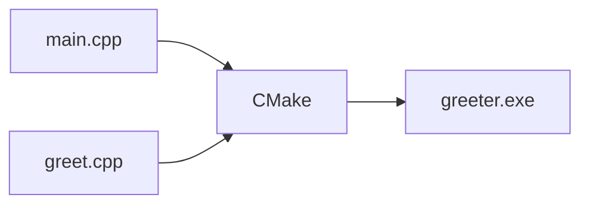

# 项目变大——多个文件怎么办，引出 CMake

## 开场

上一篇咱们在 vscode 里跑通了第一个 C++ 程序，终端老老实实打印出 `Hello, C++!`。但那个工程就一个 `main.cpp`，所有代码全挤在一个文件里。真实的项目不可能这么小。稍微写点正经东西，代码量一上来，全塞一个文件里会乱到您自己都看不下去。

这一篇咱们就把工程从「一个文件」扩到「三个文件」，顺手把上一篇只是提了一句名字的 CMake 真正用起来。等三个文件的工程跑通了，您就知道 CMake 到底帮了什么忙。

## 为什么要分文件

先说清楚为啥非得分文件，不分不行吗。

不分也行，但您试试把所有代码塞进 `main.cpp`，写到两三百行就能体会到那种乱：找某个函数得满屏滚条，改一处怕牵连另一处，函数和函数之间挤成一坨，眼睛扫不到结构。文件一长，调试的时候血压会先上来。

常见的拆法是按「一类功能」分一个文件。这一篇咱们就做一个最简单的「打招呼」功能，单独放在 `greet.cpp` 和 `greet.h` 两个文件里，`main.cpp` 只管主流程，谁干谁的活清清楚楚。

::: details 点开看：.cpp 和 .h 是怎么回事
C++ 里一个功能通常拆成两个文件：一个 `.h`（头文件，header），一个 `.cpp`（实现文件）。

`.h` 里放的是「声明」，告诉别的文件「我这儿有这么个东西，长这个样子」。`.cpp` 里放的是「定义」，也就是具体这个东西怎么干活。

别的文件要用这个功能，就 `#include` 那个 `.h`，相当于把「承诺书」拿过来看一眼，知道自己能调什么。至于 `.cpp` 里怎么实现的，调用方根本不关心，链接的时候（咱们下面会讲到）编译器会自己接上。

这套机制看着啰嗦，但好处实在：改动一个功能的实现，只要「承诺书」（`.h`）没变，调用它的别的文件根本不用重新编译。文件一多，省下来的时间非常可观。
:::

## 三个文件长这样

咱们新建一个工程文件夹，叫 `greeter`（打招呼的小程序），里面放三个文件。先把篇 3 那个 hello 工程关了也行，重新开一个干净的目录。

新建三个文件，文件名和内容如下。先看 `greet.h`，这是头文件，声明 `greet` 这个函数长什么样：

```cpp
#pragma once
#include <string>

std::string greet(const std::string& name);
```

`#pragma once` 这一行是头文件的「防重复包含」开关。意思是「这个文件在整个编译过程里只算一次，谁要是 include 了第二回，直接跳过」。要是没这行，万一两个文件都 include 了 `greet.h`，编译器会把里面的内容抄两遍，然后报「重复定义」的错给您看。

中间那行 `#include <string>` 把标准库的字符串类型拿进来。`greet` 函数要用到 `std::string`，得先告诉编译器这是个啥。

最后一行是函数声明：有个叫 `greet` 的函数，吃一个 `std::string`（名字 name），返回一个 `std::string`。注意结尾是分号，没有大括号，这是「承诺书」，只说有这么个函数，不说怎么干。

再看 `greet.cpp`，这个文件负责实现：

```cpp
#include "greet.h"

std::string greet(const std::string& name) {
    return "Hello, " + name + "!";
}
```

第一行 `#include "greet.h"` 把刚才那个承诺书拿过来。注意这里用双引号 `""` 而不是尖括号 `<>`：双引号是「项目里您自己写的头文件」，尖括号是「系统/标准库的头文件」，这是个约定，别写反。

下面是函数定义：把 `"Hello, "`、传入的名字、`"!"` 三个字符串拼一起返回。这就是「兑现承诺」，告诉编译器这个函数具体怎么干活。这时候才有大括号，里面是真正干活的代码。

最后改 `main.cpp`，调用这个函数：

```cpp
#include <iostream>
#include "greet.h"

int main() {
    std::cout << greet("world") << "\n";
    return 0;
}
```

`main.cpp` 里也 include 了 `greet.h`，它要用 `greet` 这个函数，得先把承诺书拿过来，知道这个函数吃啥、吐啥。然后调 `greet("world")`，把返回的字符串丢给 `std::cout` 打印出来。

打个比方帮您记：`greet.h` 是张承诺书（「有个叫 `greet` 的函数，吃一个名字，返回一句话」），`greet.cpp` 是兑现承诺（具体怎么拼字符串），`main.cpp` 是拿来用的人（拿来就用，不关心细节）。三个文件各司其职。

## 手动编译太累，CMake 上场

三个文件准备好了。问题来了：怎么把它们编译成一个 `.exe`？

上一篇单文件工程的时候，咱们的 `CMakeLists.txt` 里关键的就一行：

```cmake
add_executable(hello main.cpp)
```

这行的意思是「生成一个叫 `hello` 的可执行程序，源文件是 `main.cpp`」。现在三个文件，只要把这行的源文件列全：

```cmake
add_executable(greeter main.cpp greet.cpp)
```

就把 `greet.cpp` 也加进去了。改这一行就够，别的都不用动。完整的 `CMakeLists.txt` 长这样：

```cmake
cmake_minimum_required(VERSION 3.20)
project(greeter LANGUAGES CXX)

set(CMAKE_CXX_STANDARD 17)
set(CMAKE_CXX_STANDARD_REQUIRED ON)

add_executable(greeter main.cpp greet.cpp)
```

把这四行（加一个空行）存成 `CMakeLists.txt`，放在工程根目录里，跟三个 `.cpp` / `.h` 文件平级。

注意文件名大小写：是 `CMakeLists.txt`，大写的 C 和 L，结尾是 `.txt` 不是 `.cmake`。CMake 默认就找这个名字，写错一个字母它都认不出来。

## 跑通

四个文件齐了，开始跑。流程跟上一篇一模一样：

第一步，保存所有文件。在 vscode 里按 `Ctrl+K` 再按 `S`（或者菜单 File → Save All），把改过的文件全存一遍。新手最容易踩的坑就是改了文件没存，编译的还是旧内容，然后对着「为什么没生效」怀疑人生。

第二步，配置。点 vscode 底部状态栏的「Configure」按钮（或者命令面板搜 `CMake: Configure`）。CMake 会扫一遍 `CMakeLists.txt`，准备构建文件。这一步过了的话，工程目录里会冒出一个 `build` 文件夹。

第三步，生成。点状态栏的「Build」（或者 `CMake: Build`，快捷键 `F7`）。这一步是真正编译，能看到终端刷一串输出。看到 `[100%]` 和 `greeter.exe` 字样，就是编完了。

第四步，运行。点状态栏的「Run」（或者 `CMake: Run Without Debugging`，快捷键 `Shift+F5`）。

终端会打印：

```text
Hello, world!
```

到这一步，三个文件的工程就跑通了。`main.cpp` 调了 `greet.cpp` 里实现的 `greet` 函数，函数拼好字符串返回，`main` 把它打印出来。一个最简单的多文件协作。

## CMake 到底帮了什么忙



咱们停下来想想，要是不用 CMake，这三个文件怎么编译成 `.exe`？得自己在命令行敲一条类似这样的命令（不用真敲，这里只是让您看一眼）：

```text
g++ main.cpp greet.cpp -o greeter
```

三个文件还勉强能记住。可要是项目有十个、二十个 `.cpp`，这条命令得列一长串文件名，每次漏一个就链接报错；改了某一个文件，又得把整条命令重跑一遍，把没改过的文件也重新编译一遍，白白浪费时间。

CMake 帮咱们管的就是这两件麻烦事：

哪几个文件要编译、它们之间谁依赖谁——您只要在 `add_executable` 那一行把文件名列清楚，剩下 CMake 排队。`main.cpp` include 了 `greet.h`，CMake 自己看出来 `main.cpp` 依赖 `greet.cpp`，链接的时候自动接上，不用您操心。

改了一个文件要不要全部重编——CMake 会算出来「这次只改了 `greet.cpp`，那就只重编它一个，别的直接用上次编好的」。文件一多，这个能省一大把时间。

以后再往工程里加文件，操作就一句：在 `add_executable` 那行末尾追加一个文件名。比如加个 `farewell.cpp`，改成 `add_executable(greeter main.cpp greet.cpp farewell.cpp)`，重新点 Configure + Build，新文件就进来了。您不用记任何编译命令，CMake 全包了。

## CMakeLists 每一行什么意思

逐行翻译一遍，您心里有个数：

```cmake
cmake_minimum_required(VERSION 3.20)
```

声明「这个工程要用的 CMake 最低版本是 3.20」。CMake 自己版本很老（2000 年就有了），但这套教程里用的几个写法至少得 3.20 才支持。版本写高了，老版本 CMake 跑不动会直接报错告诉您；写低了，可能用到一半才在某些命令上炸。设个底线最稳。

```cmake
project(greeter LANGUAGES CXX)
```

声明「这个工程叫 `greeter`，用的语言是 C++」。`LANGUAGES CXX` 里的 `CXX` 是 CMake 对 C++ 的代号（C 是 `C`，C++ 是 `CXX`，因为加号在变量名里不合法）。声明了语言，CMake 才会去找对应的编译器（咱们装的 g++）。

```cmake
set(CMAKE_CXX_STANDARD 17)
set(CMAKE_CXX_STANDARD_REQUIRED ON)
```

这两行一起看，管的是「用哪个版本的 C++ 标准」。`CMAKE_CXX_STANDARD 17` 设成 C++17。`CMAKE_CXX_STANDARD_REQUIRED ON` 的意思是「这个标准是硬要求」——要是您装的编译器太老、不支持 C++17，就直接报错，而不是偷偷降级成更老的标准偷偷编下去（那种「偷偷降级」最坑，编过了但行为不对，调半天才发现）。

```cmake
add_executable(greeter main.cpp greet.cpp)
```

最后这行最关键：告诉 CMake「生成一个可执行程序叫 `greeter`，源文件是 `main.cpp` 和 `greet.cpp`」。可执行程序的名字（`greeter`）和文件名（`main.cpp greet.cpp`）之间不用一致，您愿意叫 `greeter` 就叫 `greeter`。最后生成的 `.exe` 就叫 `greeter.exe`。`.h` 头文件不用列在这里，它通过 `#include` 进 `.cpp`，CMake 自己能找到。

## 命令行怎么做

要是您不想点鼠标，全用命令行也行。在工程根目录（`CMakeLists.txt` 所在那一层）打开终端：

::: details 点开看：命令行怎么做
先开终端。Windows 上按 Win+R 输入 `cmd`，或者更顺手的方式：在 vscode 里菜单 Terminal → New Terminal，会直接在工程目录开一个。请确认开的是「MSYS2 UCRT64」终端（篇 2 装的那个），不是普通的 cmd——普通 cmd 里找不到 `cmake` 和 `g++`。

第一条命令，配置（`-B build` 意思是「构建文件放到 `build` 子目录里」，省得把工程根目录弄乱）：

```bash
cmake -B build -S .
```

第二条命令，编译：

```bash
cmake --build build -j
```

编完之后，可执行文件在 `build/greeter.exe`（Windows）或 `build/greeter`（Linux/macOS）。直接跑：

```bash
./build/greeter
```

终端照样打印 `Hello, world!`。鼠标点按钮和敲命令，背后跑的是同一套 CMake，结果一样。

第一次跑 `cmake -B build` 时它会问您用哪个「生成器」、检测编译器，刷一屏信息。看到末尾 `Generating done`，就是配置好了，可以接着 build。
:::

三个文件的工程跑通了，CMake 也帮咱们把「哪些文件要编译、谁依赖谁、改了要不要重编」这几件麻烦事管起来了。往后工程再大，往 `add_executable` 那行加名字就是。

但您可能已经发现一个烦心事：在 `main.cpp` 里点 `greet` 这个函数名，想跳到它的定义去看一眼实现，跳不过去；代码里的 `#include "greet.h"` 有时候还画着红波浪线，明明能编译过去，红线就是不消。这是 vscode 还不知道 `greet.h` 在哪、`greet` 函数长啥样——下一篇咱们就治这个，让编辑器也跟着聪明起来。


::: details 点开看：CMake 想再多学一点

- [菜鸟教程 · CMake 入门](https://www.runoob.com/cmake/cmake-tutorial.html) —— 别因为「菜鸟」俩字就嫌弃，对零基础确实友好，CMake 是什么、CMakeLists 怎么写讲得清楚
:::
