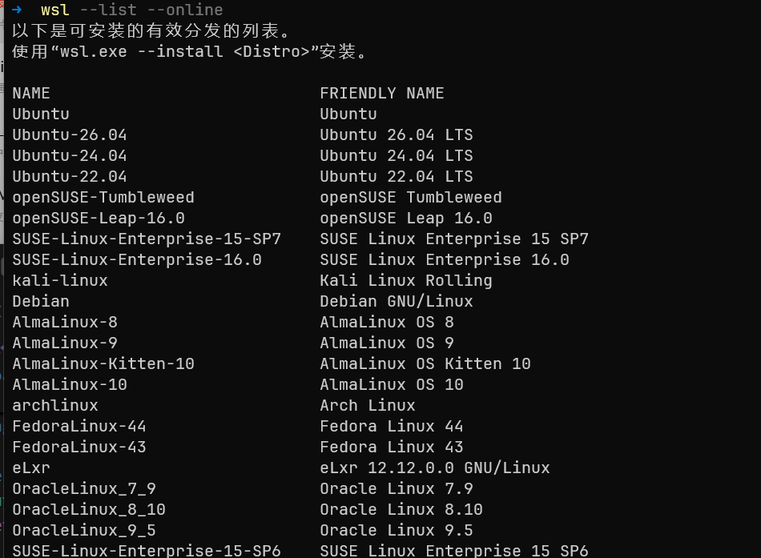
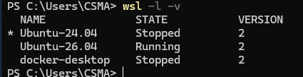
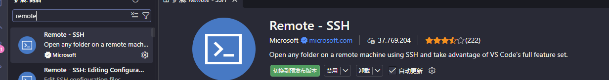
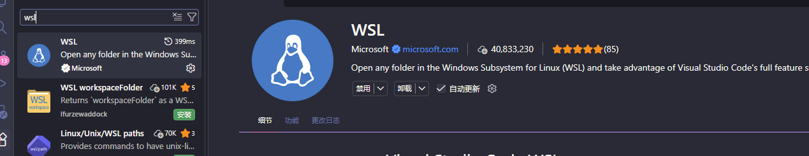

> 目标：
>
> - 避免 Windows 与 Linux 环境混用导致的工具冲突（如 node/npm、python、git 等），实现更干净、可控的开发环境。
> - 修改 WSL2 网络模式为 Mirrored（镜像模式）实现使用 Windows 代理（检测到 localhost 代理配置，但未镜像到 WSL。NAT 模式下的 WSL 不支持 localhost 代理）。
> - 在 Windows 11 上安装并使用 WSL2，掌握常用 Linux 命令，并用 VS Code 做本地（WSL）和远程（SSH）开发。

# 一、关于WSL的背景说明？

一些老嵌入式朋友可能会有疑问，欸？啥是WSL，为什么要用，凭什么不是虚拟机，有这样或者是那样的疑问。这里就做一些笔者自己默默跟WSL爆破的一些记录，供大伙参考。

WSL是Windows Subsystem for Linux这四个单词的缩写。微软的意图很简单：让你在 Windows 里运行真正的 Linux。对于嵌入式开发、脚本、构建工具和很多开源工具来说，Linux 环境显得友好得多。您不必跟一堆开发环境配置上的障碍做斗争。

这个时候，就有朋友说，为什么不VMWare，VirtualBox（嗯，这个基本噶了）呢。答案是这种虚拟机的方式存在一定的性能损耗，而且最大的麻烦在于稳定的互操作是需要折腾的。笔者就记得，VMWare版本一改，一些老办法就使不得了。最后就是VMWare上Ubuntu等等经常挂掉。稳定性实在是令人叹气。

> 当然，一些活要是跟显卡打交道，VMWare一类的事情那就是别想了，这类虚拟机似乎是看不到显卡的。

WSL的出现让双系统，传统虚拟机的方式可以从必选降低为备选。从互操作性上，现代WSL显然远远比VMWare等方案强得多。我们不费吹灰之力的就能在WSL下的Linux访问到Windows上的文件。比如说，你要摸到D盘上的PDF或者是C语言文件。我们直接就能

```shell
cat "/mnt/d/My Documents/report.pdf"
```

路径带空格时要记得加引号，不然会按空格拆成好几段，各自报「文件不存在」。除此之外完全不用做其他操作，开箱即用。甚至可以直接调用显卡等等。

> 当然，USB设备访问，需要使用usbipd等开源项目加持，狗屎微软一直不入正，只能说没招了。需要的朋友可以单独寻找搜索引擎了解usbipd项目~

---

# 二、准备工作（你需要做的事）

WSL不错，咋开始呢？好，开始你美好的WSL时光需要这些实在是最基本的条件了：

- Windows 11（推荐最新版）。
- 拥有管理员权限的用户账号（安装时需要管理员身份运行 PowerShell）。
- 稳定的网络（安装过程中需要下载文件）。
- BIOS 里的硬件虚拟化（Intel 的 VT-x，AMD 的 AMD-V）处于开启状态。多数机器默认就是开的，个别老机器装 `wsl --install` 装不上，多半是它被关了。

---

# 三、在 Windows 11 上安装并使用 WSL2

**PS：一些老旧的教程会让你开Hyper-V虚拟化，笔者查证了一下，现在不需要了，启用「虚拟机平台」就足够了**。但是，WSL的安装自动会拉起需要的功能，您不必担心。按照下面的内容做就好

## 3.1 WSL2 的安装

**注意是以管理员身份**，您启动Windows Powershell，（右键“开始”→`Windows Terminal (Admin)` 或 `PowerShell (Admin)`）。在管理员 PowerShell 里输入：

```powershell
wsl --install
```

这条命令会自动启用所需 Windows 功能（这就包含了启用“虚拟机平台”）、安装 WSL2，并提示重启。

**关闭 WSL**，在 PowerShell 里执行：

```powershell
wsl --shutdown
```

到这里，您急需要选择一个发行版，现在还没有Linux发行版，比如说Ubuntu，或者是Arch Linux给您使用。

## 3.2 发行版本的安装

选择自己的发行版咯！您输入这个指令，在网络通畅（不通畅那就记得挂代理。挂代理是一个危险的教程，这里咱们就不参合了~）

```powershell
wsl --list --online
```



1. 选择想要安装的发行版本，以下以`Ubuntu-26.04`为例

   ```powershell
   wsl.exe --install Ubuntu-26.04
   ```

2. **关闭 WSL**在 PowerShell 里执行：

   ```powershell
   wsl --shutdown
   ```

3. **重新进入 WSL**直接输入：

   ```powershell
   wsl
   ```

Over，您可以开始美美使用了。

## 3.3 检查与常用管理命令

之后WSL将会陪伴您度过每一天，所以，稍微会一些WSL的指令是不赖的，上面已经给出了WSL的安装，和直接关掉的指令，下面给出一些常见的其他指令，下面的命令都在 `PowerShell` 或 `Windows Terminal` 中执行。

### 查看已安装的发行版

先列出已经安装的 Linux 发行版，同时查看它们的运行状态和 WSL 版本：

```powershell
wsl -l -v
```



输出中的 `NAME`、`STATE` 和 `VERSION` 分别表示发行版名称、运行状态和 WSL 版本。名称前的 `*` 表示当前的**默认发行版**，所以直接执行 `wsl` 时会进入这一发行版。

### 设置默认发行版

如果电脑上安装了多个发行版，可以把常用的那个设为默认。例如，将 `Ubuntu-26.04` 设为默认发行版：

```powershell
wsl --set-default Ubuntu-26.04
```

设置完成后再次执行 `wsl`，就会进入 `Ubuntu-26.04`。


> 这里修改的是 `wsl` 默认进入的发行版，不会改变其他发行版的 WSL 版本。

### 确认 WSL 组件版本

如果要查看 WSL 本身、内核和相关组件的版本，执行：

```powershell
wsl --version
```


`wsl --version` 查看的是 WSL 组件信息，不能单独判断某个发行版使用的是 WSL 1 还是 WSL 2。发行版的版本仍然要回到 `wsl -l -v`，确认目标发行版的 `VERSION` 列是否为 `2`。

```powershell
wsl -l -v
```


### 将发行版切换到 WSL2

如果 `wsl -l -v` 显示某个发行版仍在使用 WSL 1，可以手动切换到 WSL 2：

```powershell
wsl --set-version Ubuntu-26.04 2
```

把命令中的 `Ubuntu-26.04` 换成目标发行版名称即可。使用 `wsl --install` 新安装的发行版默认使用 WSL 2；当然，如果您的操作系统非常老旧，比如说是Windows 10的早期的一个版本，那需要注意一下。

### 临时进入不同的发行版

不想修改默认发行版时，可以给 `wsl` 加上 `-d`（`--distribution`），只临时进入指定发行版：

```powershell
wsl -d Ubuntu-26.04
```

进入 `Ubuntu-26.04`，但不会改变默认设置。

```powershell
wsl -d Ubuntu-24.04
```

进入 `Ubuntu-24.04`，同样不会影响默认发行版。

### 停止指定发行版

```powershell
wsl --terminate <发行版名称>
```


比如说，我现在需要关掉正在运行的RK3506，那么

```powershell
wsl --terminate RK3506
```

这个命令就能在不干扰其他发行版运行的情况下安全停掉RK3506这个发行版。如果要一次关闭所有正在运行的 WSL 实例，可以使用前面介绍过的 `wsl --shutdown`。

# 四、WSL2 隔离 Windows PATH

孩子们，WSL的互操作性方便其实也有大雷，那就是有时候我们的shell会找上我们Windows上的东西，类似：

```bash
/mnt/c/Windows/System32
/mnt/c/Program Files/nodejs
```

也是会被找上的。意味着您刚安装的nodejs，或者是gcc编译器，很有可能找到了Windows那边去，最后特性不支持，配置解析混乱，直接导致项目运行崩溃。经典的就是：

- Node / npm / pnpm 版本混乱（优先命中 Windows，最后给您爆出来一大堆匪夷所思的错误，排查很有可能会浪费您不少的token :) ）
- Python / pip 环境污染
- CLI 工具行为异常（路径优先级不可控）
- DevOps 工具（Docker / Git / CI）出现不可预期问题

对于工程化开发（尤其是全栈 + CI/CD 场景），**强烈建议隔离**。

## 4.1 配置 `/etc/wsl.conf`

办法就是在您的发行版内部，补充：

```shell
❯ cat /etc/wsl.conf
[interop]
# 补充的是这个，会有人告诉你关掉这个。。。额。。。见过腿痛砍腿嘛？就是这个道理
appendWindowsPath = false
```

## 4.2 重启 WSL

这一步，**是必须的**。WSL启动的时候才会重新读取整个新的配置。在 Windows PowerShell 中执行：

```powershell
wsl --shutdown
```

## 4.3 验证结果

重新打开 WSL：

```bash
echo $PATH
```

预期结果应该只包含 Linux 路径，例如：

```bash
/usr/local/sbin:/usr/local/bin:/usr/sbin:/usr/bin:/sbin:/bin
```

---

## 4.4 这么做会怎样呢？

| 能力               | 变化                                                                                                               |
| ------------------ | ------------------------------------------------------------------------------------------------------------------ |
| 调用 Windows 程序  | ❌ 不直接可用（如 `explorer.exe`，非要调用，需要添加完整的路径，因为shell不再默认查找这些地方，我们本来希望如此！） |
| Node / Python 环境 | ✅ 完全隔离                                                                                                         |
| CLI 行为一致性     | ✅ 明显提升                                                                                                         |
| CI/CD 一致性       | ✅ 更接近 Linux 服务器                                                                                              |

## 4.5 第一次进入 Linux（在 Ubuntu 终端里做）

在开始菜单打开刚安装的 Ubuntu 应用。登录后建议先更新系统包索引并升级：

```bash
sudo apt update && sudo apt upgrade -y
```

PS，如果您不太熟悉Linux，玩玩这些~

| 命令            | 作用                               | 备注                                                        |
| :-------------- | :--------------------------------- | :---------------------------------------------------------- |
| `pwd`           | 显示当前所在目录                   | print working directory；在 WSL 里刚打开通常显示 `/home/你` |
| `ls -la`        | 列出当前目录下的文件（含隐藏文件） | `-l` 显示详细信息，`-a` 包含 `.` 开头的隐藏项               |
| `cd ~`          | 回到用户家目录                     | `~` 就是 `/home/你`；只敲 `cd` 效果相同                     |
| `mkdir myproj`  | 新建一个名为 `myproj` 的文件夹     | make directory；加 `-p` 可一次创建多级目录                  |
| `cd myproj`     | 进入 `myproj` 文件夹               | 用 `cd ..` 返回上一层                                       |
| `touch hello.c` | 新建一个空文件 `hello.c`           | 文件已存在时，只更新它的时间戳、不清空内容                  |
| `nano hello.c`  | 用 nano 编辑器打开该文件           | 保存：`Ctrl+O` → `Enter`；退出：`Ctrl+X`                    |
| `cat hello.c`   | 显示该文件的全部内容               | 文件很长时会刷屏，长文件可用 `less hello.c`                 |

安装常用工具（示例：git、编译工具、python）：

```bash
sudo apt install git build-essential python3 python3-pip -y
```

> 小提示：Windows 的 C: 驱动器在 WSL 里路径是 /mnt/c，例如 C:\Users\你 在 WSL 为 /mnt/c/Users/你。为了更好性能，建议把代码放在 WSL 的家目录（~）里。

# 五、修改配置文件设置全局网络模式为 Mirrored

您开发的时候，想必都会开启网络代理访问Github，对吧。简单的说：**当在 Windows 上运行了代理软件之后，其会在本地开启相关的代理端口，所有流量都会经过此端口转发**，从而实现网络代理。而在 WSL2 中则可以手动设置代理地址和端口，从而实现 WSL2 使用 Windows 的代理。

```shell
export http_proxy="http://<Windows_IP>:<代理端口>"
export https_proxy="http://<Windows_IP>:<代理端口>"
```

但是，随着 WSL2 的更新，推出了Mirrored 网络模式，它提供了更好的网络兼容性和更简单的网络配置体验。此时如果本机运行着代理，那么此时启动 WSL2 会提示

> `wsl: 检测到 localhost 代理配置，但未镜像到 WSL。NAT 模式下的 WSL 不支持 localhost 代理。`
> 本文将 WSL2 的网络模式修改为 Mirrored（镜像模式）实现在 WSL2 中使用 Windows 代理。

而 Mirrored 模式的会有以下优势：

- IP 地址共享：WSL2 实例与 Windows 主机共享相同的 IP 地址
- 简化网络配置：不再需要处理独立的虚拟网络接口
- 更好的兼容性：解决了企业网络、VPN 和防火墙的许多连接问题
- 端口无缝访问：本地端口自动映射，无需额外配置

## 5.1 配置 `.wslconfig`

> 操作步骤:关闭所有 WSL 实例打开 PowerShell（管理员权限），执行：

```powershell
wsl --shutdown
```

创建 or 修改.wslconfig 文件，在 Windows 用户目录（`%UserProfile%`，比如 C:\Users\您的用户名）下创建或编辑名为.wslconfig的文件，添加以下内容：

```ini
[wsl2]
networkingMode=mirrored
dnsTunneling=true
firewall=true
autoProxy=true

[experimental]
# 这样动态配置，但是笔者不确定会不会有问题，谨慎开启~
autoMemoryReclaim=gradual
```

来，如果好奇这些都是啥，简单的说说

```ini
[wsl2]
# 启用镜像网络模式，WSL这个时候就好像您的Windows网络情况
networkingMode=mirrored
# 启用DNS隧道（解决代理网络下DNS问题）
dnsTunneling=true
# 共享Windows防火墙设置，安全！
firewall=true
# 自动继承Windows代理配置
autoProxy=true
```

> 注意：`.wslconfig` 不支持「行尾注释」，注释要像上面这样单独成行。而且配置文件格式不对时 WSL 不会报错，只会静默忽略配置照常启动，哪天发现设置没生效，先检查是不是注释跟到了行尾。

```ini
[experimental]
autoMemoryReclaim=gradual
```

顺手说一句，`autoMemoryReclaim` 的默认值是 `dropCache`（立即回收），`gradual` 是更温和的慢回收；`dnsTunneling`、`firewall`、`autoProxy` 在 Windows 11 22H2+ 的新版 WSL 里默认就是开的，上面真正干活的其实只有 `networkingMode=mirrored` 那一行。

重启 WSL，直接在 PowerShell 中输入wsl重新启动 Ubuntu。此时 WSL 将使用与 Windows 主机相同的网络环境，包括 代理网络 连接。

# 六、用 VS Code 在 WSL 里开发（推荐）和用 VS Code 远程 SSH

当你要连接远程开发板或服务器的时候，您需要这个！我也建议必须配置！

## 6.1 用 VS Code 在 WSL 里开发（推荐）

在 Windows 上安装 VS Code（从官网下载安装程序）。
链接在这里喔：[Visual Studio Code](https://code.visualstudio.com/)
在 VS Code 中安装扩展：Remote - WSL,WSL(可以减少配置wsl的ssh这一步)





方式一（推荐）：在 WSL 终端中进入项目目录，然后执行：

```bash
cd ~/myproj
code .
```


`code .` 会调用 Windows 端的 VS Code，并通过 Remote - WSL 扩展连接到当前的 WSL 发行版。VS Code 的界面运行在 Windows 上，而工作区、集成终端、扩展和调试进程运行在 WSL 中，因此编译器、调试器等工具只需安装在 WSL 内。首次打开项目时，VS Code 可能会自动安装 VS Code Server。

方式二：如果当前使用的是 Windows PowerShell，先执行 `wsl` 进入 WSL，再运行上面的命令：

```powershell
wsl
```

这种方式几乎不需要额外配置，使用体验接近原生 Linux。

## 6.2 用 VS Code 远程 SSH（当你要连接远程开发板或服务器时）

当你未来需要连到学校/公司/家中的远程 Linux（比如树莓派、开发板、远程服务器），可以使用 VS Code 的 Remote - SSH 扩展。基本步骤：

在 Windows 上安装 VS Code 并安装 Remote - SSH 扩展。
生成 SSH 密钥（在 Windows 的 PowerShell 或 WSL 都可以）：

```powershell
ssh-keygen -t ed25519 -C "your_email@example.com"

# 回车使用默认路径（会生成 ~/.ssh/id_ed25519 和 id_ed25519.pub）
```

把公钥内容（~/.ssh/id_ed25519.pub）复制到远程主机的 ~/.ssh/authorized_keys（远程主机需要能 SSH 登录）。可以用 ssh-copy-id（在 WSL 下可用）或手动拷贝：

```bash
# 在 WSL 下：
ssh-copy-id user@remote-host

# 或者手动复制公钥内容到远端 ~/.ssh/authorized_keys
```

在 VS Code 的 Remote-SSH 面板中配置主机（或者直接通过扩展的命令 Remote-SSH: Connect to Host...），连接成功后即可像本地一样编辑、运行和调试远程文件。

# 附录 A 参考链接

## A.1 微软官方文档

| 主题                                  | 链接                                                                      |
| ------------------------------------- | ------------------------------------------------------------------------- |
| WSL 安装                              | [安装 WSL](https://learn.microsoft.com/zh-cn/windows/wsl/install)         |
| WSL 基本命令                          | [基本命令](https://learn.microsoft.com/zh-cn/windows/wsl/basic-commands)  |
| WSL 配置（`.wslconfig` / `wsl.conf`） | [配置 WSL](https://learn.microsoft.com/zh-cn/windows/wsl/wsl-config)      |
| WSL 网络配置                          | [配置 WSL 网络](https://learn.microsoft.com/zh-cn/windows/wsl/networking) |

## A.2 第三方补充资料

| 主题                                                                | 链接                                                                                           |
| ------------------------------------------------------------------- | ---------------------------------------------------------------------------------------------- |
| WSL 安装                                                            | [WSL 安装教程（CSDN）](https://blog.csdn.net/TeleostNaCl/article/details/149058218)            |
| WSL 配置（`.wslconfig` / `wsl.conf`，含 `networkingMode=mirrored`） | [WSL 配置与镜像网络（CSDN）](https://blog.csdn.net/charlie114514191/article/details/156223591) |
| WSL 网络与镜像模式                                                  | [WSL 网络与镜像模式](https://jishuzhan.net/article/2042105169136123905)                        |

---

<ArticleContributors />
