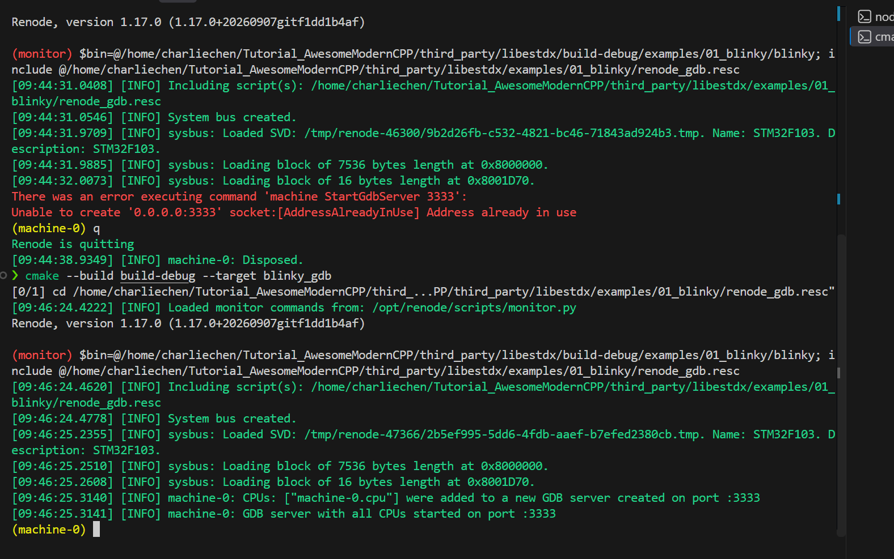

# 哟哟哟，咱们还差活滴

是的。我的意思是我们的旅程没有走完。有人会问——欸 CharlieChen114514，我跟着你配置完了STM32的HAL库依赖，也把代码编译起来了，也把代码在Renode跑起来了，怎么叫还没有完事呢？

答案是——软件工程有一个重要的闭环就是调试。说来高大尚，其实就是咱们写代码的时候出现问题了，也许是你准备兴冲冲的提交代码的时候突然你的大脑告诉你嘿伙计你有没有测试一个corner case（换而言之，一个比较边角的情况），或者更惨一点，你被测试和领导拉群。嘿伙计，写出来bug了，今天下班之前我要看到他修好~。好了，修复吧。你当然可以说咱们靠串口printf定位。问题来了，万一串口本身还在做别的咋办，万一有一些场景下干脆就没有串口或者是不准暴露串口，咋办？万一查的是一些时序问题，你打个printf程序时序错开了，这个时候没事了但是下一秒又炸代码了。你咋办？

睡不着了孩子们。这就是这一张的主题——调试您写的程序。让您快速的修复好bug之后，睡大觉 :）。

## 那么，他跟我们上位机的调试，区别何在？

我相信大家如果是从上位机来的，或者是在编写交叉平台无关的程序的时候，应该都是调试过程序的。比如说，您使用IDE摁下调试键，调试器Attach到了运行的程序，程序也就在您指定的位置上停下来。这个指定的位置，叫断点（也就是咱们开发中的经典吐槽：“不是，这个哥们啥情况，下个断点都不会吗？”）。上位机开发中我们时常这样看问题并且处理他们。

> 官方的说——在电脑上调普通程序，您按 F5 就能打断点，是因为调试器（GDB 这类）和被调试的程序住在同一台机器上，操作系统给了它一套控制接口，停进程、读内存，直接伸手就够得着。

但是还是有问题。我们不是上位机开发！我们是要部署到我们的单片机上的，他不跑在我们的操作系统上。GDB 伸不过去，中间需要一个翻译：**GDB Server**。它监听一个 TCP 端口，把 GDB 发来的"第 373 行停一下""把变量 tickstart 给我"翻译成对目标 CPU 的操作。

对于Renode模拟装置，这个事情非常的简单，他自己就内置了一个，一行命令的事<RefLink :id="1" preview="Renode official documentation, Debugging with GDB" />。

但是对于真正的板子上，那就需要有人来引出来调试服务器接口，桥接板子的调试接口，让我们可以使用调试器调试板子。这就是我们后面上真正的开发板让我们的STM32F103C8T6跑我们自己的代码。


另外，因为看起来有人对ELF格式并不熟悉，简单的说，ELF是一个 **带地址（您在哪？）、带符号（这是谁？）、带调试信息（他是啥？）** 的完整档案，对于我们烧录的 bin 文件，他是剥得只剩指令和数据的裸二进制。GDB 要把机器码对回您的源代码，靠的就是 ELF 里那些额外的东西。喂它 bin，它连 `HAL_Delay` 是谁都查不到。

## 一条龙：把调试服务起起来

模拟器这头，libestdx 给咱们备好了一个 target，我写的，您可以随意看看这里是如何custom target的。

```bash
cmake --build build-debug --target blinky_gdb
```

我是这样写的：

```cmake
add_custom_target(blinky_gdb
    DEPENDS blinky
    COMMAND renode --console --disable-xwt
            -e "$bin=@$<TARGET_FILE:blinky>"
            -e "include @${CMAKE_SOURCE_DIR}/examples/01_blinky/renode_gdb.resc"
    WORKING_DIRECTORY ${CMAKE_SOURCE_DIR}
    USES_TERMINAL
    VERBATIM
)
```

renode_gdb.resc 是笔者添加的，说穿了其实就是通知拉起一个gdbserver，毫无新意~

```text
using sysbus

mach create
machine LoadPlatformDescription @sim/stm32f1/bluepill.repl

$bin?=@build-debug/examples/01_blinky/blinky

sysbus LoadELF $bin

machine StartGdbServer 3333
```

建机器、装 bluepill 板级户口、加载固件，其实真正的新面孔只有最后一句 `machine StartGdbServer 3333`——给机器开一个 GDB 服务，等电脑这头来连。终端保持开着别关：`--console` 模式下 Renode 跟着终端的 stdin 活着，想塞进脚本里自动化跑的话，重定向了 stdin 后，它加载完就自己退，日志里看不出半点异常。真跑起来是这样：



日志里那行 `Loading block of 7536 bytes length`——7536 正是 Debug 构建的 text，加载的是哪份固件，字节数自己会说话，咱们看一眼就能确认口径没拿错。这个 target 还有个聪明的地方：CMake 用生成器表达式把**当前 build 目录的** ELF 喂给 renode，您从 build-debug 调它加载的就是 Debug 固件、从 build 调就是 Release，调试器跟模拟器各拿各的 ELF 这种幽灵没有出生的机会。

## 喂！把 VSCode 连上去

好了，笔者记得有群友大佬是对着原生的GDB插件开始猛调，真的狠人，我对TUI和CLI干重活半点兴趣都没有（尽管笔者实际上打命令绝对是CLI第一）。我们有VSCode，就不折磨各位大佬了。

咱们给 VSCode 装上 Cortex-Debug 扩展（作者是 marus25 大佬，反正最出名的这个就是）就齐了。

> 写到这里随手说一下——您在IDE中感知到的智能补全，和友好的报错信息是LSP友情提供的。目前笔者认为比较流行的，看起来也比较好用的，就是clangd了，之后提升开发体验的时候继续说我们咋搞。

```json
{
    "version": "0.2.0",
    "configurations": [
        {
            "name": "Renode blinky (外接 GDB Server)",
            "type": "cortex-debug",
            "request": "launch",
            "servertype": "external",
            "gdbTarget": "localhost:3333",
            "executable": "${workspaceFolder}/third_party/libestdx/build-debug/examples/01_blinky/blinky",
            "gdbPath": "/usr/sbin/arm-none-eabi-gdb",
            "runToEntryPoint": "main"
        }
    ]
}
```

咱们认三个关键字段：`servertype: "external"` 告诉 Cortex-Debug"GDB Server 我自己管着呢，你别另起"；`gdbTarget` 就是 Renode 那个 3333 端口；`executable` 指向 Debug 构建的 ELF——为什么必须是它，下面构建口径那一节专门说。

然后您按 F5。头一回连上，DEBUG CONSOLE 里大概会刷两行怪话：

```text
Program stopped, probably due to a reset and/or halt issued by debugger
⚠️ warning: Invalid state, unable to determine sp alias, assuming msp.
```

都不是病。前一行是 Cortex-Debug 的口头禅，目标一停它就猜这么一句；后一行是 gdb 在函数入口分不清主栈/进程栈时的老毛病，裸机 main 走的就是 msp（主栈），它猜得对。您真正会看到的画面长这样：


程序停在 main 入口，之后就是面板的天下：行号旁点一下下断点，F5 继续、F10 单步、F11 步入、Shift+F11 步出，鼠标悬停就能看变量，左侧调用栈面板把谁调谁列得清清楚楚。底下那根线没变过——调试器连着 Renode 的 GDB 服务，只是命令一个都不用您敲。整个流程笔者录了一份实录，从起服务到按按钮一镜到底：

<video controls muted src="./debug-session.mp4" width="640"></video>

## 停在断点上，现场随便看

拿主循环那句 `HAL_Delay(500)` 练手：在 `main.cpp` 里那行调用旁点一个断点，F5 命中后按 F11 步入，编辑器跳进 HAL 源码，变量面板立刻给您看家底——参数 `Delay=500`，您在 `main.cpp` 里写的那个 500，一路上到了这里；调用栈面板里 `main () at main.cpp:41`，调用点精确到行。程序卡死的时候这两块面板往往就是破案的第一现场：停在哪个函数、被谁调的，一目了然。

变量面板的底气从哪来？咱们把这份 Debug 固件里 `HAL_Delay` 开头几条真指令解剖出来（`arm-none-eabi-objdump` 的真输出）：

```text
080004cc <HAL_Delay>:
 80004cc:  b580       push {r7, lr}
 80004ce:  b084       sub  sp, #16
 80004d0:  af00       add  r7, sp, #0
 80004d2:  6078       str  r0, [r7, #4]             ← 参数 Delay 存进栈格子
 80004d4:  f7ff ffb4  bl   8000440 <HAL_GetTick>    ← 断点落在这一条(373 行头一句)
 80004d8:  60b8       str  r0, [r7, #8]             ← tickstart 存进另一格
```

一条条看：`push` 把帧指针 r7 和**返回地址 lr** 一起压栈，调试器能列出"是谁调进来的"，靠的就是栈里这份返回地址；`sub sp, #16` 给局部变量开出 16 字节的栈格子；`str r0, [r7, #4]` 把参数 Delay 摆进自己的格子——所以断点一停，面板就能报出 `Delay=500`，那不是猜的，是从这格栈里读的。断点本身落在 373 行的第一条指令 `bl` 上：栈帧已经搭好、参数已经归位，您停下的瞬间看到的就是一个完整的现场。这也顺带解释了 Debug 构建 7536 比 Release 的 5500 大两千字节的另一层来由：每个变量都要有自己的格子、每次读写都是实打实的访存指令，不开优化就是这个排场。

按 F10 单步走过 373 行，还有个细节值得咂摸：刚停下时 `tickstart` 显示 2，走完这行变成 0。2 不是它的值，是栈格子里残留的旧数据——断点停在这一行，**这一行还没执行**；F10 之后 `bl HAL_GetTick` 的返回值 0 才写进格子。为什么是 0？`HAL_GetTick()` 读的是全局节拍 `uwTick`（02 篇对拍过的老熟人），从复位到主循环第一次延时，仿真时间还没走过 1 毫秒，SysTick 一次都没响过。您在 Watch 面板里加一个 `uwTick`，每按一次 F5 命中一次断点，看它 0→501→1001 地涨：两次 `HAL_Delay(500)` 之间正好五百个节拍的等待，加上主循环翻转 GPIO 的那点开销。`HAL_Delay` 的工作机制（死等 `uwTick` 追上起点加 500）就这样在变量现场里现了形，一行汇编不用读。这条时间线画出来给您看：


## 不对啊！我看你调试的和实际执行的完全不是一个binary

对的，你看我们调试用的是build-debug，因为我们的行号断点要靠 ELF 里的 `-g` 调试信息（也就是addr2line中行号和地址的双向映射）：变量表、行号表，调试器把"这格栈是哪个变量""这条指令对应源码第几行"对上号，全靠它。而咱们日常的默认构建按 Release 走，全开优化、不带 `-g`：ELF 里有函数符号，往函数上打断点还使得；变量和行号干脆没有。您要是拿默认构建的固件连进来，行号断点找不到落点、变量面板空空如也——这不是操作错了，是那份 ELF 里压根没记这些。

所以调试的时候咱们用 Debug 口径，另起一个 build 目录，两边互不干扰：

```bash
cmake -B build-debug -G Ninja -DCMAKE_TOOLCHAIN_FILE=cmake/arch/stm32f103c8t6.cmake -DCMAKE_BUILD_TYPE=Debug
cmake --build build-debug --target blinky
```

构建尾部的真输出：

```text
   text    data     bss     dec     hex filename
   7536      12       4    7552    1d80 .../build-debug/examples/01_blinky/blinky
```

7536 对 5500，多出来的两千字节就是不开优化的代价。

需要注意的是函数的地址排布两个口径不一样，Release 版 `HAL_Delay` 在 `0x08000350`，Debug 版在 `0x080004cc`。**讨论地址、贴输出，永远先说清楚是哪份构建**——两份 ELF 混着看，看到的现象全是在骗您。您在断点里看到的超长文件路径也是 `-g` 干的：编译时机器上的绝对路径被它原样记进 ELF，所以每个人看到的都是自己机器的样子，不用奇怪。

什么时候用哪副面孔，现在可以说清楚了：

| | 默认（Release） | Debug |
|---|---|---|
| text | 5500 | 7536 |
| 调用栈 | 有函数名，无行号 | 函数名 + 文件:行号 |
| 变量 | 无 | 参数、局部变量全在 |
| 用途 | 日常构建、体积对照 | 抓虫、单步、看现场 |

> 笔者提示一下：您抓完虫记得切回默认口径再上秤，拿 Debug 版的 7536 去谈零开销，是给自己挖坑。

## 断点本身也有物理课

断点不是无限的。真 Cortex-M3 芯片里管断点的硬件叫 FPB（Flash Patch and Breakpoint），规格是六个指令比较器加两个字面量比较器<RefLink :id="2" preview="ARM Cortex-M3 TRM (DDI 0337), FPB" />。

机器码从 Flash 里取出来的时候，六个比较器各自盯一个地址，取指地址对上就触发停机。这就是咱们挂起调试的原理嘛！不奇怪的。

对于我们现在玩的板子上， Flash 断点最多六个，下第七个要么报错要么静默失效。另一类叫软件断点，原理是把断点处那条指令当场改写成一条 BKPT 停机指令——但 Flash 是写之前必须先擦的，跑在 Flash 里的代码改不动，所以咱们的固件在真机上走的全是硬件通道。习惯上断点用完就删，别攒着。

那 Renode 呢？笔者一口气下了八个断点，从 `HAL_Delay` 到 `HAL_RCC_ClockConfig`，八个全部生效，一个没被拒绝。这是因为 Renode 是功能级模拟，断点由仿真器自己实现，不占用 FPB 这块硬件，模拟器里没有这个限制。这算模拟器给的便利，但习惯别在这养成：断点攒成八个的肌肉记忆带上真机，第七个就开始装聋作哑，您还得当它是玄学。您把两边摆在一起看：


## 排错速查

连不上 3333，先看 Renode 活着没：那两行 "GDB server ... started on port :3333" 在不在日志里；再看端口被谁占着，`ss -tln | grep 3333` 一查便知。断点下了不命中，先核对调试器加载的 ELF 和机器里跑的是不是同一份：04 篇那个"跑的还是别人的固件"的幽灵，在调试器里同样存在；再考虑口径：

Release 构建里函数可能被优化器揉进调用者，行号断点找不到落点，换 Debug 口径再试。至于 F5 按下去毫无动静、调试器报 "Cannot execute this command while the target running" 这类话，是仿真压根没开起来：这台 Renode（1.17）默认 GDB 一连上就自动开跑，但 `machine StartGdbServer` 有个 autostart 参数，笔者把它显式掰成 `false` 试过，连上时 CPU 停在 `0x00000000`，等到来生也等不来断点。遇到这种情况，在 Renode 终端里敲一句 `start` 立竿见影，这一句顶多白敲，不敲就要赌版本默认行为。

到这儿，咱们手里的观测家伙就全了：采样判据看结果，断点调试看过程，两副构建口径按需切换。模拟器这套练熟了，真板子上的流程结构一模一样，只是 GDB Server 那个位置换成 OpenOCD 加调试探针。有板子的朋友，06 篇见；没板子的也不亏，接下来 07 篇咱们先让编辑器看懂这套交叉编译的代码，跳转补全一条龙。

<ReferenceCard title="参考文献">
  <ReferenceItem
    :id="1"
    author="Renode Project"
    title="Debugging with GDB"
    :year="2026"
    url="https://renode.readthedocs.io/en/latest/debugging/gdb.html"
    chapter="StartGdbServer 与 autostartEmulation 选项"
  />
  <ReferenceItem
    :id="2"
    author="ARM"
    title="Cortex-M3 Technical Reference Manual — About the Flash Patch and Breakpoint Unit"
    :year="2026"
    url="https://developer.arm.com/documentation/ddi0337/h/debug/about-the-flash-patch-and-breakpoint-unit--fpb-"
    chapter="FPB:六个指令比较器与两个字面量比较器"
  />
</ReferenceCard>
