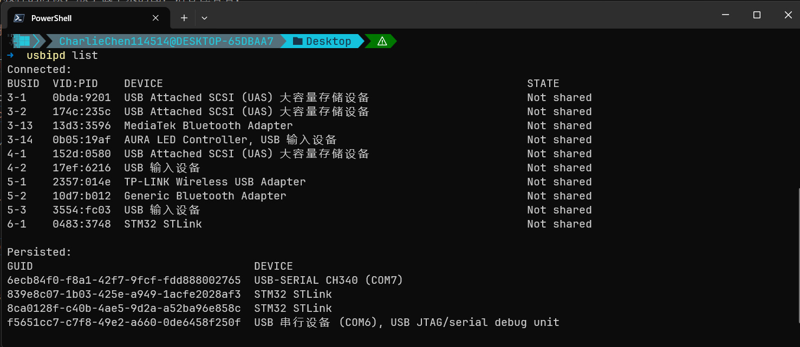

# 板子到手了,插上再说

好了！现在我们准备上真正的板子了！这里，没有板子的朋友请您止步，不要浪费时间。当然您愿意的话看看真正的WSL下写代码烧录到自己的板子上如何做，欢迎留下！

笔者单独留下这一篇的理由很简单。就是WSL下写代码，我们插入 ST-Link 插上 USB 口,兴冲冲在 WSL2 里敲 `lsusb`,输出里空空如也,别说 ST-Link,连个键盘鼠标都看不到。问题不在您的板子,也不在操作,在 WSL2 的架构本身。

## 插上了,却看不见

WSL2 用起来像一个装在 Windows 里的 Linux 程序,实际是一台完整的 Hyper-V 虚拟机:自己的内核、自己的内存管理、自己的设备清单。USB 设备在 PC 上由主机控制器管理,咱们每插一个设备,操作系统就加载驱动接管它;而 WSL2 虚拟机里的 USB 控制器是虚拟出来的,连不到物理控制器上,所以物理插上去的设备对 WSL2 完全不可见——Windows 那边设备管理器里 ST-Link 好好的,Linux 这边一无所知。

咱们要用的工具叫 usbipd-win,开源项目,微软自己的 WSL 文档拿它当官方推荐方案<RefLink :id="1" preview="Microsoft Learn: Connect USB devices" />。它实现的是 USB/IP 协议:Windows 这头当服务器,把设备分享出去;WSL2 那头当客户端,把分享来的设备挂进自己的虚拟 USB 总线。设备还是插在 Windows 机器上,只是 Linux 也能摸到了。

## Windows 侧:从 Not shared 到 Attached

开一个**管理员权限**的 PowerShell，因为咱们后面的 bind 操作是要管理员的,后面的 attach 不用,到那步再说。

咱们装的时候就用官方那条完整命令<RefLink :id="1" preview="Microsoft Learn: Install the USBIPD-WIN project" />:

```powershell
winget install --interactive --exact dorssel.usbipd-win
usbipd list
```

这个是笔者当时夸夸写教程的时候，顺手截下来的图，请各位看看：


笔者这个时候呢，没有插入st-link，所以的话您可以看到这里没有ST-link，没事，现在有了，哈哈！



这份列表，我们要分两段读。Connected 段是眼下插着的全部 USB 设备,咱们关心两列:BUSID 是设备在总线上的位置(比如说，笔者的电脑上是 `6-1`),STATE 是透传状态,整个 Windows 侧的流程,就是把 ST-Link 那一行的 STATE 从 `Not shared` 推到 `Attached`。找到 ST-Link 那行(`0483` 开头的 VID 是 ST 的厂商号),记住 BUSID。

Persisted 段是另一个东西:挂着自动重连的设备清单。等咱们讲 attach 时它会上场。bind 告诉 Windows“这个设备以后允许被分享”,**做一次就够**,您重启电脑它也保留:

```powershell
usbipd bind --busid 6-1
```

咱们再跑一次 `usbipd list`,那一行的 STATE 变成 `Shared`。attach 才是把设备真的接进 WSL2,**默认每次重插、重启之后都要重做**:

```powershell
usbipd attach --wsl --busid 6-1
```

然后我们的powershell就会吐出来这些东西~

```text
usbipd: info: Using WSL distribution 'LinuxWSL' to attach; the device will be available in all WSL 2 distributions.
usbipd: info: Loading vhci_hcd module.
usbipd: info: Detected networking mode 'mirrored'.
usbipd: info: Using IP address 127.0.0.1 to reach the host.
```

到这里设备就归 WSL2 管了:`usbipd list` 里 STATE 变 `Attached`,Windows 那边反而看不到它了。第三行报的网络模式因机器而异(mirrored 或 NAT),不影响流程。嫌每次重做麻烦,attach 加上 `--auto-attach`:它变成一个长驻循环,设备一重连就自动接回来,`usbipd list` 的 Persisted 段列的就是这些设备,笔者机器上那两个 ST-Link 和一个 CH340 串口就在里面,都是之前挂过自动的。

还有两个小事实省得您撞墙。attach 这一步从 usbipd-win 5.0 起不再要管理员权限,普通 PowerShell 就行<RefLink :id="1" preview="Microsoft Learn: You no longer need to use an elevated administrator prompt" />;attach 之前保持一个 WSL 终端开着:设备要接进 WSL2 那台虚拟机,虚拟机得活着才有的接,冷启动状态下 attach 会报连不上。日常查看类命令从 WSL 里也能直接发,还是那个全路径的 `powershell.exe -Command "usbipd list"`,要管理员权限的 bind 不行。

## Linux 侧:lsusb 里认出它

回到 WSL2 终端验证:

```bash
lsusb | grep -Ei '0483:3748|st-?link'
```

看到类似输出就通了(笔者本机实录):

```text
# 笔者输入了 lsusb 后回车
Bus 001 Device 001: ID 1d6b:0002 Linux Foundation 2.0 root hub
Bus 001 Device 003: ID 0483:3748 STMicroelectronics ST-LINK/V2
Bus 002 Device 001: ID 1d6b:0003 Linux Foundation 3.0 root hub
```

`0483:3748` 是 ST-Link V2,`374b` 是 V2-1,OpenOCD 都认识。grep 的模式咱们写成 `st-?link` 而不是 `stlink`,因为 lsusb 的显示里带着连字符。看到了 `Bus 001 Device 003` 吧！它不只是编号，因为Linux 把每个 USB 设备当一个文件管,这个设备的文件就在 `/dev/bus/usb/001/003`,OpenOCD 打开它来操控设备,马上用得到。

> PS，很有可能，你会发现你没有权限在Linux这一端操作usb，openocd会告诉你没有权限操作ST-Link，那就麻烦`sudo chmod 666 /dev/bus/usb/001/003`，到底这里是哪个设备依旧跟随您看到的实际的那个usb端口说。

## 烧录:一条命令的事

libestdx 里 target 都替咱们配好了,进 `third_party/libestdx` 目录:

```bash
cmake --build build --target flash
```

欸？咱们的烧录这么简单吗？并非，是笔者自己封装的一条 openocd 命令<RefLink :id="2" preview="OpenOCD User's Guide: Flash Commands" />,来，请：

```bash
openocd -f interface/stlink.cfg -f target/stm32f1x.cfg \
        -c "program build/examples/01_blinky/blinky.bin verify reset exit 0x08000000"
```

两个 `-f` 各管一头:`interface/stlink.cfg` 说用什么探针,`target/stm32f1x.cfg` 说烧什么芯片。换 DAP-Link 探针就换第一个,换 F4 芯片就换第二个。排错时配置和硬件对不上,病根多半在这两个文件。`-c` 里那串才是烧录本体:`program` 烧文件,`verify` 烧完校验一遍,`reset` 复位芯片让它从头跑新程序,`exit` 做完就退出 openocd,结尾的 `0x08000000` 是 Flash 起始地址——裸 `.bin` 文件里没有地址信息,烧到哪得咱们指定<RefLink :id="2" preview="OpenOCD User's Guide: program 语法与 offset" />。

```text
[1/1] Flashing blinky.bin via OpenOCD (ST-Link)
Open On-Chip Debugger 0.12.0-01004-g9ea7f3d64-dirty (2026-08-27-22:55)
Licensed under GNU GPL v2
For bug reports, read
        http://openocd.org/doc/doxygen/bugs.html
Info : auto-selecting first available session transport "hla_swd". To override use 'transport select <transport>'.
Info : The selected transport took over low-level target control. The results might differ compared to plain JTAG/SWD
Info : clock speed 1000 kHz
Info : STLINK V2J46S7 (API v2) VID:PID 0483:3748
Info : Target voltage: 3.221508
Info : [stm32f1x.cpu] Cortex-M3 r1p1 processor detected
Info : [stm32f1x.cpu] target has 6 breakpoints, 4 watchpoints
Info : starting gdb server for stm32f1x.cpu on 3333
Info : Listening on port 3333 for gdb connections
[stm32f1x.cpu] halted due to debug-request, current mode: Thread
xPSR: 0x01000000 pc: 0x080004e0 msp: 0x20005000
** Programming Started **
Info : device id = 0x20036410
Info : flash size = 64 KiB
Warn : Adding extra erase range, 0x08001588 .. 0x080017ff
** Programming Finished **
** Verify Started **
** Verified OK **
** Resetting Target **
shutdown command invoked
```

烧完抬头看板子:PC13 那盏灯按 500 毫秒的节奏闪,就是 Renode 里跑了这么久的那份 blinky,现在在您桌面上闪。判据和观测课同一套:不用肉眼猜节奏,拿您的手机慢动作数一下周期,和固件里 `HAL_Delay(500)` 对得上就算过。

## 排错速查

`Error: open failed`:openocd 没摸到设备。笔者把 ST-Link 拔了真跑一遍,完整报错长这样:

```text
[1/1] Flashing blinky.bin via OpenOCD (ST-Link)
FAILED: [code=1] examples/01_blinky/CMakeFiles/flash /home/charliechen/Tutorial_AwesomeModernCPP/third_party/libestdx/build/examples/01_blinky/CMakeFiles/flash
cd /home/charliechen/Tutorial_AwesomeModernCPP/third_party/libestdx/build/examples/01_blinky && openocd -f interface/stlink.cfg -f target/stm32f1x.cfg -c program\ /home/charliechen/Tutorial_AwesomeModernCPP/third_party/libestdx/build/examples/01_blinky/blinky.bin\ verify\ reset\ exit\ 0x08000000
Open On-Chip Debugger 0.12.0-01004-g9ea7f3d64-dirty (2026-08-27-22:55)
Licensed under GNU GPL v2
For bug reports, read
        http://openocd.org/doc/doxygen/bugs.html
Info : auto-selecting first available session transport "hla_swd". To override use 'transport select <transport>'.
Info : The selected transport took over low-level target control. The results might differ compared to plain JTAG/SWD
Info : clock speed 1000 kHz
Error: open failed

** OpenOCD init failed **
shutdown command invoked

ninja: build stopped: subcommand failed.
```

哎，我的ninja炸了！不着急，您按照这个顺序看看！

1. 咱们先跑 `lsusb | grep -Ei '0483:3748|st-?link'` 确认设备透传了没,没有就回 Windows 侧重新 attach。
2. 如果openocd告诉你：`LIBUSB_ERROR_ACCESS`:权限问题,权限一节里那条 `chmod 666` 兜底。
3. `Error: unable to find a matching device`:配置和硬件不匹配——探针明明是 J-Link,咱们用了 stlink.cfg;或者芯片是 F4,咱们用了 stm32f1x.cfg。

烧完灯不闪:先确认 BOOT0 在低电平侧,再确认看的是 PC13(板载灯在 C 端口 13 脚,不是随便哪盏),最后确认烧的这份固件在 Renode 里本来就闪。模拟器里都不闪的固件,真板上更不会闪,这就是咱们一直先跑模拟器的理由。

## 原生 Linux 的朋友,这里更快

原生 Ubuntu 这类发行版内核直接管 USB,usbipd 整个跳过,只剩权限一件事,而且 openocd 包那份 `60-openocd.rules` 装上就有,拔插一次设备规则即生效,普通用户直接用。WSL2 里咱们多走的透传一路,是虚拟化边界多出来的一道手续,原生 Linux 没有这道边界,也就没有这道手续。

## 到这儿,三件观测家伙齐了

咱们这套起步环境的观测能力现在是三层:采样判据看结果,断点调试看过程,真板烧录管盖章。前两层调试篇齐的,这一层今天补上。模拟器是功能级仿真,它说“行为正确”的时候,固件在指令层面的逻辑确实没问题;但最终要在物理世界里跑的代码,发布之前在真板上点一次灯、看一次串口输出,这个章只有真板能盖。往后每一站的例程,libestdx 都同时备着 sim 和 flash 两个 target,一个管验证,一个管盖章,您两边对着跑,数字对得上,心里才有底。

真板这边结了。下一篇咱们回头收拾编辑器:让它看懂这套交叉编译的代码,跳转、补全、查定义一条龙,写固件的顺手程度,从下一篇开始变。

<ReferenceCard title="参考文献">
  <ReferenceItem
    :id="1"
    author="Microsoft"
    title="Connect USB devices (WSL documentation)"
    :year="2026"
    url="https://learn.microsoft.com/en-us/windows/wsl/connect-usb"
    chapter="usbipd-win 安装与 attach 流程"
  />
  <ReferenceItem
    :id="2"
    author="OpenOCD"
    title="OpenOCD User's Guide — Flash Commands"
    :year="2026"
    url="https://openocd.org/doc/html/Flash-Commands.html"
    chapter="program 语法(verify/reset/exit/offset)与 stm32f1x mass_erase"
  />
</ReferenceCard>
