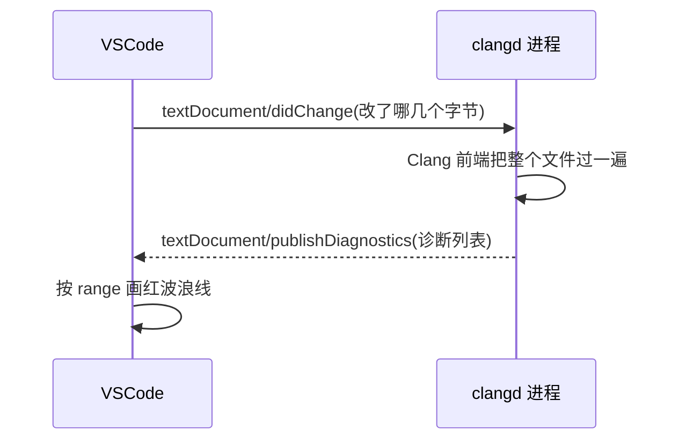

# 喂喂，刚刚你折腾的很开心嘛

我们折腾到现在，打开我们的工程一看，哦吼，为什么还是红线满天飞呢？答案是，clangd（如果您读过我们的新手教程）没有找到正确的compile commands。

听不太懂？我慢慢说！

## 编辑器不懂 C++,懂代码的是另一个进程

VSCode 其实是一个大白痴来着的，他压根不知道你在写啥。对！他不知道。。。它自带的语法高亮是按文本规则上色的,`int` 这个词认得,可哪个名字是类型、`HAL_GPIO_WritePin` 定义在哪个文件,它一概不知道。真正懂代码的,是另一个进程:clangd。起步卷[装 clangd 那篇](/getting-started/05-vscode-clangd)里咱们装的 VSCode 扩展,只做两件事,把 clangd 这个程序拉起来、在编辑器和它之间转发消息;分析本身,全在 clangd 进程里做。

一个编辑器进程,一个语言分析进程,两边怎么配合?靠一套约定好的消息格式:LSP(Language Server Protocol,语言服务器协议)<RefLink :id="2" preview="microsoft.github.io: LSP Specification — base protocol 与消息定义" />。这套协议是微软 2016 年随 VS Code 提出来的,治的是一个老毛病:编辑器有几十种,语言也有几十种,每个编辑器都为每门语言单独写一套"懂代码"的插件,工作量是两边相乘;定下协议之后,每门语言实现一个"语言服务器",每个编辑器实现一个"客户端",两边按同一套消息对话,工作量变成两边相加。如今主流编辑器全认这套协议。咱们这套环境里,客户端是 VSCode 加它的 clangd 扩展,语言服务器就是 clangd(LLVM 出品,C++ 这边用得最广的一个)。

把整条链路串起来,您每改一处代码,背后发生的事是:



那 clangd 拿什么判断对错?官网的一句话最直白:"clangd runs the clang compiler on your code as you type"<RefLink :id="3" preview="clangd.llvm.org: Features — errors and warnings" />。

您每改一处,它就把当前文件在 Clang 编译器前端里过一遍,词法、语法、语义分析全走,只省掉最后生成机器码那一步;没动过的前缀(通常是一串 include)有专门的缓存,名字叫 preamble,所以逐字符地改也不卡。判对错走的是编译器的规矩,这就要求 clangd 解析每个文件时,必须知道这个文件按什么参数编译:头文件从哪些路径找、`-std` 定在哪、目标是什么架构。这份参数,`compile_commands.json` 一个文件一条地登记着;登记里查不到的文件,clangd 就退回一套兜底参数自己撑着。补全、跳转、查找引用、悬停、重命名、clang-format 格式化、clang-tidy 静态检查,再加上把整个项目建一遍的后台索引(跨文件跳转就靠它,缓存在 `~/.cache/clangd/index`),全都架在这套解析之上。

回过头看,开头那句话就能读通了:clangd 没拿到正确的编译参数。host 平台上参数白给,咱们这套交叉工具链,clangd 一边缺信息一边还得继续干活,于是开始猜。猜什么、怎么猜错的,下一段见分晓。

## 红线从哪来:clangd 在自己猜

host 平台的 clangd 为什么开箱就能用?咱们看那边 `compile_commands.json` 里登记的编译命令:`g++ -std=c++20 -I...`,clangd 拿着就能干活,g++ 的头文件布局(`/usr/include/c++/14`、`/usr/include` 这一套)它内置认识,什么都不用配。

换到咱们的工程,编译命令变成 `/usr/bin/arm-none-eabi-g++ --target=arm-none-eabi -mcpu=cortex-m3 -mthumb -I...`。clangd 是基于 clang 的,它**不认识这个 GNU 交叉编译器内部把头装在哪**:arm 的 C++ 标准库头、newlib 的 C 头、CMSIS 的 `core_cm3.h`,它一个都不知道在哪。那它怎么办?猜。clangd 22 本机实测,打开 `include/libestdx/gpio/gpio_base.hpp` 这个头(它 include 了 `<concepts>` 和 `<cstdint>`),cc1 日志里 C++ 头的搜索路径是这一行:

```text
internal-isystem /usr/bin/../arm-none-eabi/include/c++/v1
```

`c++/v1` 是 libc++ 的目录布局(LLVM 家 C++ 标准库的排法)。咱们去真的目录里看一眼:

```bash
$ ls /usr/arm-none-eabi/include/c++/
16.2.0
```

目录里只有 `16.2.0`,没有 `v1`。clangd 拿一个不存在的假路径去找 `<concepts>`,结果自然是找不到。咱们把这次解析跑完,真实报错长这样:

```text
E ... [pp_file_not_found] Line 2: 'concepts' file not found
E ... [undeclared_var_use] Line 12: use of undeclared identifier 'std'
E ... [requires_expr_expected_type_constraint] Line 12: expected concept name with optional arguments
...
```

`<concepts>` 一丢,连锁反应全来了:`std` 未声明、requires 表达式报“不是 concept”,您屏幕上那一片红,源头就是这一条找不到的头。病根在于 clangd 从没去问真正的交叉编译器“您的头文件装在哪”,它拿自己家 libc++ 的布局去套一个 GCC 工具链。GCC 家的 libstdc++ 住在 `c++/16.2.0`(按版本排),LLVM 家的 libc++ 住在 `c++/v1`,两家目录排法不同,布局猜错了,再多的假路径也拼不出真的 `<cstdint>`。

## 问编译器本人:query-driver

clangd 有个机制正好治这个:`--query-driver`。原理很直接:clangd 不再自己猜,而是真的去执行您放行的那个编译器,跑一条 `arm-none-eabi-g++ -E -xc++ -v /dev/null`,让编译器把内部的头文件搜索路径吐到 stderr 里。咱们本机(16.2.0)真跑一遍,它吐的是这六行:

```text
#include <...> search starts here:
 /usr/lib/gcc/arm-none-eabi/16.2.0/../../../../arm-none-eabi/include/c++/16.2.0
 /usr/lib/gcc/arm-none-eabi/16.2.0/../../../../arm-none-eabi/include/c++/16.2.0/arm-none-eabi
 /usr/lib/gcc/arm-none-eabi/16.2.0/../../../../arm-none-eabi/include/c++/16.2.0/backward
 /usr/lib/gcc/arm-none-eabi/16.2.0/include
 /usr/lib/gcc/arm-none-eabi/16.2.0/include-fixed
 /usr/lib/gcc/arm-none-eabi/16.2.0/../../../../arm-none-eabi/include
End of search list.
```

这些路径全是真实存在的:`c++/16.2.0` 是 libstdc++ 头,最后那个 `arm-none-eabi/include` 是 newlib 的 C 头。现在咱们把同一个 `gpio_base.hpp` 再 check 一遍,这次带上放行参数:

```bash
clangd --check=include/libestdx/gpio/gpio_base.hpp --query-driver='**/arm-none-eabi-g*'
```

```text
I ... All checks completed, 0 errors
```

同一条 flag 之差,红的变 0 错误。它真去问了吗?咱们看这次解析的 cc1 日志,C++ 头那几行变成了:

```text
-isystem .../arm-none-eabi/include/c++/16.2.0
-isystem .../arm-none-eabi/include/c++/16.2.0/arm-none-eabi
-isystem .../arm-none-eabi/include/c++/16.2.0/backward
```

咱们对照上面编译器自己吐的六行 search list,一一对应。clangd 拿到了真路径,`<concepts>` 找到了,后面那串连锁报错全部消失。这就是单变量对照:编译器没换、文件没换,只多了“允许 clangd 去问编译器”这一件事。

那为什么这么好用的东西默认不开?因为 `--query-driver` 等于让 clangd 执行一个外部二进制。设想您 clone 一个来历不明的工程,它的配置里写着“编译器”在 `/tmp/evil.sh`,clangd 一启动就把这玩意儿跑一遍——这事不能让它默默发生。所以 clangd 默认拒绝,必须由您显式放行哪些编译器可以执行。这是安全设计,不是 bug。

## 三份配置,各管一段

仓库里这套已经配好了,咱们把它们逐份读懂。您要是往自己的工程里搬,这三份一起搬。

头一份在 `third_party/libestdx/.vscode/settings.json`:

```json
{
    // clangd 对 arm-none-eabi 目标默认猜 libc++ 布局(c++/v1),本机工具链
    // 实为 libstdc++ 布局(c++/<版本>),不问真编译器就找不到 <cstdint>
    // 等标准头。--query-driver 放行 arm gcc/g++(装在 /usr/sbin),让
    // clangd 探测真实系统头路径。它是进程旗标,进不了 .clangd,只能放这。
    "clangd.arguments": [
        "--query-driver=**/arm-none-eabi-g*"
    ]
}
```

等号后面是逗号分隔的路径,支持 glob。`**/arm-none-eabi-g*` 一个 glob 把 gcc、g++ 连带变体全放行了,C 工程和 C++ 工程都覆盖,也省得关心工具链到底装在 `/usr/bin` 还是 `/usr/sbin`(Ubuntu 的 apt 装在 `/usr/bin`,咱们这台 Arch 系在 `/usr/sbin`,发行版不同位置不同)。要写死也可以,跑一下 `which arm-none-eabi-g++`,输出填进去。两个注意:这里必须是路径或路径的 glob,写 `--query-driver=arm-none-eabi-g++` 这种光秃秃的命令名不生效,clangd 不去 PATH 里找;另外它是**进程旗标**,只能放在 IDE 传给 clangd 的启动参数里,`.clangd` 配置文件收不了它,所以这份文件注定住在 `.vscode` 里。

库根还有一份 `.clangd`,管的是另一件事:孤立头文件。`compile_commands.json` 只登记 `.cpp` 的编译命令,您单独打开一个 `.hpp` 而它没被任何编译单元包含时,clangd 查无此条,退回一份兜底配置去解析,兜底默认的标准停在 gnu++17,咱们库里 concept 这类 C++20 语法就会误报。这份配置按扩展名分块注入旗标:

```yaml
---
If:
  PathMatch: [.*\.hpp, .*\.cpp]
CompileFlags:
  Add: [-std=c++23]
---
If:
  PathMatch: .*\.h
CompileFlags:
  Add: [-std=c2x]
```

`.hpp`/`.cpp` 按 C++23 解析,和 CMake 里 `CMAKE_CXX_STANDARD 23` 同值;`.h` 按 C23(`c2x` 是它定稿前的代号),因为 HAL 头是 C 语境,喂 C++ 旗标它会不认<RefLink :id="1" preview="clangd.llvm.org: CONFIG file — CompileFlags" />。对已经进了 `compile_commands.json` 的文件,注入的和 CMake 同值,覆盖无害;救的是孤立文件。刚才咱们的 A/B 实验拿 `gpio_base.hpp` 当靶子,它走的就是这条路——头文件没有 CDB 条目,全靠这份兜底。

最后一份在 CMake 里,咱们看 `cmake/arch/stm32f103c8t6.cmake` 的结尾,注释就写着用途:

```cmake
# 给 clangd / IDE 用
set(CMAKE_EXPORT_COMPILE_COMMANDS ON)
```

它让 CMake 在构建目录里生成 `compile_commands.json`,每条编译命令连 flag 带宏全量登记,咱们前面 A/B 实验里 clangd 读到的 `-mcpu=cortex-m3 -mthumb -DSTM32F103xB -I...` 全从这里来。没有这份文件,前两份配得再对,clangd 也只能对着一堆 `-I` 抓瞎。

## 验收

命令行咱们已经测过了,两条命令一红一绿,您在库根目录就能复现:

```bash
clangd --check=include/libestdx/gpio/gpio_base.hpp                            # 复现满屏报错
clangd --check=include/libestdx/gpio/gpio_base.hpp --query-driver='**/arm-none-eabi-g*'   # 0 errors
```

您再到 VSCode 里,重开窗口或 Command Palette 执行 `clangd: Restart language server`,然后打开 `examples/01_blinky/main.cpp`:红波浪线该没了;按住 Ctrl 点 `HAL_GPIO_WritePin`,跳进 HAL 头里的声明;敲 `HAL_` 出来一串补全。编辑器到这一步就看懂了这套交叉编译的代码,和 host 工程的体验持平。还想在 host 侧补 clangd 安装本身的,起步卷的[装 clangd 那篇](/getting-started/05-vscode-clangd)是前置;站在工程角度再深一层看交叉编译,接 [vol7 的交叉编译与 CMake](/vol7-engineering/01-cross-compilation-and-cmake)。

## 起步站,齐了

到这儿,起步站七篇凑齐:一篇破迷思,一篇简史,Renode 观测、工作环境、第一个固件、调试、真机,再到这篇的编辑器。回头看,这套环境已经能编译、能仿真、能调试、能上真板、写起来还顺手。下一站进 LED:先下到地砖下面用裸寄存器点一盏灯,看清官方库在替咱们做什么,再回到 HAL 之上用现代 C++ 把同一盏灯重新点亮。

<ReferenceCard title="参考文献">
  <ReferenceItem
    :id="1"
    author="LLVM"
    title="clangd documentation — CONFIG file"
    :year="2026"
    url="https://clangd.llvm.org/config"
    chapter="CompileFlags.Add、If.PathMatch 按条件分块"
  />
  <ReferenceItem
    :id="2"
    author="Microsoft 等"
    title="Language Server Protocol Specification (3.18)"
    :year="2024"
    url="https://microsoft.github.io/language-server-protocol/"
    chapter="Base protocol:Content-Length 分帧、JSON-RPC 2.0;publishDiagnostics 通知"
  />
  <ReferenceItem
    :id="3"
    author="LLVM"
    title="clangd documentation — Features"
    :year="2026"
    url="https://clangd.llvm.org/features"
    chapter="errors and warnings:clangd runs the clang compiler on your code as you type"
  />
</ReferenceCard>
