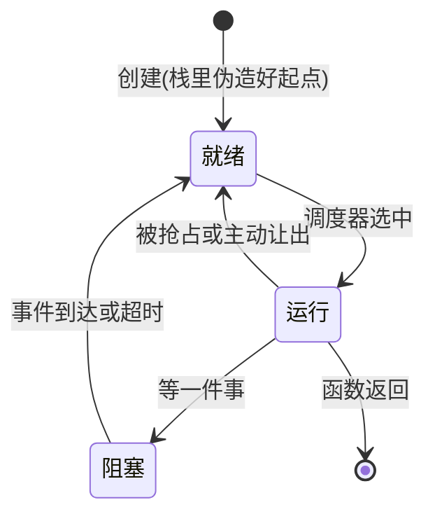

> PS: 初稿，慢慢优化ing

# 从超级循环到 RTOS:为什么需要,怎么验证

## 三件事挤一个循环,谁先谁后

把 F103 线攒下的几件事放在一起看:按键要消抖,隔 20ms 复查一眼;UART 的字节不能丢,中断收进环形缓冲,得有人取走;传感器每 100ms 要读一次;再添一块 OLED,刷一屏要 50ms。这些模块咱们都亲手写过,单拎出来个个能跑。麻烦从把它们放进同一个 `while (true)` 开始。

咱们写一个假想的 `main`。它够糙,但真实项目的 `main` 长着长着就是这个样子:

```cpp
// 示意代码,不是 ZerOS 的任何一站
int main() {
    uart1_init();
    uint32_t last_sample = 0;
    while (true) {
        oled_refresh();                          // 阻塞刷屏,50ms 走不掉
        if (tick - last_sample >= 100) {         // 传感器:每 100ms 读一次
            sensor_sample();
            last_sample = tick;
        }
        button_poll();                           // 按键消抖,内部自己记时间
        cli_process(uart_try_read());            // 命令解析,没字节就空转
    }
}
```

刷屏那一行是阻塞的。这意味着 `button_poll` 两次被调用,中间最坏隔 50ms,再加上采样和命令解析的耗时;您哪天往循环里塞一个 200ms 的传感器初始化,按键的响应就奔 250ms 去了。注意这件事的结构:任何一个功能变慢,惩罚的是循环里所有其他功能,它们的最坏响应时间就是整圈循环的耗时。没有哪一行代码写错,是结构就这样。

这套结构有名字,叫前后台系统(foreground/background system)。中断是前台,事件随到随办;`main` 循环是后台,所有慢活排队轮询。您在 F103 线用的就是这套结构。系统小的时候它简单直接;上面这些结构性问题,是系统变大之后才显出来的。

## 问题在哪:响应、优先级、同步

响应时间没有保证,是第一个结构性问题。上面已经算过:循环里最长的阻塞决定了其他所有逻辑的最坏响应时间。您把 OLED 刷屏拆细点?可以,但下一个耗时的操作进来,最坏响应又被顶上去。它随功能数量单调变差,而且没有任何机制约束它。

优先级也没有。后台任务一律平等,处理越界报警的代码和刷动画的代码排同一条队,谁排前面全凭 `while` 里的书写顺序,紧急与否不参与意见。您可能想问,中断不是有优先级吗?有,但 ISR 里不敢久留(F103 线讲中断安全那篇,咱们领教过关中断的代价),重活得交回后台处理;一交回队,又平等了。

最麻烦的是同步。中断和循环共享的数据,环形缓冲的读写指针、tick 计数、各种标志位,要么关中断保护,要么精心设计访问次序。关长了,串口字节和系统 tick 都会丢;关短了,竞态留在代码里,什么时候发作不确定。F103 线的环形缓冲咱们已经手工处理过一小块,那是单个外设的量;外设多起来,每处共享都得再来一遍,而且一次都不能错。

## 手写状态机:不上 RTOS 的替代方案

咱们别把前后台系统说成错误。两三件慢活、没有实时要求的小系统,它就是最合适的形态。真有一两个耗时操作,也不必上 RTOS,消抖状态机就是现成做法:把 50ms 的阻塞等待拆成"现在做什么、下次回来接着做什么",循环里每件事只跑一小步就返回,响应就回来了。F103 线的按键篇咱们正是这么干的。

您把手写状态机想深一层,会发现它在手工模拟一个协作式调度器:每个状态机就是一个不占栈的"任务",主循环就是在轮询调度它们。这个方案在中小系统里完全够用,很多产品一辈子就用它。

什么时候不够用?等的东西一多。时间要等、字节要等、总线空闲要等、几个设备的事件要组合着等,每种等待都要写进状态机的状态里,状态数按组合往上涨,改一处牵三处。到这份上,咱们该考虑把"等"从每个状态机里抽出来,交给一个专职模块统一管理。这个模块就是调度器;以调度器为核心,加上任务、同步、时间服务、中断后半段,合起来就是 RTOS。

## RTOS 把等待交给内核

RTOS 提供给咱们的核心能力只有一条:每个任务(task)写成一段看似独占 CPU 的普通函数,想等就直接等,`sleep(20)`、等信号量、等队列;等待背后的事由内核处理,任务被标记为阻塞,CPU 去跑别的就绪任务,等的条件一到,内核再把它放回就绪。代价是每个任务要有自己的一块栈,内核要在任务之间保存和恢复 CPU 现场。

咱们把任务的状态归纳成三个,来回转换:



图里"创建(栈里伪造好起点)"这个标注值得咱们提前说一句:新任务从来没运行过,它的栈里得有人替它伪造一份"正在被中断打断"的现场,第一次切换才能把它当作"恢复"来处理。怎么伪造、怎么切换,是第三站的内容。

响应时间的量级差别就在这里。前后台系统里,紧急逻辑的最坏响应由整圈循环决定;有了优先级抢占,最坏响应由"最长临界区加一次切换"决定。ZerOS 在 72MHz 真机上实测的切换本身开销是 93 个周期,约 1.3 微秒(测量方法和这个数的来历在性能那一站,咱们到时候连测量代码一起拆)。对比 50ms 级的循环,差四个数量级。单条指令的执行时间没有变,变的是 CPU 的分配规则:高优先级任务就绪,低优先级任务立刻让位。

中断的位置没变,还是前台,但分工变了:ISR 只把事件投递(post)给任务,自己立即返回,被唤醒的任务去做耗时的处理。这个分工叫底半(bottom half)。F103 线的 UART 篇咱们手工干过同一件事:中断收字节进环形缓冲,主循环取走处理。RTOS 把这个模式做成了正式机制:信号量、队列、直接通知,都是投递的不同形式。

## 优先级反转:1997 年火星上的真实事故

同步原语这一组,信号量、互斥锁、队列、事件组,各自解决什么问题,咱们不在这里逐个展开,下面的对照表里有各自的位置。但有一个概念值得现在讲清楚,因为它最有名,也最容易被轻视:优先级反转。

1997 年,火星探路者着陆器在火星表面反复整机复位。背后的机制后来被复盘得很清楚,咱们照着走一遍:运行 VxWorks 的着陆器上,一块互斥锁被低优先级的气象数据任务(ASI/MET)拿着;高优先级的总线管理任务等着这把锁才能干活;偏偏中间优先级的通信任务不停抢占 CPU,低优先级的持锁者得不到运行机会,锁迟迟还不回去。高优先级任务就这样一直等不到锁,直到看门狗超时,复位,再来一遍。JPL 没有改一行任务代码:他们通过深空链路远程把那把锁的优先级继承开关打开,高优先级任务等锁时,持锁者临时抬升到等锁者的优先级,中间优先级任务抢不到 CPU,锁很快归还,复位消失([JPL 软件负责人的复盘](https://www.cs.unc.edu/~anderson/teach/comp790/papers/mars_pathfinder_short_version.html)、[Rapita Systems 的整理](https://www.rapitasystems.com/blog/what-really-happened-software-mars-pathfinder-spacecraft))。

这个故事在咱们这条线里有两层用处。一层是提醒:优先级反转不需要任何一行错误代码就能发生,它是调度规则与锁规则组合出来的后果,所以互斥锁必须带优先级继承,这不是可选功能。另一层是预告:ZerOS 的互斥锁实现了单层优先级继承,还配了一个专门复现反转的 inversion demo,第四站咱们在串口窗里,能亲眼看中间优先级的 M 停止输出的那几秒。

## 为什么用 C++23,不用 C

咱们先把边界划清:裸机上是 freestanding 环境,无堆、无 RTTI、无异常,这三样是 ZerOS 主动禁用的。下一篇您会看到禁令写进链接脚本,谁引入堆 `new` 或异常,链接器直接报错拦下。

边界之内,C++23 有几样真正用得上的东西。concepts(C++20)把接口约束写成编译器可检查的形式:调度器对移植层的要求写成一个 concept,移植实现少一个函数,`static_assert` 当场失败,接口文档从注释变成编译器亲自执行,第三站咱们会见到 `Switchable` 这个例子。`std::expected`(C++23)把错误放进返回值:没有异常可抛的世界里,"要么结果、要么错误码"是函数返回类型的一部分,配 `[[nodiscard]]`,忽略错误的代码编不过,第一站的内存池全程用它。类型状态再进一步,把"用法对不对"也交给编译器:任务建造者链上漏配优先级、重复传栈,编译直接报错,这是第三站的内容之一。全局对象一律 `constinit`,编译期就位,没有初始化顺序问题,也没有藏在背后的堆分配。

还要说反面:热路径上没有这些。您看切换、入队、唤醒的代码,那些是朴素的静态 C 风格,能数得清周期。这些特性用在接口和防错上,不进每纳秒都在执行的热路径。这也是 ZerOS 的组件定位:内核不认识任何板级寄存器,应用只面向 `<ZerOS/*>` 头,换板子不动内核。

## 概念对照表

整条手搓线按 ZerOS 仓库的 commit 时序走,26 个 commit,每个概念都能对上它落地的那一篇。这张表您不用背,每站进门都会重新细讲;它的用途是您走到半路时查一眼自己到了哪。

| 概念               | 一句话                                                   | 在哪落地                             |
| ------------------ | -------------------------------------------------------- | ------------------------------------ |
| 内存池             | 无堆环境里的 `new`:位图定长块池                          | 第一站 `ece6e26`                     |
| 时间内核           | tick、回绕安全比较、按到期时间排序的等待队列             | 第二站 `54817f3` `4f12867`           |
| 真·临界区          | 拆掉 CMSIS 后发现优先级移位错误,亲手修好                 | 第二站 `e63067e`                     |
| 任务与调度器       | 就绪位图、三态、第一次上下文切换                         | 第三站 `0bf9461`                     |
| 丢唤醒与类型状态   | `park_for` 把两步并进同一临界区;建造者链让错误用法编不过 | 第三站 `6308dd0`                     |
| 中断唤醒           | ThisTask 与第一条"中断唤醒任务"链路                      | 第三站 `0e8ce6d`                     |
| 信号量             | 事件计数器,先到的事件不丢                                | 第四站 `5c62c0d`                     |
| 互斥锁与优先级继承 | 所有权、按优先级排队、继承防反转                         | 第四站 `7dbbcdf`                     |
| 可观测性           | HardFault 现场报告、栈金丝雀、零分配日志                 | 第五站 `feef8fb`                     |
| 队列与底半         | 环形队列加工作者线程,ISR 只投递事件                      | 第五站 `3570f27`                     |
| 软件定时器         | 等 300ms 不必占用一个任务加一块栈                        | 第五站 `766c462`                     |
| 同级时间片         | 同优先级任务轮流运行                                     | 第六站 `1006648`                     |
| 事件组与通知       | 多方等待;开销最小的通知路径                              | 第六站 `92a9aae`                     |
| demo 与 CI         | 注册中心、任务创建三条路径、四道检查                     | 第七站 `0054cf8` `d48f5a3`           |
| 真机性能           | 时钟树、DWT、切换开销实测、一次错误优化的回滚            | 第八站 `e2b7dc0` `3dc60bf` `fe270d9` |
| 第二块板与发布     | QEMU 零改移植、栈水位、tickless、v0.1.0                  | 第九站 `8efe93a` `fb9072b` `6c0a4f7` |

## 四个验证环境

同一份 ZerOS 代码,要在四个环境各跑一遍,每个环境管一类问题。host 桌面单测最快:内核逻辑编成普通 Linux 程序跑 `ctest`,不用开任何仿真器,调度、同步、时间这些纯逻辑的回归测试在这里做。Renode 管行为验证:整块 Blue Pill 的机器模型,串口窗里看得见任务打印,每站的验收主要在这里做;不过它的外设是模型实现的,比如 RCC 寄存器在模型里是个假值,这类仿真失真咱们到性能那站会拿真机对照。QEMU 跑第二块板 mps2-an385,专门验证内核与板子无关这个性质:换块板零改动能跑,这个声称由 QEMU 实际运行来验证。真机做最终验证,所有性能数字只从真芯片上出。

这套安排一半是让没有真板的您也能跟完,F103 线已经这么走过一遍;另一半是诚实:每个结论都得说清在哪个环境验证的,仿真器再接近也不是真芯片。手头没有 Blue Pill,host、Renode、QEMU 三个环境足够跟完整条线,只有性能那站的数字暂时复现不了。

再给您一个业界参照:FreeRTOS、Zephyr、ThreadX 都是大量产品在用的 RTOS,ThreadX 2023 年 11 月由微软捐给 Eclipse 基金会,以 MIT 许可开源([公告](https://threadx.io/))。咱们手搓 ZerOS,图的是把每个概念亲手实现一遍;这之后您再用任何现成 RTOS,看到的都是它背后的取舍。

## 下一篇

概念先铺到这里。下一篇咱们 checkout `6ee1d25` 和 `fe5a0e8`,从只有 13 行的空仓库骨架开始,把链接器禁令、C++ 写的向量表、1kHz SysTick 一样样立起来,直到 Renode 串口窗里打出第一行 banner。有个细节值得您留意:向量表里 SVC 和 PendSV 两个表项,在 `fe5a0e8` 里就是空指针,注释写着"归内核 port"。调度器要到第三站才实现,但它的位置从第一份向量表起就留好了。
