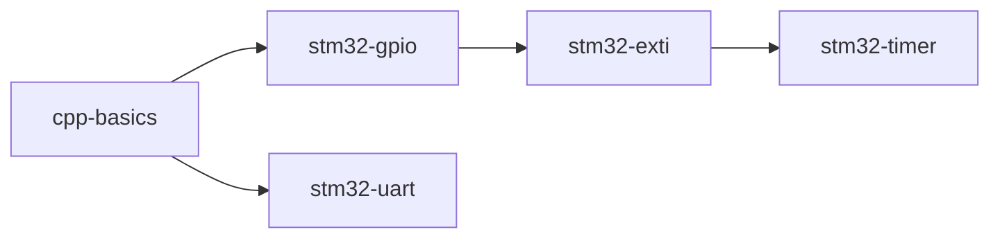

# 文档自动化生成：目录、索引与统计报告

## 目标

开发自动化文档生成工具，为项目自动生成和维护以下内容：

1. **文章目录**：根据目录结构和 frontmatter 自动生成层级化的文章目录页面
2. **交叉引用表**：生成文章之间的引用关系图和代码文件引用索引
3. **代码引用索引**：反向索引（哪个代码文件被哪些文章引用）
4. **统计报告**：项目整体统计（文章数、总字数、覆盖率、平台分布等）

生成的文档可集成到 CI 流水线中，在内容变更时自动更新，确保索引和统计信息始终与实际内容同步。

## 验收标准

- [ ] `scripts/generate_docs.py` 脚本已创建
- [ ] **文章目录生成**：根据 `documents/` 目录结构和 frontmatter 自动生成 `documents/generated/toc.md`
- [ ] **交叉引用表**：生成文章间的链接关系，输出 `documents/generated/cross-references.md`
- [ ] **代码引用索引**：反向映射代码文件 → 引用它的文章，输出 `documents/generated/code-index.md`
- [ ] **统计报告**：生成包含以下指标的 `documents/generated/stats.md`：
  - 总文章数、总字数
  - 按平台分类的文章数（STM32/ESP32/RP2040/Host）
  - 按难度分类的文章数（beginner/intermediate/advanced）
  - 代码覆盖率（有配套代码的文章占比）
  - 标签使用频率分布
- [ ] 脚本支持本地运行：`python3 scripts/generate_docs.py`
- [ ] 可集成到 CI：`--ci` 模式下若生成结果与现有文件有差异则报错
- [ ] 生成的文档使用 Mermaid 图表展示引用关系
- [ ] 支持输出 JSON 格式供其他工具消费：`--format json`

## 实施说明

### generate_docs.py 架构

```python
class DocGenerator:
    def __init__(self, docs_root: Path):
        self.docs_root = docs_root
        self.articles = self._scan_articles()
    
    def _scan_articles(self) -> list[Article]:
        """扫描所有 .md 文件，解析 frontmatter 和内容。"""
        ...
    
    def generate_toc(self) -> str:
        """根据目录层级和 frontmatter 生成文章目录。"""
        # 按目录层级组织
        # 使用 frontmatter 中的 title 和 order
        # 输出 Markdown 列表格式
        ...
    
    def generate_cross_references(self) -> str:
        """生成文章间交叉引用表。"""
        # 解析每篇文章中的相对链接
        # 构建引用关系图
        # 输出 Mermaid 图和 Markdown 表格
        ...
    
    def generate_code_index(self) -> str:
        """生成代码文件反向引用索引。"""
        # 扫描所有代码文件
        # 匹配文档中的代码引用
        # 输出：code/file.cpp → [article1.md, article2.md]
        ...
    
    def generate_stats(self) -> str:
        """生成项目统计报告。"""
        ...
```

### 文章目录格式示例

```markdown
# 文章目录

## 嵌入式 C++ 基础

| 序号 | 标题 | 平台 | 难度 | 预计阅读 |
|------|------|------|------|----------|
| 01 | C++ 在嵌入式开发中的优势 | 通用 | ★☆☆ | 10 分钟 |
| 02 | 现代工具链配置 | STM32 | ★☆☆ | 15 分钟 |

## STM32F1 外设教程

| 序号 | 标题 | 外设 | 难度 | 预计阅读 |
|------|------|------|------|----------|
| 01 | GPIO 输入输出 | GPIO | ★☆☆ | 20 分钟 |
| 02 | UART 串口通信 | USART | ★★☆ | 25 分钟 |
```

### 交叉引用 Mermaid 图示例



### 统计报告格式示例

```markdown
# 项目统计报告

生成时间：2026-04-15

## 总览

| 指标 | 数值 |
|------|------|
| 总文章数 | 45 |
| 总字数 | 85,000 |
| 平均阅读时间 | 18 分钟 |
| 代码覆盖率 | 78% |

## 平台分布

| 平台 | 文章数 | 占比 |
|------|--------|------|
| STM32F1 | 20 | 44% |
| ESP32 | 8 | 18% |
| RP2040 | 5 | 11% |
| Host/通用 | 12 | 27% |

## 标签云

cpp-modern: 15 | peripheral: 12 | rtos: 8 | debugging: 6 | ...
```

### CI 集成模式

在 `--ci` 模式下：
1. 生成文档到临时目录
2. 与 `documents/generated/` 下现有文件 diff
3. 如果有差异，输出 diff 并退出码为 1
4. 维护者可以运行 `python3 scripts/generate_docs.py --update` 更新

## 涉及文件

- `scripts/generate_docs.py` — 文档生成脚本
- `documents/generated/` — 生成的文档输出目录（git 跟踪）

## 参考资料

- [MkDocs 文档索引](https://www.mkdocs.org/user-guide/configuration/)
- [Mermaid 图表语法](https://mermaid.js.org/intro/)
- [Python pathlib 文档](https://docs.python.org/3/library/pathlib.html)
