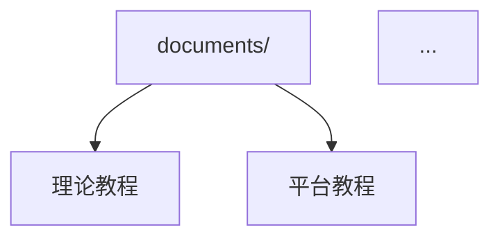

# 重新设计 README.md：项目门户与快速开始

## 目标

全面重新设计项目 README.md，使其成为项目的核心门户页面。README 应在 30 秒内让访问者理解项目价值和定位，在 5 分钟内让新用户完成快速开始。

中英双语 README（`README.md` 中文版，`README.en.md` 英文版），包含：项目愿景说明、特性徽章、目录预览图、快速开始指南、架构概览图、学习路径图、贡献指南链接、分支说明。

## 验收标准

- [ ] `README.md` 中文版已重新设计，内容完整
- [ ] `README.en.md` 英文版已创建
- [ ] 包含项目徽章：Build Status、Documentation Link、GitHub Stars、License
- [ ] 包含项目愿景和定位说明（一段话说明这个项目是什么、为什么存在）
- [ ] 包含快速开始指南（<5 分钟完成）：clone → 安装工具链 → 编译第一个示例 → 阅读
- [ ] 包含架构概览图（Mermaid 或 ASCII），展示项目结构
- [ ] 包含学习路径图，指导不同背景的读者（嵌入式新手/C++ 新手/两者都会）
- [ ] 包含目录结构概览
- [ ] 包含贡献指南链接（指向 CONTRIBUTING.md）
- [ ] 包含分支说明（main/archive/v0-legacy 等分支的用途）
- [ ] 在 GitHub 上渲染美观（无排版错误）
- [ ] README 总长度合理（建议 300 行以内，善用折叠块）

## 实施说明

### README 结构设计

```markdown
# Tutorial_AwesomeModernCPP

> 徽章行：build | docs | stars | license

> 一句话项目描述

## 项目愿景
2-3 段话，说明：
- 为什么做这个项目（嵌入式 C++ 教育资源匮乏）
- 目标读者（有 C/嵌入式基础，想学现代 C++ 的人）
- 项目独特价值（理论 + 实战、多平台、RTOS）

## 特性亮点
- 特性 1（带图标）
- 特性 2
...

## 快速开始（<5 分钟）

### 前置要求
...

### 5 分钟上手
步骤 1/2/3/4

## 架构概览


## 学习路径
根据背景推荐学习顺序的图表

## 项目结构
目录树（关键目录说明）

## 贡献
链接到 CONTRIBUTING.md

## 许可证
MIT License

## 致谢
...
```

### 学习路径图设计

针对不同背景的读者提供个性化学习路径：

- **路径 A**：C 语言 + 嵌入式经验 → 现代 C++ 基础 → 嵌入式 C++ → RTOS
- **路径 B**：C++ 经验 → 嵌入式基础 → 平台教程 → RTOS
- **路径 C**：两者都会 → 直接跳到感兴趣的主题

使用 Mermaid flowchart 或简单表格呈现。

### 分支说明

| 分支 | 用途 | 稳定性 |
|------|------|--------|
| `main` | 主开发分支，包含最新内容 | 活跃开发 |
| `archive/v0-legacy` | 早期版本存档 | 只读 |
| `gh-pages` | 自动部署的文档站点 | 自动生成 |

### 视觉设计原则

- 使用 GitHub 支持的 Markdown 特性（不支持 HTML）
- 徽章使用 shields.io 格式
- 图表优先使用 Mermaid（GitHub 原生渲染）
- 适当使用 emoji 作为视觉锚点（但不滥用）
- 长内容使用 `<details>` 折叠

## 涉及文件

- `README.md` — 中文版 README
- `README.en.md` — 英文版 README

## 参考资料

- [GitHub README 最佳实践](https://docs.github.com/en/repositories/managing-your-repositorys-settings-and-features/customizing-your-repository/about-readmes)
- [shields.io 徽章生成](https://shields.io/)
- [Mermaid GitHub 支持](https://github.blog/2022-02-14-include-diagrams-markdown-files-github/)
