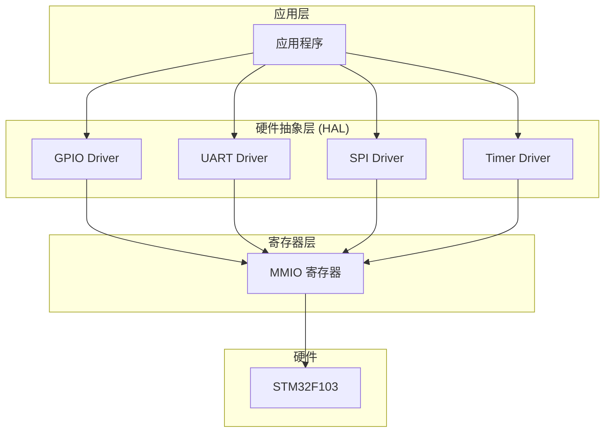
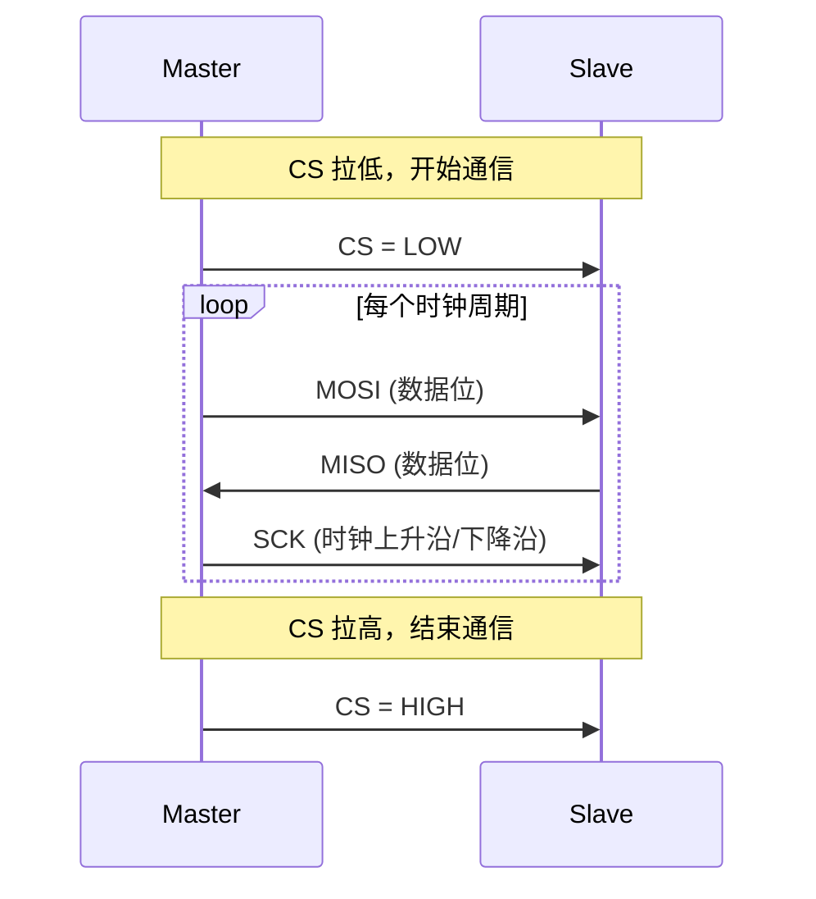
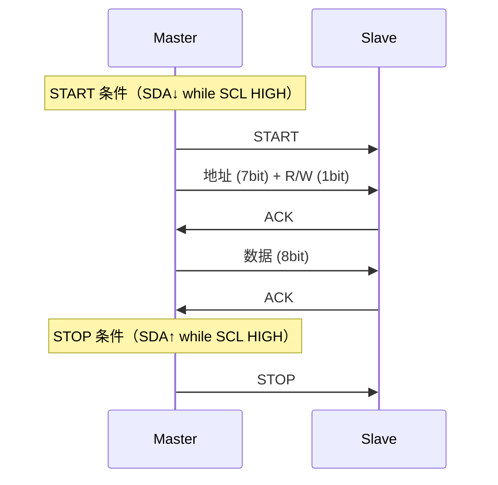
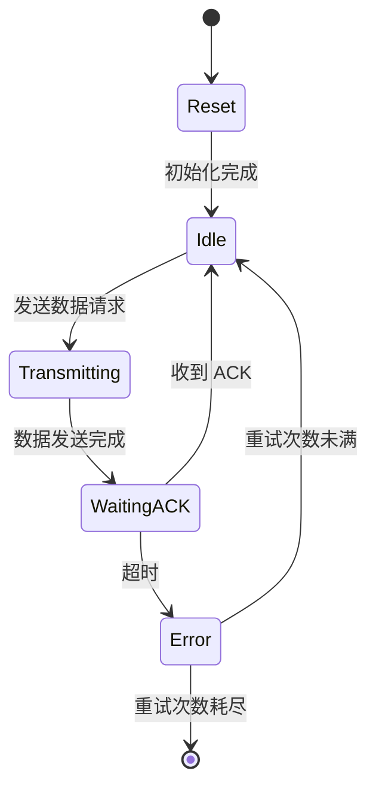

# 图表和可视化内容

## 目标

为关键教程添加丰富的图表和可视化内容，提升内容的可理解性。视觉化的内容对于理解硬件架构、通信协议、内存布局等抽象概念至关重要。

需要添加的图表类型：
1. **架构图**（Mermaid）：系统架构、软件分层、模块关系
2. **时序图**（Mermaid）：通信协议（SPI/I2C/UART）的时序
3. **内存布局图**（CSS/HTML）：栈/堆布局、寄存器映射
4. **硬件连接图**（ASCII art 或 SVG）：开发板接线图
5. **状态机图**（Mermaid）：外设状态转换

## 验收标准

- [ ] 至少 5 篇核心教程添加了 Mermaid 架构图
- [ ] SPI 和 I2C 教程添加了通信时序图（Mermaid sequence diagram）
- [ ] 内存管理教程添加了内存布局可视化
- [ ] 至少 3 篇硬件相关教程添加了接线图
- [ ] 所有图表在亮色/暗色模式下都正确渲染
- [ ] 所有图表有文字替代描述（可访问性）
- [ ] 创建 `documents/images/diagrams/` 目录存放 SVG/图片格式的复杂图表
- [ ] 图表风格统一（颜色方案、字体、线条粗细）

## 实施说明

### 架构图示例（Mermaid）



### 时序图示例（Mermaid）

**SPI 通信时序**：



**I2C 通信时序**：



### 内存布局图（HTML/CSS）

在 Markdown 中使用 HTML 块绘制内存布局：

```html
<div style="font-family: monospace; border: 2px solid #333; max-width: 400px;">
  <div style="background: #e3f2fd; padding: 8px; border-bottom: 1px solid #333;">
    <strong>栈 (Stack)</strong> ← SP<br/>
    函数局部变量<br/>
    返回地址<br/>
    保存的寄存器
  </div>
  <div style="background: #fff3e0; padding: 8px; border-bottom: 1px solid #333;">
    <strong>堆 (Heap)</strong><br/>
    <em>嵌入式通常不使用</em>
  </div>
  <div style="background: #e8f5e9; padding: 8px; border-bottom: 1px solid #333;">
    <strong>.bss (未初始化全局变量)</strong><br/>
    uint32_t counter;
  </div>
  <div style="background: #f3e5f5; padding: 8px; border-bottom: 1px solid #333;">
    <strong>.data (已初始化全局变量)</strong><br/>
    uint32_t counter = 42;
  </div>
  <div style="background: #fce4ec; padding: 8px;">
    <strong>.text (代码段)</strong><br/>
    Flash 存储区域
  </div>
</div>
```

### 硬件连接图

**方案 A：ASCII Art**（适合简单接线）

```
STM32F103C8T6          LED 电路
┌──────────┐
│       PA0├──────────┤330Ω├────┐
│          │                      │
│       GND├─────────────────────┤
└──────────┘           LED ▼ (GND)
```

**方案 B：SVG 图**（适合复杂接线）

使用 draw.io 或 Fritzing 生成 SVG：
- Fritzing：专为电子设计，有真实元件外观
- draw.io：灵活，适合示意图
- KiCad：专业 PCB 工具，功能过重

**推荐**：简单接线用 ASCII art，复杂接线用 Fritzing 导出 SVG。

### 状态机图（Mermaid）



### 统一图表风格

```yaml
# Mermaid 主题配置
# 在 mkdocs.yml 的 extra 中配置
extra:
  mermaid:
    theme: default
    themeVariables:
      primaryColor: "#4051B5"
      primaryTextColor: "#fff"
      primaryBorderColor: "#303F9F"
      lineColor: "#546E7A"
      secondaryColor: "#E8EAF6"
      tertiaryColor: "#C5CAE9"
```

### 优先添加图表的文章

1. **项目架构概述**：软件分层架构图
2. **GPIO 教程**：寄存器映射图、接线图
3. **SPI 教程**：通信时序图、接线图
4. **I2C 教程**：通信时序图、接线图
5. **UART 教程**：数据帧格式图
6. **中断教程**：中断处理流程图
7. **Timer 教程**：定时器工作原理图
8. **RTOS 调度器**：任务状态机图、调度流程图
9. **内存管理**：内存布局图
10. **DMA 教程**：DMA 传输流程图

## 涉及文件

- `documents/images/diagrams/` — SVG/图片格式的复杂图表
- 各教程 `.md` 文件 — 添加 Mermaid 图表
- `documents/stylesheets/extra.css` — 图表相关样式

## 参考资料

- [Mermaid 图表语法](https://mermaid.js.org/intro/)
- [Mermaid 序列图](https://mermaid.js.org/syntax/sequenceDiagram.html)
- [Mermaid 状态图](https://mermaid.js.org/syntax/stateDiagram.html)
- [Fritzing 电子设计工具](https://fritzing.org/)
- [draw.io 在线绘图](https://app.diagrams.net/)
