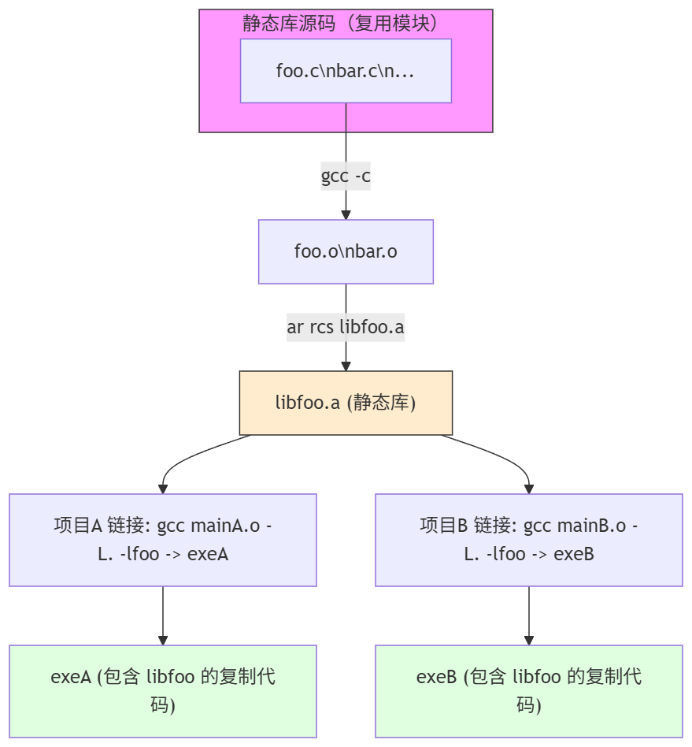

# 深入理解CC++的编译与链接技术2：动态库静态库导论

## 什么是重用概念，跟我们的编译与链接技术有什么关系

重用无处不在，我相信不会有人不赞同的。我们讨论的重用就是代码的再次利用。这一点，在C++编程中已经可以窥得一丝猫腻了：

```cpp
template<typename AddType>
auto add(const AddType& a, const AddType& b){
    return a + b; // 没有任何技巧的相加
}

std::string 
trim_self(const std::string& waited_trim){ // returns the copy of the trimmed string
    size_t i = 0; // left index
	while (i < str.size() && isspace((unsigned char)str[i]))
		i++;
    size_t j = str.size(); // right index
    while (j > 0 && isspace((unsigned char)str[j - 1]))
		j--;
	return str.substr(i, j);
}

int main()
{
    int res = add(1, 2); // deduced as int
    float res2 = add(1.0f, 2.0f); // deduced as floats 
}
```

比如说，上面的模板代码和函数代码，让我们不必在每一次调用加法和字符串空白字符压缩的时候，重复的拷贝代码。所以这样看，早在很久之前的C语言盛行的时代，代码的重用就出现了。不过我想，这个层次的代码复用还不算很高级——因为这样的复用是源码分发的。换而言之，想要使用自己曾经，或者是其他人的代码杰作，我们不得不焦头烂额的翻找出来他们的源文件，确保所有的依赖齐全后，加入自己的工程进行编译。我相信你注意到了问题——很多情况下我们压根不可以得到源代码。（商业机密，懂得都懂）这种情况下，我们自然就要思考更加低层次的代码复用了。那就是二进制层级的分发。这就是静态库和动态库的作用，也是我们后面几个专门讲述机器码分发层次的几个复用手段的前置。

## 啥是静态库？

静态库也许比你想的简单太多了。我们知道，在编译器预处理和编译源文件结束之后，就会得到可重定位文件。这些可重定位文件在之前，会被直接拿来组合成可执行文件，现在我们可以换一个思路，这些通用的可重定位文件完全可以自己集合成一个库，下一次找符号的时候，直接链接这个库就好了，这样我们就把源代码藏起来了，也就可以按照二进制层级进行分发。但是这有一个问题——我们怎么使用呢？我们总是需要可用的符号告诉我们确切的入口，就像我们知道库里有一个可以压缩字符串空白字符的函数，但如果我们不知道他叫什么，我们没办法使用它。所以很显然了。光具备这些二进制文件，是完全不够的，我们还需要满足其他的条件，那就是——导出的头文件供我们编程使用了。

下面两个图会比较好的说明静态库的作用



但是这存在一个新的问题。实际上，libfoo的代码完全一致，但是却存在两份。这种比较硬的复制在有时候我们是不期望的。libfoo比较小还好，现在的硬盘容量相对没那么昂贵了，我们可以说冗余优势。但是更多的情况下，我们如果libfoo有比较重要的安全更新，希望所有的软件都要下一次启动重新加载的时候，静态库看起来无能为力。因为他是只是简单的把分发从更加困难的源码分发转向了二进制分发。但是丝毫没有解决更加重要的load when use的问题。所以看起来并不优雅。所以实际上，静态库使用的并不算太广泛（笔者自己也很少用静态库）

## 动态库

所以问题出在，我们对所有的二进制代码做了深拷贝，而不是引用层次的浅拷贝，如果我们允许可执行代码中的一部分符号可以是懒加载确定的（这就要求我们有加载器，可以动态的加载和修改这些未定义符号的地址为真正的共享的符号的地址），所以我们很自然的想到——都做到库这个层次了，我们再做的彻底一些，干脆将这些代码改成纯粹的可共享的代码，当他们需要是可用的时候，加载他们，随后所有的需要这个库的可执行程序就都可以安稳的直接使用这个共享的代码段，而不必自己狼狈的拷贝一份。这极大的节约了我们的内存空间。这种共享的特性也让我们可以说动态库也是一种共享库（共享的代码必然动态加载重新修改共享符号的地址，所以在这个意图上，共享库和动态库完全可以互换，今天不会有人刻意区分）。

当然，动态库的更深层次特性——比如说为了咱们可以具备任何需要这个库的可执行程序顺利加载里面的符号，我们将所有的符号按照-fPIC的方式（位置无关的代码, Position Independent Code）编译，这样加载器就会很方便的进行重定位。

## 概述：所以动态库到底如何做到的？

### 动态库的构建（从源代码到 `libfoo.so` / 带版本号的 `libfoo.so.1.0`）

目标：生成一个对客户端可被动态加载、可被多个进程共享的 `.so`，并保证 ABI 管理明确（通过 SONAME/versioning）。

跟可执行文件的构建在事实上几乎一致，只是不添加启动头，除此之外，我们还需要保证几个最基本的关键点：

- **必须使用位置无关代码（PIC）**：`-fPIC`（或 `-fpic`）用于生成能在任意地址运行的代码（函数内存访问使用相对地址或通过 GOT）。不使用 PIC 会导致链接器/运行时产生重定位冲突或不可重定位段。
- **使用 `-shared` 生成共享对象**：链接器会把类型标记为动态库（ELF type = DYN）。
- **设置 SONAME**：通过链接器选项 `-Wl,-soname,libfoo.so.1` 指明 ABI 名称（客户端在 DT_NEEDED 中记录 SONAME）。实际文件通常是 `libfoo.so.1.0`，并提供软链接 `libfoo.so.1 -> libfoo.so.1.0`，`libfoo.so -> libfoo.so.1`（开发时方便 `-lfoo`）
- **控制导出符号（visibility / version script）**：默认会导出全局符号，可用 GCC `-fvisibility=hidden` + `__attribute__((visibility("default")))` 标出需要导出的接口，或使用链接器版本脚本控制符号表，减少 API 污染并降低符号冲突风险。
- **可选：符号版本（symbol versioning）**：用于在同一 SONAME 内支持不同版本的符号，便于兼容性管理（需要链接器版本脚本）。

### 构建客户端可执行文件（基于“信任库 ABI/SONAME”）

这里“信任”意味着客户端在构建时相信动态库的 ABI/接口（头文件、SONAME、符号语义）不会破坏其期望。构建阶段与运行时的关系和生成的 ELF 字段非常关键。

#### 链接时发生的事（构建客户端）

- 客户端使用头文件声明（`foo.h`）和 `-lfoo` 链接对应共享库（或库的开发 symlink `libfoo.so`）。
- 链接器会：
  1. 把客户端自身的代码与目标文件合并为可执行文件（ELF type = EXEC 或 DYN（可位置无关可执行））。
  2. **验证**：尝试解析未定义引用（在动态链接的情况下，链接器通常会利用被指定的共享库的动态符号表来满足这些引用；如果找不到，会报 undefined reference 错误）。
  3. **不复制库代码**：与静态 linking 不同，链接器不会把 `.o` 代码复制到可执行文件；而是把依赖记录到 `DT_NEEDED`（记录的是库的 SONAME），并生成必要的重定位/PLT占位。
- 结果：可执行文件包含 `DT_NEEDED: libfoo.so.1` 等动态段条目，但不包含库的实现代码。

### 运行时加载与符号解析（动态链接器 / loader 的具体行为）

这是最复杂也最关键的一部分 —— 运行时 `ld.so`（或相应平台的 loader）把所有东西组合成可运行的进程地址空间并解决符号引用。下面按步骤和机制详细说明。

#### 启动阶段 —— 从内核到动态链接器

1. **内核加载可执行文件**：内核读取 ELF header -> 如果 ELF 中 `INTERP` 段存在（绝大多数动态可执行文件都会有，值如 `/lib64/ld-linux-x86-64.so.2`），内核先把动态链接器映射到进程地址空间，然后把可执行文件的 PT_LOAD 段也映射好，但不直接运行可执行的 `_start`。
2. **动态链接器（ld.so）开始执行**：它负责解析 `DT_NEEDED`、寻找实际库文件、递归加载依赖并进行重定位、执行初始化（constructors），最后把控制权交给可执行的入口点（`_start` -> `main`）。

#### 映射（mmap）库文件

- loader 读取每个依赖 `.so` 的 ELF Program Headers（PT_LOAD），把可执行段（text）映射为可执行只读、把数据段映射为读写等；并处理页对齐与段保护（mmap + mprotect）。
- 每个库一般只会映射一次（多个进程可以共享相同物理页，只要页是只读/共享的）。

#### 重定位（Relocations）

重定位有多种类型，分两类重要概念：

- **不需要符号查找的重定位**（例如 RELATIVE 类型）：这类可以直接按基址调整（对于位置无关代码，运行时把库基址加到相对偏移），通常在启动阶段就批量处理，速度快。
- **需要符号查找的重定位**（例如 R_X86_64_JUMP_SLOT / R_*_GLOB_DAT 等）：这些需要基于符号名搜索相应定义位置（可能在可执行或其它库）。

#### 符号查找顺序（默认 ELF 搜索规则，大意）

对于解析某个符号（例如函数 `foo`），loader 的查找顺序通常是：

1. 可执行文件的全局符号表（executable overrides）。
2. 按 DT_NEEDED 列表顺序遍历每个已加载库的动态符号表，查找第一个匹配的全局/弱符号（注意：实际规则受 ELF 版本、运行时标志、RTLD_LOCAL/RTLD_GLOBAL、symbol visibility 等影响）。
3. 如果 symbol versioning 存在，则需要匹配版本标签。
4. 如果使用 `dlopen` 加载且采用 `RTLD_GLOBAL`，这些库的符号可能参与后续库的解析；`RTLD_LOCAL` 则不参与其他后续解析。

> 重要：**可执行文件中的符号优先**于共享库（这就是所谓的 symbol interposition），因此可执行文件可以“覆盖”库中的函数（这也是 `LD_PRELOAD` 可替换函数实现的基础）。


上面这个图就把具体的流程说清楚了。

## 一些对比

笔者整理一下对比表格，可以参考一下：

| 比较项                        | 静态库（Static）                                             | 动态库（Shared / .so/.dll/.dylib）                           |
| ----------------------------- | ------------------------------------------------------------ | ------------------------------------------------------------ |
| 二进制文件性质                | `.a` / `.lib`：由若干 `.o` 目标文件打包，属于归档形式，链接时将目标代码复制进可执行文件。 | `.so` / `.dll` / `.dylib`：可被运行时加载的共享对象，通常为位置无关代码（PIC），带有 SONAME/版本信息。 |
| 可执行文件集成（链接与运行）  | 链接时解析并把需要的目标代码复制到可执行文件中（静态绑定），运行时不再依赖该库文件。 | 链接时记录 `DT_NEEDED`（或等效），运行时由动态链接器映射并在进程地址空间重定位/解析符号（动态绑定，可实时替换/加载）。 |
| 会导致可执行文件大小变化如何  | 可执行文件体积增大（包含库代码的实际副本），多个可执行会重复包含相同代码。 | 可执行文件较小（只记录依赖），多个进程共享同一份库的只读/共享页；运行时会占用额外内存用于映射与 GOT/PLT。 |
| 可移植性                      | 部署简单：可执行文件通常自包含（同架构同ABI下更易移植），但仍受系统/内核/CRT 影响。 | 部署依赖运行时环境：需要合适的共享库版本、加载器、搜索路径（rpath/LD_LIBRARY_PATH/ldconfig）；跨发行版/平台兼容性更敏感。 |
| 集成的难易程度                | 链接配置简单（直接 `-l` / -L 或把 .o 合并），不用考虑运行时加载；但是版本升级需重编译所有客户端。 | 构建与部署更复杂（需 `-fPIC`、SONAME、rpath、符号可见性、版本脚本等）；但是支持运行时替换、插件、dlopen，升级时可只替换库文件。 |
| 二进制文件处理/转换的难易程度 | 打包/检查/合并较直观（`ar`, `nm`, `objdump`），反向替换/替换局部符号更困难（需重新链接）。 | 生成与控制导出符号更复杂（symbol versioning, visibility），运行时重定位 & 符号解析机制复杂；但运行时 `dlopen/dlsym` 提供灵活扩展能力。 |
| 是否适合开发工作              | 适合：小型工具、嵌入式/单文件发布、无运行时依赖场景；方便离线/受限环境部署。 | 适合：大型项目、模块化设计、插件系统、需要热更新或减少重复内存/磁盘占用的场景；利于团队协作与库独立发布。 |
| 其他值得一提的点              | - 安全/Bug 修复需重建并重新发布所有可执行。- 版权/许可证（如 GPL）在静态链接下可能带来更严格的义务。- 对运行时性能（调用）通常没有 PLT 费用。 | - 可以单独修复/替换库（快速补丁）。- 存在运行时劫持风险（LD_PRELOAD、RPATH 注入）和首次调用的延迟（lazy binding）。- 对平台 ABI/SONAME 管理和部署流程要求更高。 |

# Reference

基本上都是源于这本书：《高级C/C++编译技术》
